---

# required metadata
title: "Configuring CA Single Sign-On | DeployR 8.x"
description: "How to configure CA Single Sign-On for DeployR"
keywords: ""
author: "j-martens"
manager: "jhubbard"
ms.date: "03/17/2016"
ms.topic: "article"
ms.prod: "microsoft-r"
ms.service: ""
ms.assetid: ""

# optional metadata
ROBOTS: ""
audience: ""
ms.devlang: ""
ms.reviewer: ""
ms.suite: ""
ms.tgt_pltfrm: ""
ms.technology: "deployr"
ms.custom: ""

---

# Configuring CA Single Sign-On for DeployR

**Applies to: DeployR 8.x**

>Looking for the new documentation for the operationalization feature in Microsoft R Server 9.0.x ? [Start here](operationalize/about.md).

## Introduction

This document is written as a guide for CA Single Sign-On (formerly known as SiteMinder) administrators interested in configuring CA Single Sign-On policies for use with DeployR. It is not meant to be a complete step-by-step manual, but rather offer enough instruction to permit experienced administrators to perform the necessary steps to configure for DeployR. Please consult the [CA website](http://support.ca.com/) for the complete CA Single Sign-On documentation.

## Create the Agent

The first step to configuring CA Single Sign-On for DeployR is to create an agent.

**To create an agent:**

1.  In the Administrative interface for CA Single Sign-On, click on the **Infrastructure** tab.

2.  Click **Agent**.

3.  Click **Agents**.

4.  Click **Create a new object of type Agent**.

5.  Click **OK**.

    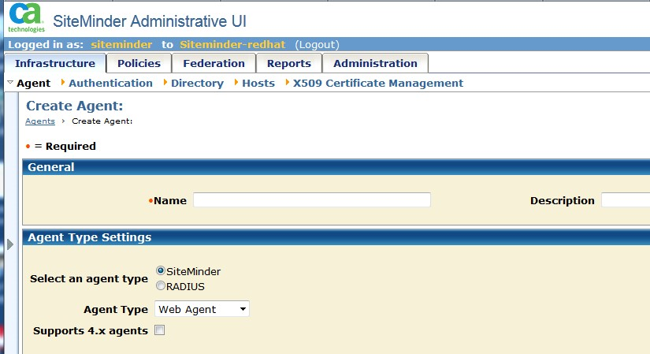

6.  In the **Name** field, enter the name `deployr`.

7.  Click **Submit**.

## Create the Agent Group

The second step is to create an Agent Group.

**To create an agent group:**

1.  In the Administrative interface for CA Single Sign-On, click on the **Infrastructure** tab.

2.  Click **Agent**.

3.  Click **Agent Groups**.

4.  Click **Create Agent Group**.

5.  Click **Create a new object of type Agent Group**.

6.  Click **OK**.

    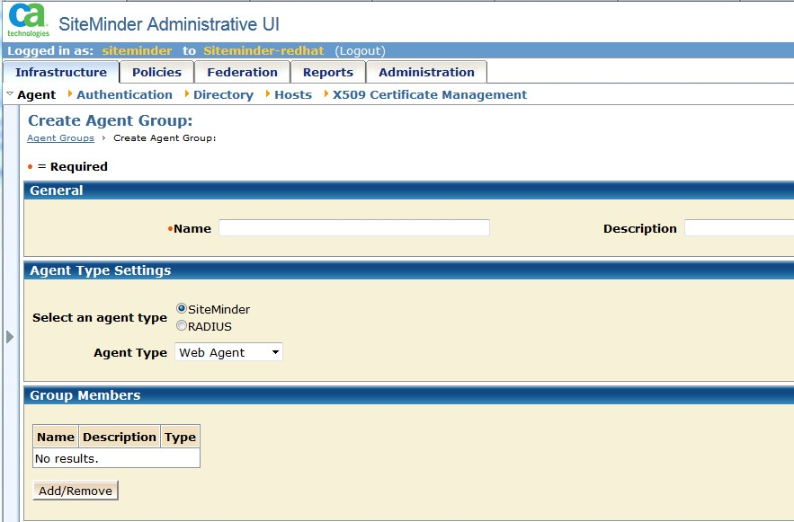

7.  In the **Name** field, enter the name `deployrGroup`.

8.  Click **Add/Remove** button.

    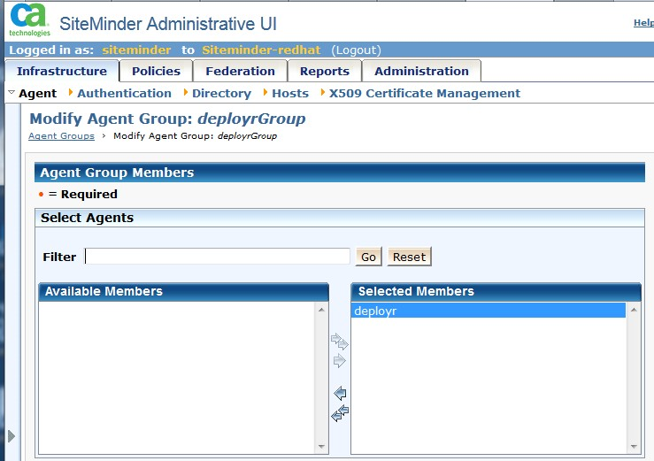

9.  Select the `deployr` agent from the list of available members and move it to **Selected Members**.

10. Click **OK**.

11. Click **Submit**.

## Create Agent Configuration Object

**To create agent configuration objects:**

1.  Click **Infrastructure, Agent Configuration Objects, Create Agent Group**.

2.  Click **Create Agent Configuration**.

    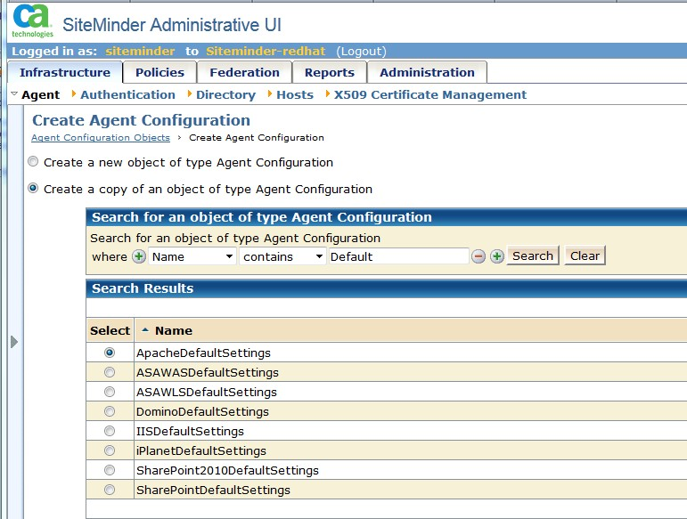

3.  Select **Create a copy of an object of type Agent Configuration**.

4.  Select `ApacheDefaultsSettings`.

    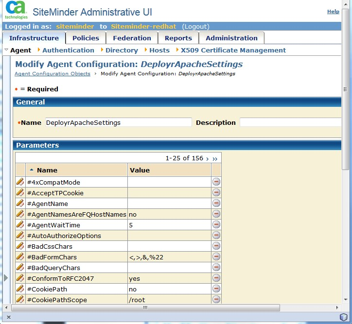

5.  In the **Name** field, enter the name `deployrApacheSettings`.

6.  Click on **Submit**.

### Configure Agent Configuration Object

**To configure new agent configuration objects:**

1.  Click on the pencil icon next to the `deployrApacheSettings` object to enter the configuration page.

    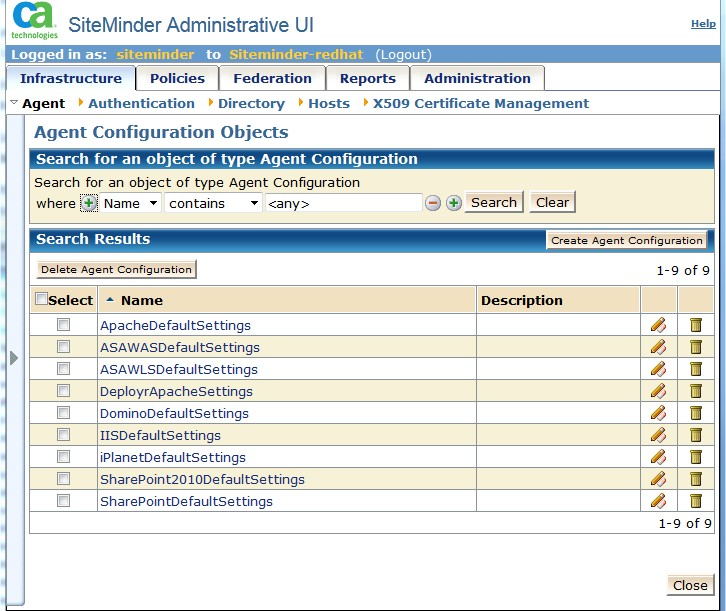

2.  In the table, click on the pencil icon next to `DefaultAgentName`.

3.  Enter the agent name that was created above.

4.  Remove the preceding \#.

5.  Click **OK**.

    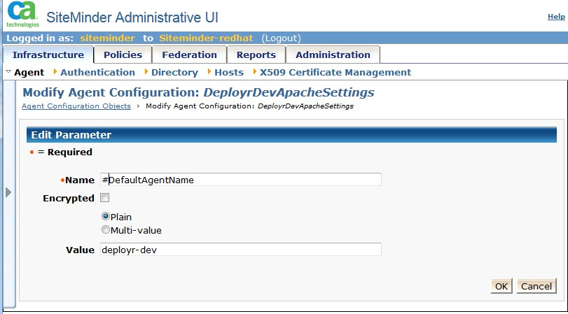

6.  In the table, click on the pencil icon to the left of `BadUrlChars`.

7.  Update the **Value** to the following characters: `//,./,/.,/*,*.,~,\`

8.  Click **OK**.

    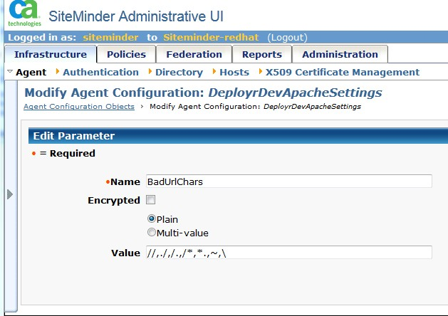

9.  Click on the pencil icon next to `LogoffUri`.

10. Change the **Value** to: `/logout.html`

11. Remove preceding `#` character in the **Name** field.

12. Click **OK**.

13. Click **Submit** to save all changes.

## Create the Domain

A domain is a logical grouping of resources associated with one or more user directories.

**To create a new domain**:

1.  In the Administrative interface for CA Single Sign-On, click on the **Policies** tab.

2.  Click **Domain -&gt; Domains**.

3.  Click **Create Domain**.

4.  In the **General** tab, enter `deployrDomain` in the **Name** field.

    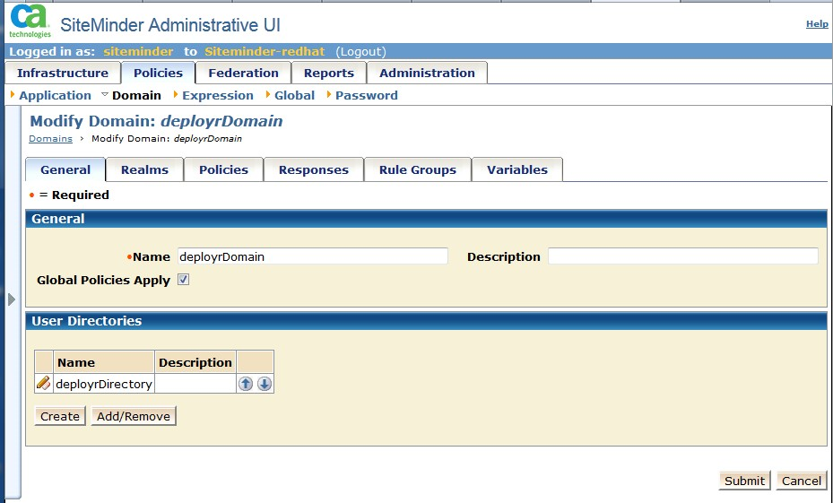

5.  In the **User Directory** window, click **Create** and fill in the following info:

    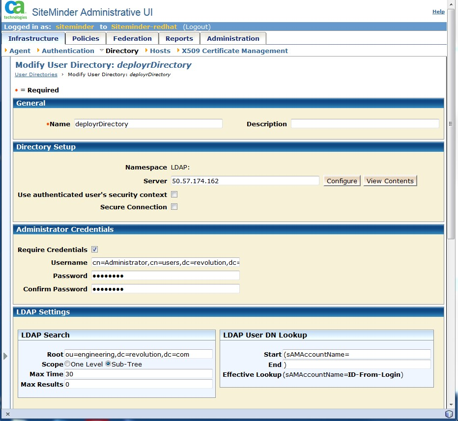

6.  Click **Submit**.

## Create the Realm & Sub-Realms

A realm defines a group of resources with the same security or personalization requirements. Each realm can only be associated with one agent/agent group and with one authorization scheme.

Conceptually, a realm is the door that protects the resources.

**To create a realm**:

1.  Click the **Realms** tab.

2.  Click **Create Realm**.

3.  Enter the following information in the form.

    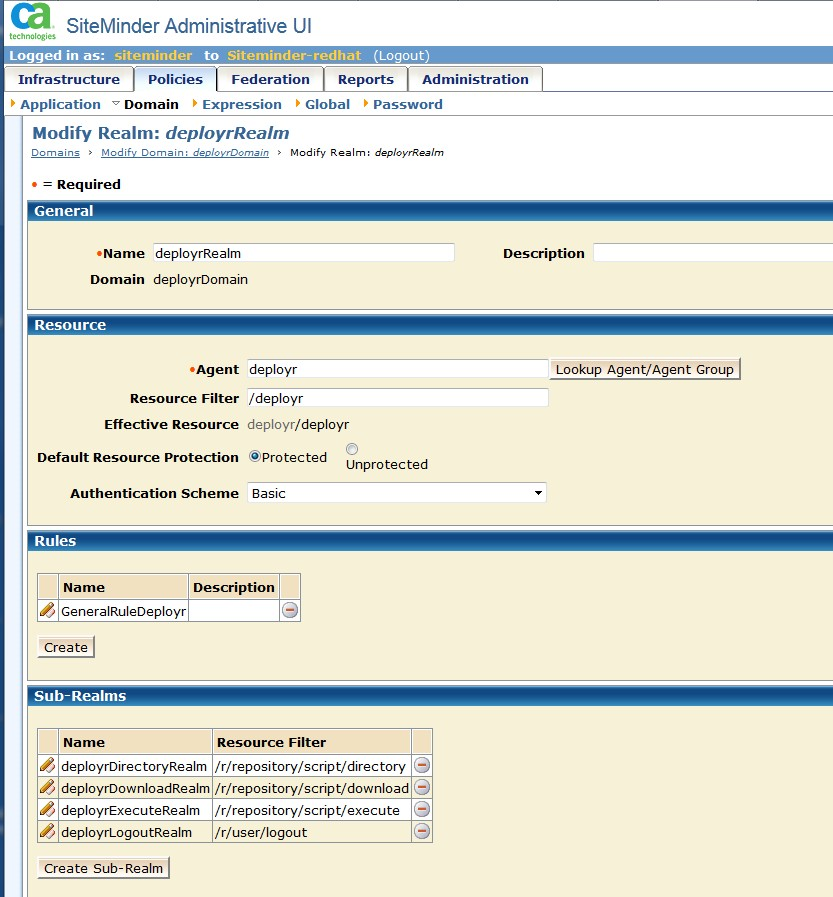

4.  In the **Rules** section, click **Create**.

5.  Enter the following information in the form.

    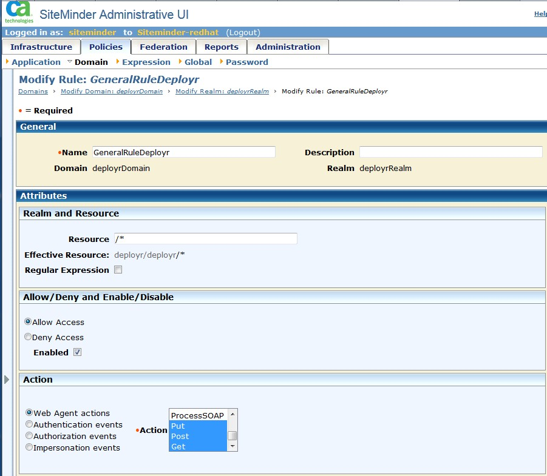

6.  Create the following sub-realms for your configuration using the values in the following table. There are no rules associated with the sub-realms.

    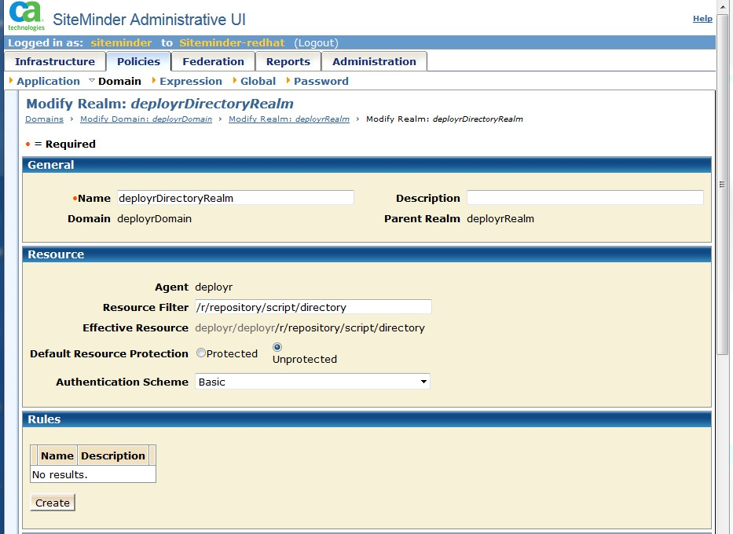

| Name                    | ResourceFilter                   |
|-------------------------|----------------------------------|
| `deployrDirectoryRealm` | `/r/repository/script/directory` |
| `deployrDownloadRealm`  | `/r/repository/script/Download`  |
| `deployrExecuteRealm`   | `/r/repository/script/Execute`   |
| `deployrLogoutRealm`    | `/r/user/logout`                 |
| `deployrAboutRealm`     | `/r/user/about`                  |

## Create Responses

A response returns information to the web agent or redirects the user to another site and must be paired with a rule. It can be a static response or a value from Active Directory. Responses are only available to protected resources.

**To create responses**:

1.  Click on **Policies** -&gt; **Domain** -&gt; **Create Responses**.

2.  Enter the following information in the form.

    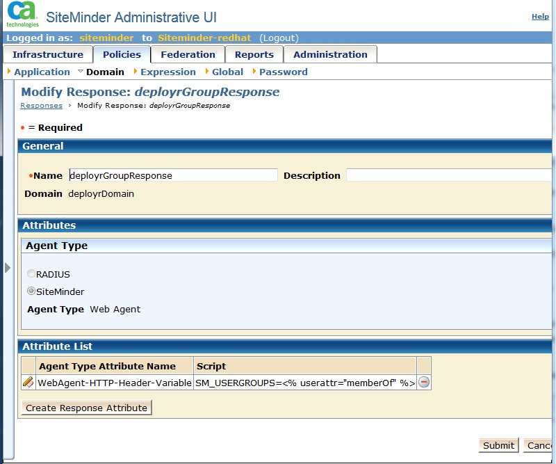

3.  Click **Create Response Attribute**. The **Create Response Attribute** window appears.

4.  Fill in the information as shown in the image below.

    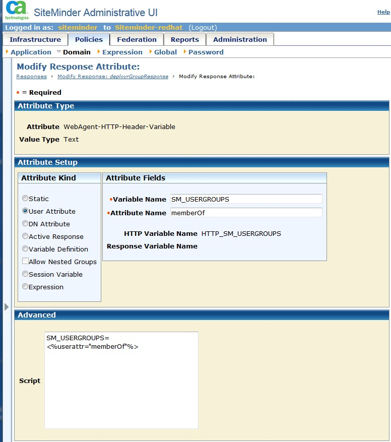

5.  Click **OK**.

6.  Click **Submit**.

## Create Response Groups

1.  Click **Policies** -&gt; **Domain** -&gt; **Response Groups**.

2.  Click **Create Response Group**.

3.  Enter the following information in the form.

    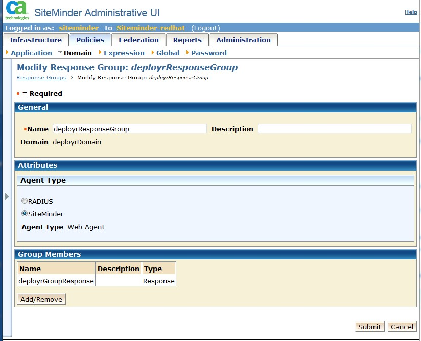

4.  Click **Add/Remove** and add `deployrGroupResponse`.

    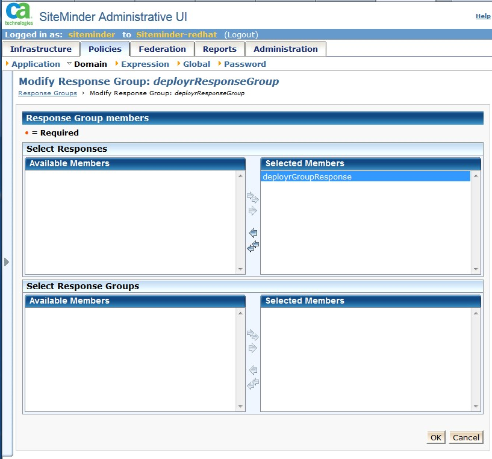

5.  Move `deployrGroupResponse` from **Available Members** to **Selected Members**.

6.  Click **OK**

7.  Click **Submit**.

## Create the Policy

Policies define how users can interact with resources. When a user creates policies in the **Policy Server User Interface**, he or she links together (binds) objects that identify users, resources, and actions associated with the resources.

1.  Click **Policies** -&gt; **Domain** -&gt; **Domain Policies**.

2.  Click **Create Policy**.

3.  Fill in the following information in the form.

    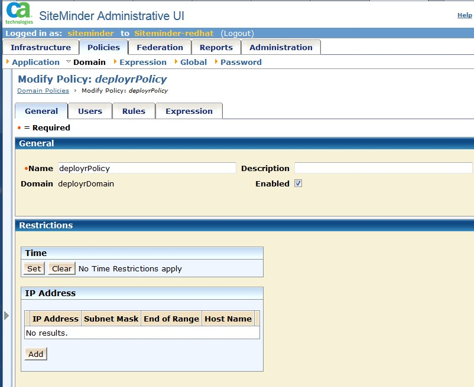

4.  Click the **Users** tab.

    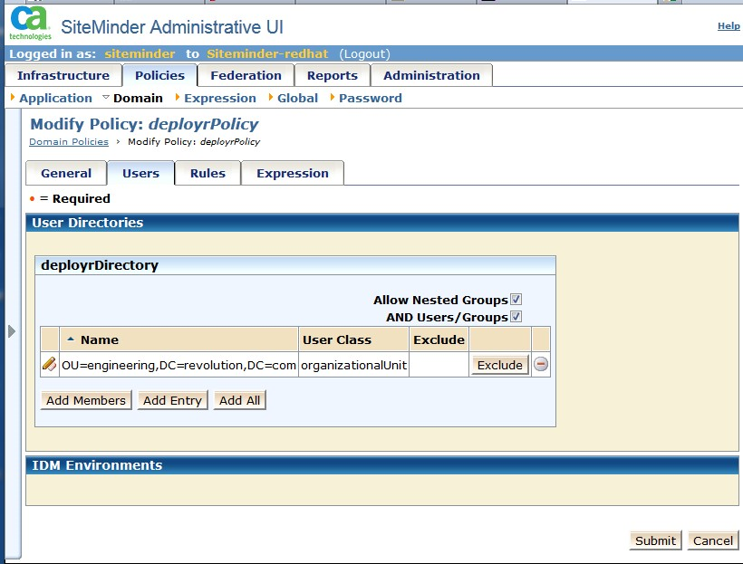

5.  Click **Add Members**.

    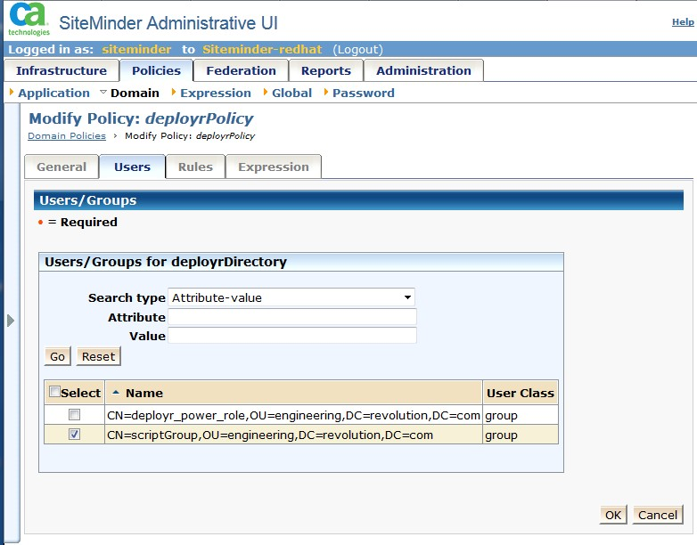

6.  Select `CN=scriptGroup,OU=engineering,DC=revolution,DC=com`.

7.  Click **OK**.

    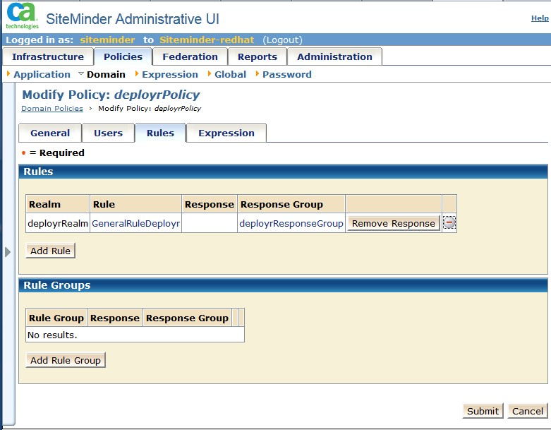

8.  Click **Add Rule** and select `GeneralRuleDeployr`.

9.  Click **OK**

10. Click **Submit**.

