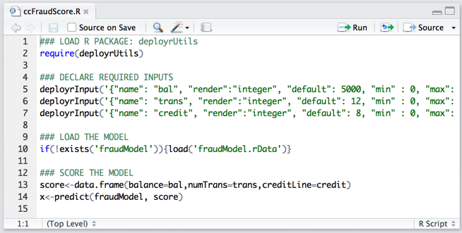
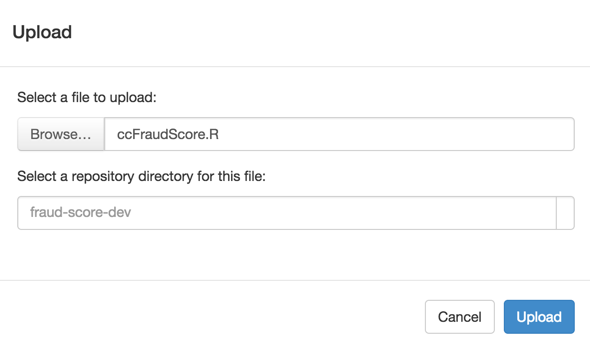

---

# required metadata
title: "Writing Portable R Code for DeployR"
description: "Data scientist's guide to Writing Portable R Code for DeployR "
keywords: ""
author: "j-martens"
manager: "Paulette.McKay"
ms.date: "05/06/2016"
ms.topic: "article"
ms.prod: "microsoft-r"
ms.service: ""
ms.assetid: ""

# optional metadata
ROBOTS: ""
audience: ""
ms.devlang: ""
ms.reviewer: ""
ms.suite: ""
ms.tgt_pltfrm: ""
ms.technology: "deployr"
ms.custom: ""

---

# Writing Portable R Code

## Introduction

As a data scientist, you need to aware of several R portability issues that arise when developing R analytics for use in your local R environment and in the DeployR server environment. They are:

1.  [Package portability](#package-portability)
2.  [Input portability](#input-portability)
3.  [Portable access to data files](#portable-access-to-data-files)

These portability issues can be solved when you use the functions in the `deployrUtils` package.

-   Use `deployrPackage()` to declare your package dependencies in your R code.
-   Use `deployrInput()` to declare the required inputs along with default values in your R code.
-   Use `deployrExternal()` to access big data files from your R code.

The steps for using and testing the package functions in your R code locally and then testing them again in the DeployR server environment are described in the [Usage](#usage) section at the end of this document.

## Package Portability

Let's begin with some sample R code demonstrating how to declare your package dependencies in a portable manner:

    ## Ensures this package dependency is installed & loaded from the start
    deployrPackage("ggplot2")

Traditional R package management primarily involves using `install.packages()` to install R packages from CRAN or a local repository in your local environment and `library()` to load packages at runtime.

When preparing portable R code for use both locally and in DeployR server environment, R package management recommendations differ slightly since the R script will be run in a remote server environment whenever executed on the DeployR server.

Unlike your local environment, you do not control that remote environment as a data scientist. Since that remote environment is entirely independent, it is also potentially different from your local environment, which means that your R code might not be portable if that remote environment doesn't have all the packages your R scripts need.

> **Solution:** Always declare your package dependencies in your R code using the `deployrPackage()`.

To ensure your R code runs consistently in your local environment and in the DeployR server environment, always use the `deployrPackage` function from the `deployrUtils` package in your R code. To learn how to get the package, use its functions locally, and test them in DeployR, read the [Usage](#usage) section.

In a nutshell, using the `deployrPackage` function safeguards your R code by making certain that:

-   The necessary packages are loaded and available to your R code at runtime.
-   Your R code is portable across your local environment and the DeployR server environment.

When you use the `deployrPackage` function, you can avoid issues such as having tested your R code locally, and then discovering that your R code fails when executed in the DeployR server environment due to one or more missing package dependencies.

## Input Portability

Let's begin with some sample R code demonstrating how to declare your required script inputs in a portable manner:

    ## Creates an integer variable named 'age' if it does not already exist
    deployrInput('{ "name": "age", "label": "Age", "render": "integer", "default": 6 } ')

The R scripts you develop and deploy to the DeployR server environment are ultimately executed as [Analytics Web Services](deployr-application-developer-getting-started.md#analytics-web-services) by client applications. Most commonly, these R scripts expect input data to be provided by this application upon execution. In order for these inputs to be provided, the application developer who is integrating the R scripts must first know which inputs are required.

As a data scientist creating analytics for use in DeployR, you are responsible for providing the application developers not only with the necessary analytics, but also helping them understand the inputs required by those analytics.

Whenever a required input is missing at runtime, the R script will fail. Missing inputs present a real problem not only in production, but also when testing R scripts in multiple environments.

> **Solution:** Always declare the inputs required by your R code and assign them default values using `deployrInput()`.

The `deployrInput` function, provided by the `deployrUtils` package, enables you to specify the inputs required for your scripts directly in your R code along with the default value for each input. Using the `deployrInput` function, you can ensure your code is portable while providing clear guidance to your client application developers as to which script inputs their application will be required to supply. To learn how to get the package, use its functions locally, and test them in DeployR, read the [Usage](#usage) section.

In a nutshell, the `deployrInput` function allows you to:

1.  Declare the required inputs for your script.
2.  Assign default values for those inputs.

When you declare your required inputs (and default values) using the `deployrInput` function, your script will be portable and run successfully even when no input values are passed. These default values are ideal for developing and testing your scripts both locally and in the DeployR server environment since they guarantee that the script can always execute and return the same results across environments unless, of course, those default values are overwritten programmatically by an application.

## Portable Access to Data Files

Let's begin with some sample R code demonstrating how to reference your data files in a portable manner:

    ## READ CSV FILE
    ## Locally: finds in current working directory
    ## In DeployR: finds in user's external directory
    data <- read.csv(file = deployrExternal("data.csv"))

Whenever the data files with which you need to work are too big to be copied from the Web or copied from your local machine to the server, you can ask your administrator to store those files on your behalf in 'big data' external directories on the DeployR main server. Since you're likely to use a copy or subset of the data in your local environment for development and testing purposes, it becomes interesting to reference those files in a portable manner so that data can be accessed whenever you run the R code locally or on the DeployR server.

> **Solution:** Always reference your big data files using `deployrExternal()`.

In a nutshell, the `deployrExternal` function provides you with a consistent way of referencing these big data files for reading and writing; thereby, making your R code portable across your local environment and the DeployR server environment.

All you have to do is:

1.  Ask your DeployR administrator to physically store a copy of your big data file in the appropriate external directory on the DeployR server on your behalf.
2.  Reference the data file using the `deployrExternal` function in your R code.

Then, when the R code executes locally, the function looks for a data file by that name in the current working directory of your R session. And when the R code executes remotely on the DeployR server, the function looks for a data file by that name in the dedicated external directories without requiring you to know the exact path of the file on the DeployR server.

When you use the `deployrExternal` function, you can avoid issues such as having tested your R code locally, and then having to change how you reference the data file when running it up on the DeployR server.

## Usage

The following steps describe how to use the functions in the `deployrUtils` package to ensure the portability of your R code.

>For the complete package help, use `library(help="deployrUtils")` in your IDE.

**Part 1. In your local environment:**

1.  Install `deployrUtils` locally [from GitHub](https://github.com/Microsoft/deployrUtils/releases) using your IDE, R console, or terminal window with the following commands:

        library(devtools)
        install_github('Microsoft/deployrUtils')

2.  Declare package dependencies using `deployrPackage()` at the top of your script in your preferred IDE. Consult the package help for more details.

3.  Declare each script input individually and assign default values using `deployrInput()` in your R code. Consult the package help for more details.

4.  Reference each big data file using `deployrExternal()` in your R code. Consult the package help for more details. Make sure you ask your DeployR administrator to physically store a copy of your big data file in the appropriate external directory on the DeployR server on your behalf.

5.  Test the script locally with those default values.

    

**Part 2. In the DeployR Repository Manager:**

>The `deployrUtils` package is preinstalled in the DeployR server environment.

1.  [Log into](deployr-repository-manager/deployr-repository-manager-about.md#logging-in-and-out) the Repository Manager.

    

2.  [Upload](deployr-repository-manager/deployr-repository-manager-files.md#uploading-files) your script to the DeployR repository.

    

3.  [Verify](deployr-data-scientist-getting-started.md#test-analytics) that the script's behavior remains consistent across environments by running that script using its default values in the [Test page](deployr-repository-manager/deployr-repository-manager-testing-debugging-scripts.md) before handing it off to the application developer(s).

    >[!NOTE]
	>1. If your script fails on the DeployR server due to one or more missing package dependencies, please contact your DeployR server administrator with details. See the [Administrator Guidelines](deployr-admin-r-package-management.md).
	>
    >2. If your script fails on the DeployR server because the data file could not be found, ask your DeployR administrator to verify that the files you sent him or her were, in fact, deployed to the external directories.

    
