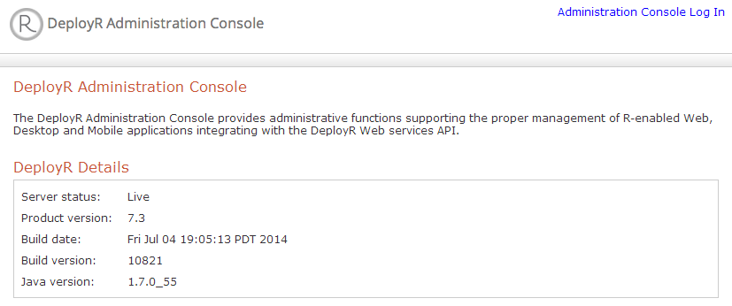
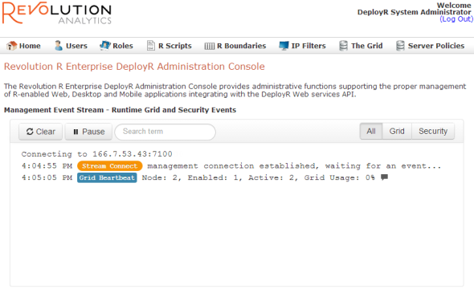
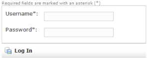

# About DeployR Administration Console

The DeployR Administration Console, which is delivered with DeployR, is an easy-to-use web interface that facilitates the proper management and administration of your DeployR deployment. Accordingly, the following functions are supported in the console:

-   The creation and management of [user accounts](user-intro.htm)
-   The creation and management of [roles](role-intro.htm), which are used to grant users permissions and to restrict access to R scripts
-   The import and export of [R scripts](script-intro.htm)
-   The creation and management of [R boundaries](boundaries-intro.htm), which are used to constrain runtime resource usage
-   The creation and management of [IP filters](filter-intro.htm)
-   The management of node resources on the DeployR [grid](node-grid-intro.htm)
-   The management of DeployR [server policies](policies-intro.htm)
-   The [monitoring of events on the grid](tasks-intro.htm)

DeployR Administration Console (before login)

## Who Can Access the Administration Console

Only the admin user account, representing the administrator, has access to this console and can:

- Create and manage user accounts, roles, R boundaries, and IP filters
- Import and export scripts for preserving backups or for the purposes of migration
- Manage DeployR grid node resources and the server policies

   
*DeployR Administration Console (after login)*

## How to Access the Administration Console

>[!IMPORTANT]
>You cannot log in to DeployR from multiple accounts using a single brand of browser program. To use two or more accounts concurrently, you'll need to log in to each one in a separate brand of browser. For example, to log in to the DeployR Administration Console with admin account and into the API Explorer tool with another user account, you could open one in Google Chrome™ and the other in Mozilla® Firefox®.

To access and log in to the Administration Console after installation:

1.  In a browser window, enter the Administration Console’s URL:

		http://<DEPLOYR-IP-ADDRESS>:<PORT>/deployr/administration

	where `<DEPLOYR_SERVER_IP>` is the IP address of the DeployR machine and where `<PORT>` is the port number used during installation. 

2.  Click **Administration Console Log In** in the upper right to log in.  If this is your first time using the Administration Console, try one of the [preconfigured users](https://deployr.revolutionanalytics.com/documents/help/admin-console/Content/Topics/user-defaults.htm).

	   
	*Login page*

3. Click **Log In**.

To log out of the Administration Console:

Click **Log Out** in the upper right corner of the console.
 
>[!IMPORTANT]
>See the Scale & Throughput documentation available on the product website for help in planning the provisioning of server and grid capacity.