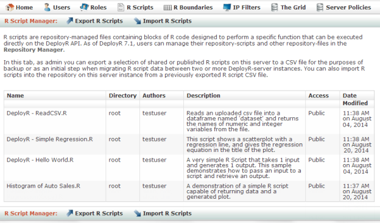
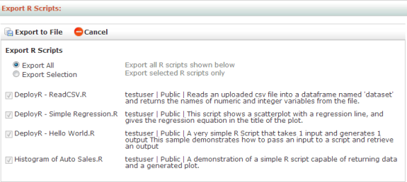
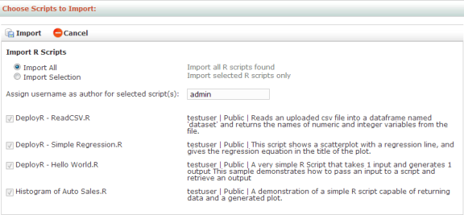

---

# required metadata
title: "DeployR Administration Console Help - DeployR 8.x "
description: "R Scripts to DeployR Administration Console Help"
keywords: ""
author: "j-martens"
ms.author: "jmartens"
manager: "cgronlun"
ms.date: "11/10/2017"
ms.topic: "article"
ms.prod: "microsoft-r"

# optional metadata
#ROBOTS: ""
#audience: ""
#ms.devlang: ""
#ms.reviewer: ""
#ms.suite: ""
#ms.tgt_pltfrm: ""
ms.technology: "deployr"
#ms.custom: ""

---

# Managing R Scripts

R scripts are repository-managed files containing blocks of R code with well-defined inputs and outputs. Each R script is designed to perform a specific function that can be exposed as an executable entity on the DeployR Web services API.

You can import and export scripts through the **R Scripts** tab in the Administration Console

In this tab, you can export shared or published R scripts on this server to a CSV file as a way to backup scripts or as the first step in migrating R script data between two or more DeployR-server instances. You can also import R scripts into the repository on this server instance from a previously exported R script CSV file. 

Users can also manage their repository scripts as well as other repository files in the [DeployR Repository Manager](../what-is-operationalization.md). 

_Figure: R Script List page_

  

## Exporting R Scripts 

You can export any scripts to which you have access into a `CSV` file.  Exporting can be used to copy the scripts to another machine or across multiple deployments or to back up your scripts.

>Only the latest version of script is exported. The previous versions are not preserved in this export file.

**To export one or more scripts:**

1.  From the main menu, click **R Scripts**.

2.  From the **R Script List**, click **Export R Scripts**.

	_Figure: Export R Scripts page_
	
	  

3.  Select the scripts to be exported. You can choose to export all of the scripts listed or only some of them.

4.  Click **Export to File**.

## Importing R Scripts

Importing into the server database allows you to retrieve the scripts in a previously exported CSV file. Alternately, you can also import a `CSV` file you have created yourself using the proper format. If a script by the same name already exists, a new version of the script is created.

When you import a script, you are automatically listed as the sole author of the script. However, if you are logged in as `admin`, you have the option to assign another user as the author instead. The script author can grant authorship to other users when editing that script later.

Scripts will be imported into the directory from which it was exported. If the directory does not exist, then it will be created.

**To import:**

1.  From the main menu, click **R Scripts**.

2.  From the **R Script List**, click **Import R Scripts**.

3.  Click **Browse** and select the `CSV` file to be imported.

	_Figure: Import R Scripts page_
	
	  

4.  In the **Choose Scripts to Import** page, choose the R script(s) to import.

5.  Assign a different user as the author for the selected script(s). Otherwise, you will be automatically assigned as the author for the script(s).

6.  Click **Import**. If a script by the same name already exists for the user importing, then a new version of the file will be created automatically.
