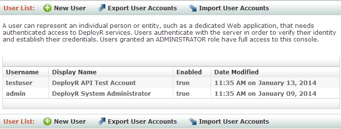
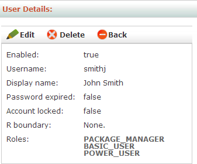
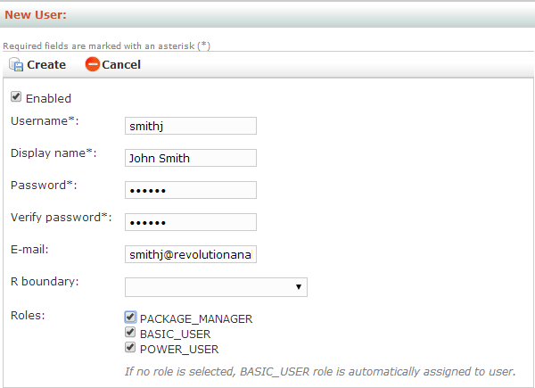
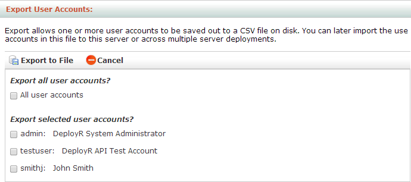
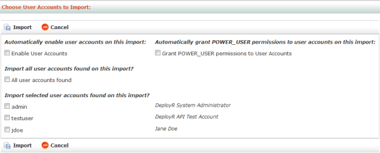

---

# required metadata
title: "DeployR Administration Console Help - DeployR 8.x "
description: "Managing Users in the DeployR Administration Console"
keywords: ""
author: "HeidiSteen"
ms.author: "heidist"
manager: "cgronlun"
ms.date: "11/10/2017"
ms.topic: "conceptual"
ms.prod: "mlserver"

# optional metadata
#ROBOTS: ""
#audience: ""
#ms.devlang: ""
#ms.reviewer: ""
#ms.suite: ""
#ms.tgt_pltfrm: ""
#ms.technology: ""
#ms.custom: ""

---

# Creating & Managing User Accounts

User accounts, which are [created](../deployr/deployr-admin-console-permissions-with-roles.md#creating-custom-roles) and [managed](../deployr/deployr-admin-console-permissions-with-roles.md#viewing-editing-and-assigning-roles) in this Administration Console, provide authenticated access to the DeployR Web Services API, the API Explorer tool, and the Administration Console.  Aside from the `admin` account, user accounts represent script authors, client application developers, or client application end-users.

Each user has an account with [properties](deployr-admin-console-user-accounts.md#user-account-properties) such as their username, password, permissions, and so on. A user can represent an individual or an entity such as a dedicated DeployR client application. The role(s) assigned to users determine their rights to access the console, their rights to access all or some of the API, and in some cases, their rights to access certain scripts. 

When you click **Users** in the main menu, you can review the list of DeployR user accounts. The user list includes the username, display name, account status (enabled or disabled), and the date the account was last modified. If there are more than 20 accounts, click **Next** to proceed to the remaining accounts.

>[!IMPORTANT]
>As an alternative, you can choose another form of [authentication for DeployR](../operationalize/configure-authentication.md), such as Active Directory, LDAP, or PAM.

_Figure: User List page_

>You cannot log in to DeployR from multiple accounts using a single brand of browser program. To use two or more accounts concurrently, you must log in to each one in a separate brand of browser. 

## Preconfigured User Accounts

The following table presents the preconfigured DeployR user accounts and their default passwords.

| Name                                 | Description and Recommendations                                                                                                    |
|--------------------------------------|------------------------------------------------------------------------------------------------------------------------------------|
| `admin`    | A default system administrator account for immediate access to the console.  This account cannot be renamed, disabled, or deleted. |
| `testuser` | A default test account for client developers. We strongly recommend that you disable this account in production deployments. This account comes locked and you’ll need to set a password in order to use it.      |

## User Account Properties

For each user, there are a number of properties that can be defined. The properties of a new account are described in the following table.

|Property|Description|
|---|---|
|`Enabled`|When **Enabled** is selected, the user account is active, thereby allowing this user to access DeployR services on the API. If you uncheck this box, the account is disabled and the user will not have access to the console or the API calls.|
|`Username`|Enter a unique name consisting of at least three alphanumeric characters, but no spaces or symbols.|
|`Display name`|Enter a display name of any combination of up to 50 alphanumeric characters or spaces. When the user logs into the Administration Console, this name appears in the upper right.|
|`Password/Verify Password`|Enter the new password and re-enter it a second time to confirm.|
|`Password Expired`|Whenever this checkbox is selected, the user will be redirected to the DeployR Account Password Reset page the next time the user attempts to login so that they can define a new password. This applies only to basic authentication.|
|`Account Locked`|When this checkbox is selected, the user account is locked. The user will not be permitted to log into the console. This applies only to basic authentication.|
|`R boundary`|Optionally, assign a [boundary](../deployr/deployr-admin-managing-r-boundaries.md) to the user. Boundaries impose a set of runtime constraints on the user when he or she executes code or scripts on the API. **Note**: Grid node boundaries take precedence over user boundaries, and user boundaries take precedence over the server-wide default boundary.|
|`Roles`|Assign [roles](../deployr/deployr-admin-managing-server-policies.md) in order to grant the user permissions to execute API calls, access the Administration Console, access some or all of the event streams, and access certain scripts. If you do not specify any roles, then the `BASIC_USER` is automatically assigned.|

## Viewing and Editing User Accounts

**To view and edit a user account:**

1.  From the main menu, click **Users**. The **User List** page appears.

2.  In the **User List** table, click the name of the user whose account you want to review or edit. The **User Details** page appears.
 
	_Figure: User Details page_

	  

3.  To edit the account, click **Edit**. The **Edit User** page appears.

4.  Make your changes to the [user properties](deployr-admin-console-user-accounts.md#user-account-properties).

5.  Click **Update** to save the changes.

## Creating New User Accounts

**To create a new user:**

1.  From the main menu, click **Users**.  The **User List** page appears.

2.  Click **New User** in the menu bar. The New User page appears.

	_Figure: New User page_
	
         

3.  In the **New User** page, enter all required [properties](deployr-admin-console-user-accounts.md#user-account-properties) for the user account as well as any optional details.

4.  Click **Create** to save the new user.

## Deleting User Accounts

**To delete a user account:**

1. From the main menu, click **Users**. The **User List** page appears.

2. In the **User List** table, click the name of the user whose account you want to delete. The **User Details** page appears and displays the account.

3. Click **Delete**.

4. Click **OK** to confirm that you want to delete the user account.

## Exporting User Accounts

You can export user accounts into a CSV file. Exporting can be used to copy the accounts to another machine or to preserve them as a backup.

>When an account is exported, the assigned boundaries or roles are **not included** in the export. If you import the account later, the `BASIC_USER` role is automatically assigned unless you choose to assign the `POWER_USER` role to all accounts being imported. Keep in mind that you can manually [assign roles](../deployr/deployr-admin-console-permissions-with-roles.md) individually later. 
 
_Figure: Export User Accounts page_
  

**To export:**

1. From the main menu, click **Users**. The **User List** appears.

2. Click **Export User Accounts**.

3. Select the account(s) to be exported.

4. Click **Export to File** and download the file.

## Importing User Accounts

Importing allows you to retrieve all of the accounts from a previously exported CSV file. Alternately, you can also import a CSV file you have created yourself using the proper format. Since role and boundary assignments cannot be exported, all imported user accounts are automatically assigned the `BASIC_USER` role at import time unless you choose to assign the `POWER_USER` role. You can, of course, manually add roles to users later after importing.

>For security reasons, user passwords are not exported. You can add a plain text password manually in the password field in the exported CSV file **prior to import**. 

**To import:**

1. From the main menu, click **Users**.

2. From the **User List**, click **Import User Accounts**.

3. Click **Browse** and select the CSV file to be imported.

4. Click **Load**.
 
	_Figure: Import User Accounts page_
      

5. To disable user accounts so that they do not have access to the server until you are ready, select the **Disable user account** option. You can always enable or disable user accounts individually later.

6. If desired, select the option to **Automatically grant POWER_USER permissions to user accounts on this import**.  It is not always prudent to assign this role to all users so weigh this option carefully. Note that all imported users are automatically assigned to the BASIC_USER role.

	>The `ADMINISTRATOR` and `POWER_USER` roles have implicit permissions to install R packages. The `BASIC_USER` role does not have permissions to manage R packages. To allow a user that was assigned only to the `BASIC_USER` role the rights to install an R package, you must edit the user account after importing and assign the `PACKAGE_MANAGER` role.

7. Choose the account(s) to import.

8. Click **Import**. If a user account by the same name already exists, a message appears to inform you that the incoming account was rejected.
