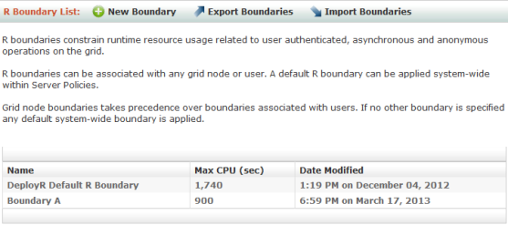
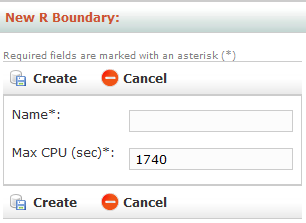
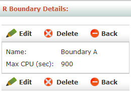
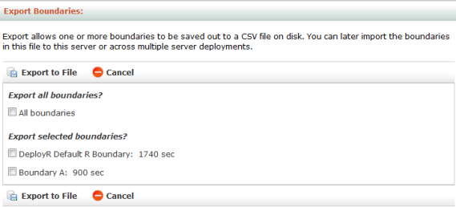
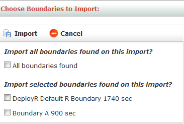

---

# required metadata
title: "DeployR Administration Console Help - DeployR 8.x "
description: "Managing R Boundaries in the DeployR Administration Console"
keywords: ""
author: "HeidiSteen"
ms.author: "heidist"
manager: "cgronlun"
ms.date: "11/10/2017"
ms.topic: "conceptual"
ms.prod: "mlserver"

# optional metadata
#ROBOTS: ""
#audience: ""
#ms.devlang: ""
#ms.reviewer: ""
#ms.suite: ""
#ms.tgt_pltfrm: ""
#ms.technology: ""
#ms.custom: ""

---

# Managing R Boundaries

R boundaries are used to constrain runtime resource usage related to:

- Authenticated operations running on projects
- Asynchronous operations running as background jobs
- Anonymous operations running on stateless projects

R boundaries help manage the optimal allocation of resources across all operations. They also protect the system from poorly written or malicious code that may attempt to consume all system resources in an infinite loop or other threats.

In this Administration Console, you can access and work with R boundaries by clicking **R Boundaries** in the main menu.

Once you create an R boundary, you can assign it to any grid node or user account in the console. Grid node boundaries take precedence over boundaries associated with individual users.

You can also designate a particular R boundary as the [default system-wide R boundary](deployr-admin-managing-server-policies.md#server-policy-properties) to be used whenever no other boundary is indicated.

If you plan to associate R boundaries with grid nodes, we recommend that you create a custom R boundary for each [node operation type](deployr-admin-managing-the-grid.md#node-operation-types) (authenticated, asynchronous, and anonymous operations) supported on the grid.

_Figure: Boundary List page_

  

## Creating New Boundaries

**To create a new boundary:**

1. From the main menu, click **R Boundaries**.

2.  From the **R Boundary List** page, click the **New Boundary** link. The **New R Boundary** page appears.

	_Figure: New R Boundary page_
        
	  

3.  In the **New R Boundary** page, define your boundary, including:

	1.  **Name**. Enter a unique name for the boundary. This field is required.

	2.  **Max CPU (sec)**. Enter the maximum amount of time in seconds that the CPU can be engaged at runtime. If the time limit is exceeded, then an R error is returned at runtime. If you enter a value of 0, this constraint will be ignored.

3.  Click **Create** to save the new boundary.

## Deleting Boundaries

**To delete a boundary:**

1. From the main menu, click **R Boundaries**.

2. From the **R Boundary List** page, click the name of the boundary you want to delete. The **R Boundary Details** page appears.

3. Click **Delete** and confirm the removal of the boundary.

## Viewing and Editing Boundaries

**To view and edit a boundary:**

1.  From the main menu, click **R Boundaries.**

2.  From the **R Boundary List** page, click the name of the boundary you want to view or edit in the table. The **R Boundary Details** page appears.

	_Figure: R Boundary Details page_
        
	  

3.  To edit a boundary, perform the following steps:

	1.  Click **Edit**.

	2.  Make your changes.

	3.  Click **Update** to save the changes.

## Exporting Boundaries

You can export all or selected R boundaries into one `CSV` file. Exporting can be used to copy the boundaries to another machine or to preserve them as a backup. You can later import the contents of this file to this server or across multiple server deployments.

_Figure: Export Boundaries page_

  

**To export:**

1. From the main menu, click **R Boundaries**.

2. From the **R Boundary List**, click **Export Boundaries**.

3. Select the R boundaries you want to export. You can choose to export all of them or individually select the boundaries to be exported.

4. Click **Export to File** and save the file.

## Importing Boundaries

You can import R boundaries from a `CSV` file into the server. This CSV file can come from a previous export or might be a file you created manually using the proper format.

_Figure: Import Boundaries page_

  

**To import:**

1. From the main menu, click **R Boundaries**.

2. From the **R Boundary List**, click **Import Boundaries**.

3. Click **Browse** and select the file to be imported. By default, the file has the CSV file extension.

4. Click **Load**.

5. Choose which R boundaries to import. You can choose to import all of them or individually select the boundaries to import.

6. Click **Import**. If a boundary by the same name already exists, then a message appears to inform you that the incoming boundary was rejected.
