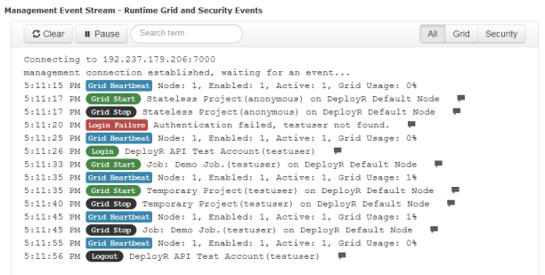

---

# required metadata
title: "DeployR Administration Console Help - DeployR 8.x "
description: "Monitoring Events in the DeployR Administration Console"
keywords: ""
author: "j-martens"
ms.author: "jmartens"
manager: "cgronlun"
ms.date: "11/10/2017"
ms.topic: "article"
ms.prod: "mlserver"

# optional metadata
#ROBOTS: ""
#audience: ""
#ms.devlang: ""
#ms.reviewer: ""
#ms.suite: ""
#ms.tgt_pltfrm: ""
#ms.technology: ""
#ms.custom: ""

---

# Monitoring Events

When you are logged in as admin, you can monitor the runtime grid and security events on the management event stream from the **Home** page.  The management event stream allows you to see runtime grid activity events, grid warning events, and security access events. By default this stream is accessible to admin only; however, access can be changed in the **Server Policies** tab.

 
_Figure: Home tab after login_

  

- Grid activity events that include the starting and stopping of grid operations, such as stateless, temporary, persistent projects and/or jobs

- Grid warning events that occur when the grid runs up against the limits that were defined in the **Concurrent Operation Policies** in the [Server Policies](deployr-admin-managing-server-policies.md#concurrent-operation-policies) tab

- Grid heartbeat events that are pushed regularly and provide a detailed summary of slot activity across all nodes on the grid

- Security events that are pushed when a user attempts to log in (`securityLoginEvent event`) or log out (`securityLogoutEvent event`)
