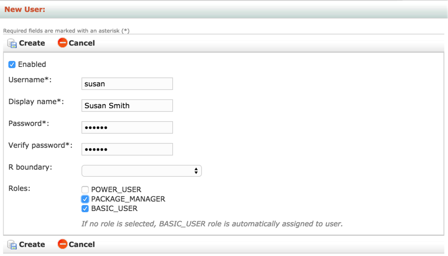

---

# required metadata
title: "R Package Management Guide | DeployR 8.x"
description: "Managing R Packages in DeployR - for DeployR administrators"
keywords: "r packages, DeployR"
author: "j-martens"
ms.author: "jmartens"
manager: "jhubbard"
ms.date: "05/06/2016"
ms.topic: "article"
ms.prod: "microsoft-r"

# optional metadata
#ROBOTS: ""
#audience: ""
#ms.devlang: ""
#ms.reviewer: ""
#ms.suite: ""
#ms.tgt_pltfrm: ""
ms.technology: "deployr"
#ms.custom: ""

---

# R Package Management Guide

**Applies to: DeployR 8.x**   (See [comparison between 8.x and 9.x](../whats-new-in-r-server.md#8vs9))

>Looking for docs for Microsoft R Server 9? [Start here](../what-is-operationalization.md).

## Introduction

As the DeployR administrator, one of your responsibilities is to ensure the R code that runs on the DeployR server has access to the R package dependencies declared within that code. The following sections discuss R package management in this context.

By adopting one or both of the R package management approaches described below, your data scientists can avoid issues where a script they've tested locally now fails due to missing package dependencies when executed in the DeployR server environment.

>**Guideline:** Assign the appropriate permissions for packaging installations and/or install the packages on behalf of your users with `deployrPackage()`.

## Centralized Management

One option is to install a fixed set of default packages across the DeployR grid on behalf of your users. This can be done in a number of ways.

One such approach is to use a master R script that contains all required package dependency declarations for the DeployR server as follows:

1.  In your local environment:

    1.  Install `deployrUtils` locally [from GitHub](https://github.com/Microsoft/deployrUtils/releases) using your IDE, R console, or terminal window with the following commands:

            library(devtools)
            install_github('Microsoft/deployrUtils')

    2.  Create a master R script that you'll use to install the package dependencies across the DeployR grid.

    3.  At the top of that script, declare each package dependency individually using `deployrPackage()`. For the full function help, use `library(help="deployrUtils")` in your IDE.

2.  In your remote DeployR server environment:

    1.  Manually run this R script on a DeployR grid node.

    2.  **Repeat previous step by running the master script manually on every grid node machine.** Running this script on each grid node ensures the full set of packages is installed and available on each node.

>You will have to update and manually rerun this script on each node on the DeployR grid whenever a new package needs to be added to the server environment.

## Decentralized Management

Another option is to [assign permissions](deployr-admin-console-permissions-with-roles.md#viewing-editing-and-assigning-roles) for R package installation to select users. Then, these select users can install the packages they need directly within their code. When you've explicitly assigned the `PACKAGE_MANAGER` role to users, they are granted permissions to install R packages via `deployrUtils::deployrPackage()`.

Also note that the `ADMINISTRATOR` and `POWER_USER` roles have implicit `PACKAGE_MANAGER` rights, while `BASIC_USER` does not. [Read more on default roles...](deployr-admin-console-permissions-with-roles.md#predefined-system-roles)
