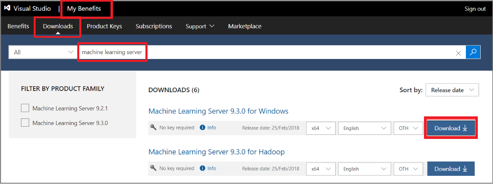

---
# required metadata
title: "Install Machine Learning Server for Windows"
description: "How to install, connect to, and use Machine Learning Server on computers running the Windows operating system."
keywords: ""
author: "HeidiSteen"
ms.author: "heidist"
manager: "cgronlun"
ms.date: "02/16/2018"
ms.topic: "article"
ms.prod: "mlserver"

# optional metadata
#ROBOTS: ""
#audience: ""
#ms.devlang: ""
#ms.reviewer: ""
#ms.suite: ""
#ms.tgt_pltfrm: ""
#ms.technology: ""
#ms.custom: ""

---

# Install Machine Learning Server for Windows

**Applies to:  Machine Learning Serve 9.2.1 | 9.3**

Machine Learning Server for Windows runs machine learning and data mining solutions written in R or Python in standalone and clustered topologies. 

This article explains how to install Machine Learning Server on a standalone Windows server with an internet connection. If your server has restrictions on internet access, see [offline installation](machine-learning-server-windows-offline.md). 

## System requirements

+ Operating system must be a [supported version of 64-bit Windows](r-server-install-supported-platforms.md). 

+ [Operationalization features](../what-is-operationalization.md) (administrator utility, web service deployment, remote sessions (R), web and compute node designations) are supported on Windows Server 2012 R2 or 2016. This functionality is not available on a Windows client.

+ Memory must be a minimum of 2 GB of RAM is required; 8 GB or more are recommended. Disk space must be a minimum of 500 MB.

+ .NET Framework 4.5.2 or later. The installer checks for this version of the .NET Framework and provides a download link if it's missing. A computer restart is required after a .NET Framework installation.

The following additional components are included in Setup and required for Machine Learning Server on Windows.

* Microsoft R Open 3.4.3 (if you add R)
* Anaconda 4.2 with Python 3.5 (if you add Python)
* Azure CLI
* Microsoft Visual C++ 2015 Redistributable
* Microsoft MPI 8.1
* AS OLE DB (SQL Server 2016) provider

## Licensing

Machine Learning Server is licensed as a SQL Server supplemental feature. On development workstations, you can install the developer edition at no charge. 

On production servers, the enterprise edition of Machine Learning Server for Windows is licensed by the core. Enterprise licenses are sold in 2-core packs, and you must have a license for every core on the machine. For example, on an 8-core server, you would need four 2-core packs. For more information, start with the [SQL Server pricing page](https://www.microsoft.com/sql-server/sql-server-2017-pricing).

> [!Note]
> When you purchase an enterprise license of Machine Learning Server for Windows, you can install [Machine Learning Server for Hadoop](machine-learning-server-hadoop-install.md) for free (10 nodes for each core licensed under enterprise licensing).

## Upgrade existing installations

If your existing server was configured for [operationalization](../what-is-operationalization.md), follow these alternative steps for upgrade: 

+ [Configure Machine Learning Server to operationalize analytics (One-box) > How to upgrade](../operationalize/configure-machine-learning-server-one-box.md#how-to-upgrade)
+ [Configure Machine Learning Server to operationalize analytics (Enterprise) > How to upgrade](../operationalize/configure-machine-learning-server-enterprise.md#how-to-upgrade).

For all other configurations, Setup performs an in-place upgrade over existing installations. Although the installation path is new (\Program Files\Microsoft\ML Server), when R Server 9.x is present, setup finds R Server at the old path and upgrades it to the new version. 

There is no support for side-by-side installations of older and newer versions, nor is there support for hybrid versions (such as R Server 9.1 and Python 9.3). An installation is either entirely 9.3 or an earlier version.

## Download Machine Learning Server installer

You can get the zipped installation file from one of the following download sites.

| Site | Edition | Details |
|------|---------|---------|
| [Volume Licensing Service Center (VLSC)](https://go.microsoft.com/fwlink/?LinkId=717966&clcid=0x409) | Enterprise | Sign in, search for "SQL Server 2017", and then choose a per-core licensing option. A selection for **Machine Learning Server 9.3** is provided on this site. |
| [Visual Studio Dev Essentials](https://www.visualstudio.com/dev-essentials/) | Developer (free) | This option provides a zipped file, free when you sign up for Visual Studio Dev Essentials. Developer edition has the same features as Enterprise, except it is licensed for development scenarios. |

For downloads from [Visual Studio Dev Essentials](https://www.visualstudio.com/dev-essentials/):

1. Click **Join or access now** to sign up for download benefits.
2. Check the URL to verify it changed to *https://my.visualstudio.com/*.
3. Click **Downloads**.
4. Search for *Machine Learning Server*.
5. Click **Download** to get the Machine Learning Server installer for Windows.

## How to install

This section walks you through a Machine Learning Server deployment using the standalone Windows installer.

### Run Setup

The setup wizard installs, upgrades, and uninstalls all in one workflow.

1. Extract the contents of the zipped file. On your computer, go to the Downloads folder, right-click **en_machine_learning_server_for_windows_x64_<build-number>.zip** to extract the contents.

2. Double-click **ServerSetup.exe** to start the wizard.

3. In Configure installation, choose components to install. Clearing a checkbox removes the component. Selecting a checkbox adds or upgrades a component. 

    + **Core components** are listed for visibility, but are not configurable. Core components are required.
    + **R** adds R Open and the R libraries.  
    + **Python** adds Anaconda and the Python libraries. 
    + [**Pre-trained Models**](microsoftml-install-pretrained-models.md) are used for image classification and sentiment detection. You can install the models with R or Python, but not as a standalone component.

4. Accept the license agreement for Machine Learning Server, as well as the license agreements for Microsoft R Open and Anaconda.

5. At the end of the wizard, click **Install** to run setup.

> [!NOTE]
> By default, telemetry data is collected during your usage of Machine Learning Server. To turn this feature on or off, see [Opting out of data collection](../resources-opting-out.md).

### Check log files

If there were errors during Setup, check the log files located in the system temp directory. An easy way to get there is typing `%temp%` as a Run command or search operation in Windows. If you installed all components, your log file list looks similar to this screenshot:

  

## Connect and validate

Machine Learning Server executes on demand as R Server or as a Python application. As a verification step, connect to each application and run a script or function.

**For R**

R Server runs as a background process, as **Microsoft ML Server Engine** in Task Manager. Server startup occurs when a client application like [R Tools for Visual Studio](https://docs.microsoft.com/visualstudio/rtvs/installation) or Rgui.exe connects to the server.

1. Go to C:\Program Files\Microsoft\ML Server\R_SERVER\bin\x64.
2. Double-click **Rgui.exe** to start the R Console application.
3. At the command line, type `search()` to show preloaded objects, including the [RevoScaleR package](../r-reference/revoscaler/revoscaler.md). 
4. Type `print(Revo.version)` to show the software version.
5. Type `rxSummary(~., iris)` to return summary statistics on the built-in iris sample dataset. The `rxSummary` function is from RevoScaleR. 

**For Python**

Python runs when you execute a .py script or run commands in a Python console window. 

1. Go to C:\Program Files\Microsoft\ML Server\PYTHON_SERVER.
2. Double-click **Python.exe**.
3. At the command line, type `help()` to open interactive help.
4. Type ` revoscalepy` at the help prompt to print the package contents. 
5. Paste in the following revoscalepy script to return summary statistics from the built-in AirlineDemo demo data:

    ~~~~
    import os
    import revoscalepy 
    sample_data_path = revoscalepy.RxOptions.get_option("sampleDataDir")
    ds = revoscalepy.RxXdfData(os.path.join(sample_data_path, "AirlineDemoSmall.xdf"))
    summary = revoscalepy.rx_summary("ArrDelay+DayOfWeek", ds)  
    print(summary)
    ~~~~

  Output from the sample dataset should look similar to the following:

    ~~~~ 
    Summary Statistics Results for: ArrDelay+DayOfWeek
    File name: ... AirlineDemoSmall.xdf
    Number of valid observations: 600000.0
    
            Name       Mean     StdDev   Min     Max  ValidObs  MissingObs
    0  ArrDelay  11.317935  40.688536 -86.0  1490.0  582628.0     17372.0
    
    Category Counts for DayOfWeek
    Number of categories: 7
    
                Counts
    DayOfWeek         
    1          97975.0
    2          77725.0
    3          78875.0
    4          81304.0
    5          82987.0
    6          86159.0
    7          94975.0
    ~~~~

To quit the program, type `quit()` at the command line with no arguments.

## Enable web service deployment and remote connections

If you installed Machine Learning Server on Windows Server 2012 R2 or Windows Server 2016, [configure the server for operationalization](../operationalize/configure-start-for-administrators.md#configure-server-for-operationalization):

1. Open an Administrator command prompt.
2. Enter the following command to configure the server: `az ml admin bootstrap`

  

This command invokes the Administrator Command Line Interface (CLI), installed by Machine Learning Server and added as a system environment variable to your path so that you can run it anywhere.

You are prompted for a password. This password is used to protect your configuration settings. Anyone using the CLI to modify a configuration must enter the password before access is granted.

The `bootstrap`command  enables operationalization features on a standalone server. It creates and starts a web node and compute node, and runs a series of diagnostic tests against the configuration to confirm the internal data storage is functionality and that web services can be successfully deployed.

If you have multiple servers, you can designate each one as either a web node or compute node, and then link them up. For instructions, see [Configure Machine Learning Server (Enterprise)](../operationalize/configure-machine-learning-server-enterprise.md).

For more information about the benefits of operationalization:

+ [Deploy Python and R script as a web service](../operationalize/concept-what-are-web-services.md) 
+ [Connect to a remote R server for code execution](../r/how-to-execute-code-remotely.md). Remote execution makes the server accessible to client workstations running [R Client](../r-client/install-on-linux.md) or other Machine Learning Server nodes on your network. 

> [!Note]
> Python support is new and there are a few limitations in remote computing scenarios. Remote execution is not supported on Windows or Linux in Python code. Additionally, you cannot set a [remote compute context](../r/concept-what-is-compute-context.md) to HadoopMR in Python. 

## What's installed

An installation of Machine Learning Server includes some or all of the following components.

| Component | Description |
|-----------|-------------|
| Microsoft R Open (MRO) | An open-source distribution of the base R language, plus the Intel Math Kernel library (int-mkl). The distribution includes standard libraries, documentation, and tools like R.exe and RGui.exe.   Tools for the standard base R (RTerm, Rgui.exe, and RScript) are under `<install-directory>\bin`. Documentation is under `<install-directory>\doc` and in `<install-directory>\doc\manual`. One easy way to open these files is to open `RGui`, click **Help**, and select one of the options. |
| R proprietary libraries and script engine | Proprietary libraries are co-located with R base libraries in the `<install-directory>\library` folder. Libraries include RevoScaleR, MicrosoftML, mrsdeploy, olapR, RevoPemaR, and others listed in [R Package Reference](../r-reference/introducing-r-server-r-package-reference.md).   On Windows, the default R installation directory is `C:\Program Files\Microsoft\ML Server\R_SERVER`.   RevoScaleR is engineered for distributed and parallel processing of all multi-threaded functions, utilizing available cores and disk storage of the local machine. RevoScaleR also supports the ability to transfer computations to other RevoScaleR instances on other platforms and computers through compute context instructions. |
| Python proprietary libraries | Proprietary packages provide modules of class objects and static functions. Python libraries are in the `<install-directory>\lib\site-packages` folder. Libraries include revoscalepy, microsoftml, and azureml-model-management-sdk.   On Windows, the default installation directory is `C:\Program Files\Microsoft\ML Server\PYTHON_SERVER`.  |
| Anaconda 4.2 with Python 3.5.2 | An open-source distribution of Python.|
| [Admin CLI](../operationalize/configure-admin-cli-launch.md) | Used for enabling remote execution and web service deployment, operationalizing analytics, and configuring web and compute nodes.| 
| [Pre-trained models](microsoftml-install-pretrained-models.md) | Used for sentiment analysis and image detection. |

Consider adding a development tool on the server to build script or solutions using R Server features:

+ [Visual Studio 2017](https://www.visualstudio.com/downloads/) followed by the [R Tools for Visual Studio (RTVS) add-in](https://docs.microsoft.com/visualstudio/rtvs/installation) and the [Python for Visual Studio (PTVS)](https://www.visualstudio.com/vs/python/).

## Next steps

We recommend starting with any Quickstart tutorial listed in the contents pane. 

## See also

+ [Install Machine Learning Server](r-server-install.md)
+ [What's new in Machine Learning Server](../whats-new-in-machine-learning-server.md)
+ [Supported platforms](r-server-install-supported-platforms.md)  
+ [Known Issues](../resources-known-issues.md)  
+ [Configure Machine Learning Server to operationalize your analytics](../what-is-operationalization.md) 
+ [R Function Reference](../r-reference/introducing-r-server-r-package-reference.md)
+ [Python Function Reference](../python-reference/introducing-python-package-reference.md)