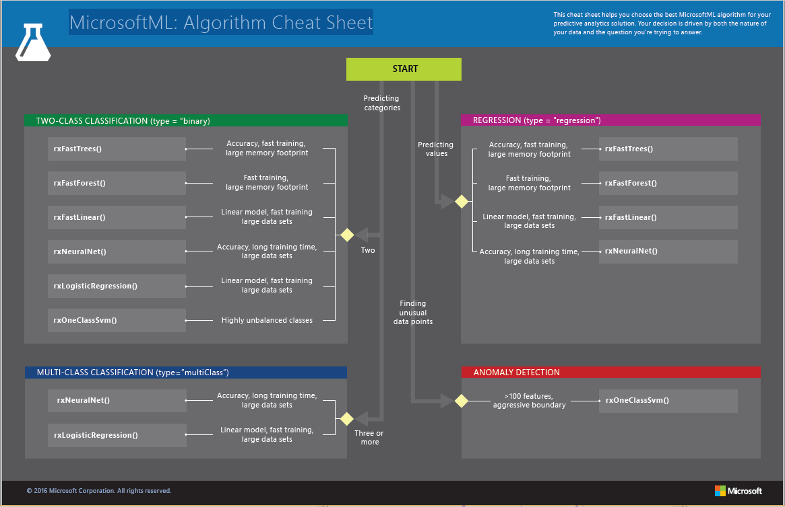

---

# required metadata
title: "Cheat Sheet: How to choose a MicrosoftML algorithm"
description: "A printable machine learning algorithm cheat sheet that helps you choose the right MicrosoftML algorithm for your predictive model when using Microsoft 
R Server."
keywords: "MicrosoftML"
author: "bradsev"
manager: "jhubbard"
ms.date: "06/20/2017"
ms.topic: "article"
ms.prod: "microsoft-r"
ms.service: ""
ms.assetid: ""

# optional metadata
ROBOTS: ""
audience: ""
ms.devlang: ""
ms.reviewer: ""
ms.suite: ""
ms.tgt_pltfrm: ""
ms.technology: "r-server"
ms.custom: ""

---

# Cheat Sheet: How to choose a MicrosoftML algorithm

The **MicrosoftML: Algorithm Cheat Sheet** helps you choose the right machine learning algorithm for a predictive analytics model when using Microsoft R Server.

MicrosoftML provides a library of algorithms from the  ***regression***, ***classification (two-class and multi-class)***, and ***anomaly detection*** families. Each is designed to address a different type of machine learning problem.

## Download the MicrosoftML Algorithm Cheat Sheet
**Download the cheat sheet here: [MicrosoftML: Algorithm Cheat Sheet (11x17 in.)](http://download.microsoft.com/download/B/3/1/B31FE451-E69B-4569-9B32-CFA9FB40027E/microsoftml-algorithm-cheat-sheet-v1.pdf)**

Download and print the **MicrosoftML: Algorithm Cheat Sheet** in tabloid size to keep it handy for guidance when choosing a machine learning algorithm.

## More help with algorithms

For a list by category of all the machine learning algorithms available in the MicrosoftML package, see [MicrosoftML functions](microsoftml/microsoftml.md).

## Notes and terminology definitions for the machine learning algorithm cheat sheet

* The suggestions offered in this algorithm cheat sheet are approximate rules-of-thumb. Some can be bent and some can be flagrantly violated. This sheet is only intended to suggest a starting point. Don’t be afraid to run a head-to-head competition between several algorithms on your data. There is simply no substitute for understanding the principles of each algorithm and understanding the system that generated your data.

* Every machine learning algorithm has its own style or *inductive bias*. For a specific problem, several algorithms may be appropriate and one algorithm may be a better fit than others. But anticipating which will be the best fit beforehand is not always possible. In cases like these, several algorithms are listed together in the cheat sheet. An appropriate strategy would be to try one algorithm, and if the results are not yet satisfactory, try the others. 

* Two categories of machine learning are supported by MicrosoftML: **supervised learning** and **unsupervised learning**.

  * In **supervised learning**, each data point is labeled or associated with a category or value of interest. The goal of supervised learning is to study many labeled examples like these, and then to be able to make predictions about future data points. All of the algorithms in MicrosoftML are supervised learners except `rxOneClassSvm()` used for anomaly detection.

  * In **unsupervised learning**, data points have no labels associated with them. Instead, the goal of an unsupervised learning algorithm is to organize the data in some way or to describe its structure. Only the `rxOneClassSvm()` algorithm used for anomaly detection is an unsupervised learner.

## What's next?

[Quickstarts for MicrosoftML](microsoftml-quickstarts.md) shows how to use pretrained models for sentiment analysis and image featurization.

