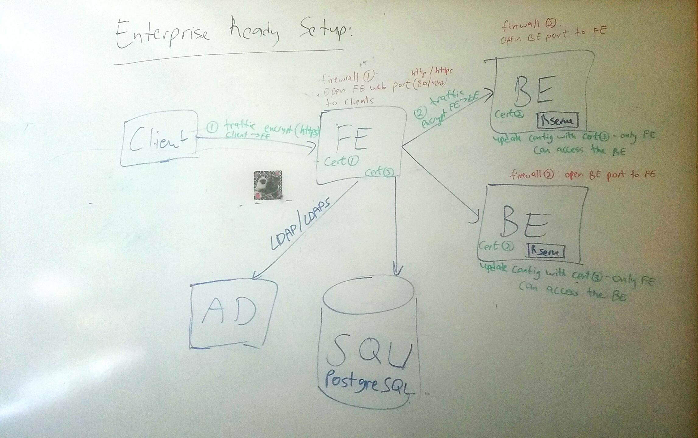

---

# required metadata
title: "Operationalization with R Server"
description: "Operationalization of R Analytics with Microsoft R Server"
keywords: ""
author: "j-martens"
manager: "jhubbard"
ms.date: "05/06/2016"
ms.topic: "get-started-article"
ms.prod: "microsoft-r"
ms.service: ""
ms.assetid: ""

# optional metadata
ROBOTS: ""
audience: ""
ms.devlang: ""
ms.reviewer: ""
ms.suite: ""
ms.tgt_pltfrm: ""
ms.technology: 
  - deployr
  - r-server
ms.custom: ""
---

# DeployR Configuration Scenarios

To operationalize your R analytics, you must configure Microsoft R Server after installation to enable the operationalization feature. 

The simplest configuration for this feature involves a single front-end and back-end, called a **one-box** configuration. These components are defined as follows:

+ A **front-end** acts as a http REST endpoint with which DeployR users can interact directly to make API calls. It can also access data in the database, and send jobs to be computed on the back-end. 

+ A **back-end** is used to execute R code as a session or service.

In addition to the one-box configuration, you can also install multiple components on multiple machines, which is referred to as an  **enterprise** configuration. 

## The Basic One-Box Configuration

With one-box configurations, as the name suggests, everything runs on a single machine and set-up is a breeze. This configuration includes an operationalization front-end and back-end on the same machine. It also relies on the default local SQLite database.

This configuration is useful when you want to explore what it is to operationalize R analytics using R Server. It is perfect for testing, proof-of-concepts, and small-scale prototyping, but might not be appropriate for production usage. 

Learn how to [set up a one-box configuration](configuration-initial.md#enterprise) for operationalization.

## The Enterprise Configuration

With an enterprise configuration, you can work with your production-grade data within a scalable, multi-machine setup, and benefit from enterprise-grade security. 

This configuration includes one or more front-ends and back-ends on a group of machines. These front-ends and back-ends can be scaled independently.  For added security, you can authenticate against [Active Directory (LDAP) or Azure Active Directory](security-authentication.md) and [configure SSL](security-https.md) for DeployR.

Additionally, when you have multiple front-ends, you must set up a [remote SQL Server or PostgreSQL database](configure-remote-database.md) so that data can be shared across front-end services.
 
Learn how to [set up an enterprise configuration](configuration-initial.md#enterprise) for operationalization.

