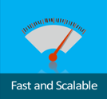

---

# required metadata
title: "Operationalization of R Analytics | Microsoft R Server Docs"
description: "Operationalization of R Analytics with Microsoft R Server"
keywords: ""
author: "j-martens"
manager: "jhubbard"
ms.date: "12/08/2016"
ms.topic: "get-started-article"
ms.prod: "microsoft-r"
ms.service: ""
ms.assetid: ""

# optional metadata
ROBOTS: ""
audience: ""
ms.devlang: ""
ms.reviewer: ""
ms.suite: ""
ms.tgt_pltfrm: ""
ms.technology: 
  - deployr
  - r-server
ms.custom: ""
---

# Operationalization with R Server

**Applies to:  Microsoft R Server 9.0.1**  &nbsp;&nbsp;&nbsp;&nbsp;&nbsp; (Find older "DeployR 8.x" documentation [here](../deployr-about.md).)

Today, more and more businesses are adopting advanced analytics for mission critical decision making in areas such as fraud detection, healthcare and manufacturing. Typically, the data scientists first build out the predictive models and only then can businesses deploy those models in a production environment and consume them for predictive actions. 

## Solving Long Development Lifecycles

R is a great modeling tool, but **the challenge lies in how to effectively operationalize R**. Traditionally, this has not been an easy process (slow innovation and error-prone) and it can take months to rewrite these models before you can use them. 

 

Introducing Microsoft R Server, the operationalization engine for your advanced R analytics. Regardless of the source, language or method, you can simplify, deploy, and realize the promise and power of advanced analytics.

<!--
## What You Get with R Server Operationalization

Once you [configure R Server for operationalization](configuration-initial.md) for R Server, you can: 

||Key Operationalization Features|
|-|-|
||● Data scientists turn R analytics into Web services in one line of code ● Developers use Swagger-based [REST APIs](api.md) that are [easy to consume](app-developer-get-started.md)  &nbsp; &nbsp; with any programming languages including R|
||● Deploy [web service servers to any platform: Windows, SQL, Linux/Hadoop](configuration-initial.md) ● Do so on-premise or in the cloud|
||● Perform fast scoring: real time & batch  ● Scale to a grid for powerful computing with load balancing ● Use [diagnostic](admin-diagnostics.md) and [capacity evaluation](admin-evaluate-capacity.md) tools|
||● Integrate with [enterprise authentication (AD/LDAP or Azure AD)](security-authentication.md) ● Connect securely: [HTTPS with SSL/TLS 1.2](security-https.md) ● Enterprise grade high availability|
-->

## "Best In Class" Deployment Experience

Microsoft R Server offers the **best-in-class deployment** experience. 

+ **Administrator**. The [easy set-up](configuration-initial.md) of Microsoft R Server's operationalization feature includes **enterprise grade security and reliability** on many platforms. It scales for business-critical applications and offers support for production-grade workloads and high availability, as well as seamless integration with popular enterprise security solutions such as [LDAP/Active Directory and Azure Active Directory](security-authentication.md). Connections can be secured [SSL/TLS 1.2](security-https.md) You can also use the [diagnostic](admin-diagnostics.md) and [capacity evaluation](admin-evaluate-capacity.md) tools provided. Check out this [Administrator Get Started](admin-get-started.md) guide.

+ **Data Scientists**. In a single line of code, data scientists can deploy  models or any arbitrary R code as web services. 

+ **Application Developers**. Using their favorite development environment, developers can easily integrate those web services into their apps using Swagger-based [REST APIs](api.md) with any programming languages including R.  They can perform fast scoring: real time & batch. Check out this [Application Developer Get Started](app-developer-get-started.md) guide.

## Powerful, Predictive Analytics

Microsoft R Server is a **powerful scoring engine** for your advanced analytics that allows you to **deploy anywhere**. 

You can deploy [web service servers to any platform: Windows, SQL, Linux/Hadoop](configuration-initial.md) on-premise or in the cloud.  It allows you to model in one platform and score in another. You can model on-premise, and then score your data in the cloud, or vice versa.  With Microsoft R Server, it is easier and faster to use the power of the R language in production so you can unlock insights hidden in your data. 

R Server's operationalization feature fits perfectly into the predictive analytics process. The steps in that process (at a high-level) include:
+ **Prepare**:  Assemble, cleanse, profile and transform diverse data relevant to the subject.
+ **Model**:  Use of statistical and machine learning algorithms to build classifiers and predictions
+ **Operationalize**:  Apply predictions and visualizations to support business applications

 

 

<iframe src="https://www.youtube.com/embed/InP1UO8BNSo" width="600" height="400" allowFullScreen frameBorder="0"></iframe>
