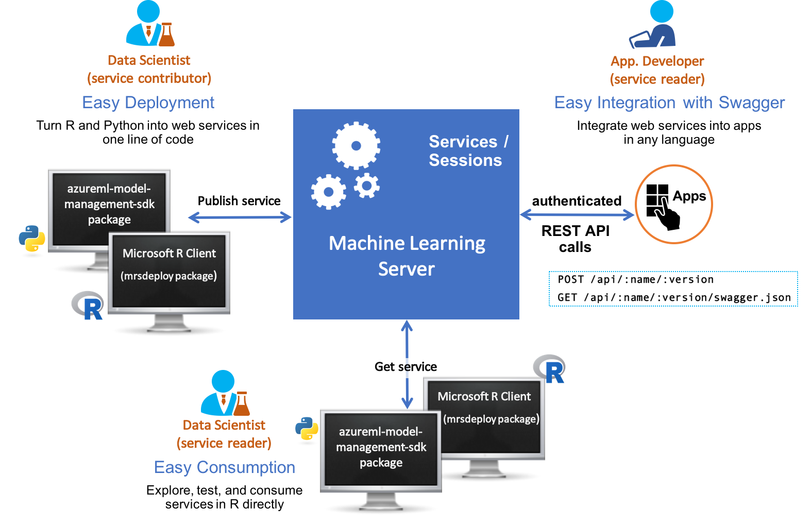

---

# required metadata
title: "What is operationalization of web services - Machine Learning Server "
description: "Operationalize Your Analytics with Machine Learning Server Get Started"
keywords: ""
author: "j-martens"
ms.author: "jmartens"
manager: "jhubbard"
ms.date: "10/12/2017"
ms.topic: "get-started-article"
ms.prod: "microsoft-r"

# optional metadata
#ROBOTS: ""
#audience: ""
#ms.devlang: ""
#ms.reviewer: ""
#ms.suite: ""
#ms.tgt_pltfrm: ""
ms.technology: 
  - deployr
  - r-server
#ms.custom: ""
---

# What is operationalization?

**Applies to: Machine Learning Server, Microsoft R Server 9.x**

Operationalization refers to the process of deploying R and Python models and code to Machine Learning Server in the form of [web services](concept-what-are-web-services.md) and the subsequent consumption of these services within client applications to affect business results.

Today, more businesses are adopting advanced analytics for mission critical decision making. Typically, data scientists first build the predictive models, and only then can businesses deploy those models in a production environment and consume them for predictive actions. 

Being able to operationalize your analytics is a central capability in Machine Learning Server. After installing Machine Learning Server on select platforms, you'll have everything you need to [configure the server to securely host R and Python analytics web services](configure-start-for-administrators.md#configure-server-for-operationalization).  For details on which platforms, see [Supported platforms](configure-start-for-administrators.md#supported-platforms).

Data scientists work locally with [Microsoft R Client](../r-client-get-started.md) or Machine Learning Server in their preferred IDE and favorite version control tools to build scripts and models. Using the mrsdeploy R package and/or the azureml-model-management-sdk Python package that ships the products, the data scientist can develop, test, and ultimately deploy these R and Python analytics as web services in their production environment. 

Once deployed, the analytic web service is available to a broader audience within the organization who can then, in turn, consume the analytics. Machine Learning Server provides the operationalizing tools to deploy R and Python analytics inside web, desktop, mobile, and dashboard applications and backend systems. Machine Learning Server turns your scripts into analytics web services, so R and Python code can be easily executed by applications running on a secure server.

Support for Python was added in Microsoft Machine Learning Server 9.2.1.

 

 
 

<iframe width="560" height="315" src="https://www.youtube.com/embed/7i19-s9mxJU" frameborder="0" allowfullscreen></iframe>

## What you'll need

You'll develop your R and Python analytics locally, deploy them to Machine Learning Server as web services, and then consume or share them.

**On the local client**, you'll need to install:
+ [Microsoft R Client](../r-client-get-started.md) if working with R code.  You'll also need to [configure the R IDE](https://msdn.microsoft.com/en-us/microsoft-r/r-client-get-started#step-2-configure-your-ide) of your choice, such as R Tools for Visual Studio, to run Microsoft R Client.  After you have this set up, you can develop your R analytics in your local R IDE using the functions in [the mrsdeploy package](../r-reference/mrsdeploy/mrsdeploy-package.md) that was installed with Microsoft R Client (and R Server). 
+ [Local Python interpreter](../install/python-libraries-interpreter.md) if working with Python code.  After you have this set up, you can develop your Python analytics in your local interpreter using the functions in the [azureml-model-management-sdk Python package](../python-reference/azureml-model-management-sdk/azureml-model-management-sdk.md).

**On the remote server**, you'll need the connection details and access to an instance of [Machine Learning Server](../what-is-microsoft-r-server.md) with its [operationalization feature configured](configure-start-for-administrators.md#configure-server-for-operationalization). After Machine Learning Server is configured for operationalization, you'll be able to [connect to it from your local machine](how-to-connect-log-in-with-mrsdeploy.md), deploy your models and other analytics to Machine Learning Server as web services, and finally consume or share those services. Please contact your administrator for any missing connection details.

## More resources

This section provides a quick summary of useful links for data scientists operationalizing R and Python analytics with Machine Learning Server.

**Key Documents**
+ [What are web services?](concept-what-are-web-services.md)

+ For R users:
    + [Quickstart: Deploying an R model as a web service](quickstart-publish-r-web-service.md)
    + [Functions in mrsdeploy package](../r-reference/mrsdeploy/mrsdeploy-package.md)
    + [Connecting to R Server from mrsdeploy](how-to-connect-log-in-with-mrsdeploy.md)
    + [Working with web services in R](how-to-deploy-web-service-publish-manage-in-r.md)
    + [Asynchronous batch execution of web services in R](how-to-consume-web-service-asynchronously-batch.md)
    + [Execute on a remote Machine Learning Server](../r/how-to-execute-code-remotely.md)

+ For Python users:
    + [Quickstart: Deploying an Python model as a web service](python/quickstart-deploy-python-web-service.md)
    + [Functions in azureml-model-management-sdk package](../python-reference/azureml-model-management-sdk/azureml-model-management-sdk.md)    
    + [Connecting to Machine Learning Server in Python](python/how-to-authenticate-in-python.md)    
    + [Working with web services in Python](python/how-to-deploy-manage-web-services.md)    
    + [How to consume web services in Python synchronously (request/response)](python/how-to-consume-web-services.md)    
    + [How to consume web services in Python asynchronously (batch)](python/how-to-consume-web-services-async.md)    
 
+ [What's new in Machine Learning Server](../whats-new-in-r-server.md)

+ [The differences between DeployR and R Server 9.x Operationalization](https://blogs.msdn.microsoft.com/rserver/2017/05/11/1885/).

+ [How to integrate web services and authentication into your application](how-to-build-api-clients-from-swagger-for-app-integration.md)

+ [Get started for Administrators](configure-start-for-administrators.md)

+ [User Forum](https://social.msdn.microsoft.com/Forums/en-US/home?forum=microsoftr)

