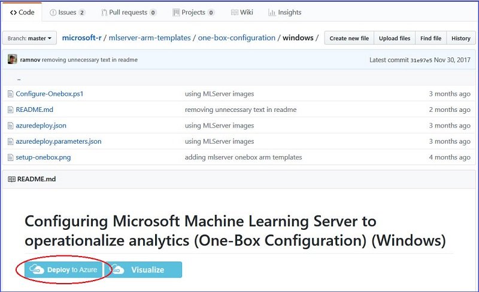
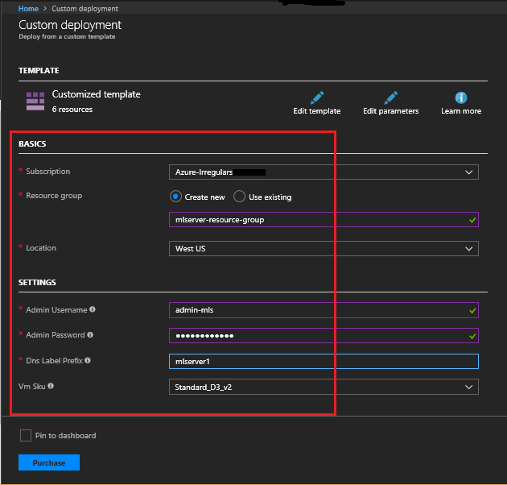
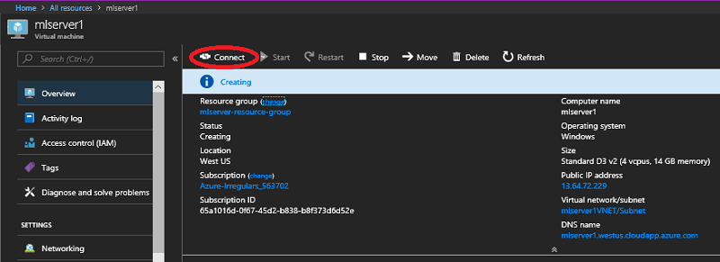
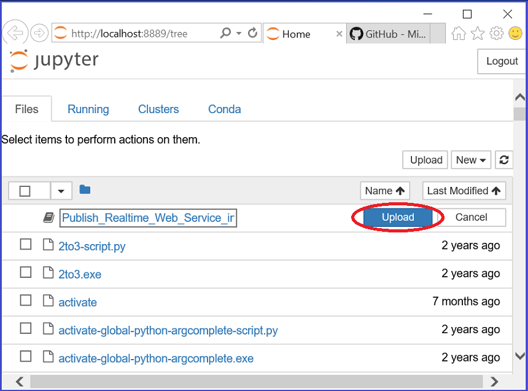
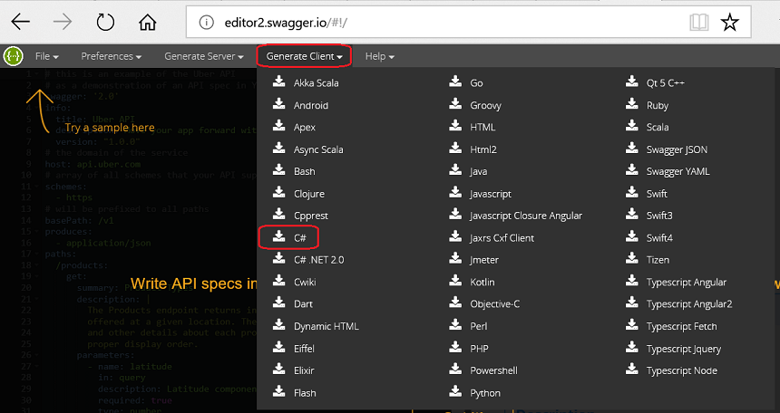

---

# required metadata
title: "Quickstart: Integrate a realtime web service into an application using Swagger - Machine Learning Server"
description: "In this quickstart you learn how to deploy an python model as a service into an application using Swagger."
keywords: "quickstart, Machine Learning Server, deploy python models, realtime web service, Swagger"
author: "bradsev"
ms.author: "bradsev"
manager: "cgronlun"
ms.date: "03/07/2018"
ms.topic: "quickstart"
ms.prod: "mlserver"
ms.custom: "mvc"

# optional metadata
#ROBOTS: ""
#audience: ""
#ms.devlang: ""
#ms.reviewer: ""
#ms.suite: ""
#ms.tgt_pltfrm: ""
#ms.technology: ""

---
# Quickstart: Integrate a realtime web service into an application using Swagger

**Applies to: Microsoft Learning Server 9.x**

This quickstart shows how to use a Swagger-generated client to consume a Python model deployed as a realtime web service in Machine Learning Server. A web service is a model or code that has been deployed and hosted in a server. Realtime web services only accept models created with the functions supported by the packages installed with the product. The [revoscalepy](./../../python-reference/revoscalepy/revoscalepy-package.md) package installed on the Machine Learning Server supports the `rx_lin_mod` function used by the linear model in this quickstart.

This quickstart shows you how to:

- deploy a Machine Learning Server in Azure
- create a realtime web service from a Python script
- use Swagger to integrate the service into a C# application.

This quickstart has been designed for new users and is self-contained. You must have an [Azure subscription](https://azure.microsoft.com/en-us/free/) and [Visual Studio](https://www.visualstudio.com/downloads/), or some other IDE for developing a C# application, installed to complete it. It also assumes some familiarity with Python and C#. After you have deployed the Machine Learning Server on Azure, this quickstart takes approximately 10 minutes to complete.

## Deploy Machine Learning Server with an ARM template

You can configure a Machine Learning Server to act as a deployment server and host analytic web services. Machine Learning Server web services can be operationalized in two types of configuration:

- **One-box configuration**: includes one web node and one compute node that run on a single machine. This configuration is useful when you want to explore what is needed to operationalize R or Python analytics.
- **Enterprise configuration**: where multiple nodes are configured on multiple machines along with other enterprise features. This configuration can be scaled out or in by adding or removing nodes.

This quickstart uses the one-box configuration on windows. The deployment is automated using an ARM template. Go to [OneBox Configuration for Windows](https://github.com/Microsoft/microsoft-r/tree/master/mlserver-arm-templates/one-box-configuration/windows) and click the **Deploy to Azure** button to deploy the ARM Templates. 

This takes you to the **Custom deployment** page in the Azure portal where you need to supply values for basics and settings in the red-started fields.

Agree to the Terms and Conditions and click **Purchase**. Find the **mlserver** resource in **All resources**, click **Connect** after the sever has been created.

Click **Open** and then click **Connect** again on the **Remote Desktop Connection** window. Use the credentials you specified when creating the server when prompted and then click **OK** to log in. Ignore the RDP warning that the certificate cannot be authenticated.

For more information on options for configuring a server for operationalization, see [Manage and configure Machine Learning Server for operationalization](./../../operationalize/configure-start-for-administrators.md)

## Deploy a Python model as a web service in Machine Learning Server

In this step, you build a linear model to predict the ratings from the data in the other columns (complaints, privileges, learning, raises, critical, advance) of the attitude dataset and publish it as a web service. 

This quickstart walks you through the individual steps needed for the two tasks in this section. But it also summarizes the commands after the walkthrough in a script that execute all of the commands needed to build and deploy the web service and provides a link to a Jupyter notebook that contains these (and some additional) commands.

To launch Python command window, open **File Explorer**, copy the full path to the executable: 

    C:\Program Files\Microsoft\ML Server\PYTHON_SERVER\python.exe

Paste it into **Address Bar** of **File Explorer** and press **Enter**.

 
### Read in the attitude dataset

From your local machine, read in the data that you use to build the linear model. We use the attitude dataset .

	#-- Import the dataset from the microsoftml package
	from microsoftml.datasets.datasets import DataSetAttitude
	attitude = DataSetAttitude()
	
	# -- Represent the dataset as a dataframe.
	attitude = attitude.as_df().drop('Unnamed: 0', axis = 1).astype('double')
	
	# -- print top rows of data to inspect the data
	attitude.head()

**OUTPUT:**

	   rating  complaints  privileges  learning  raises  critical  advance
	0    43.0        51.0        30.0      39.0    61.0      92.0     45.0
	1    63.0        64.0        51.0      54.0    63.0      73.0     47.0
	2    71.0        70.0        68.0      69.0    76.0      86.0     48.0
	3    61.0        63.0        45.0      47.0    54.0      84.0     35.0
	4    81.0        78.0        56.0      66.0    71.0      83.0     47.0

### Authenticate and initiate the DeployClient

This quickstart uses the local 'admin' account for authentication. The following code imports the [DeployClient](./../../python-reference/azureml-model-management-sdk/deploy-client.md) and [MLServer](./../../python-reference/azureml-model-management-sdk/mlserver.md) classes from the [azureml-model-management-sdk package](./../../python-reference/azureml-model-management-sdk/azureml-model-management-sdk.md) that are used to connect to Machine Learning Server.

	# -- Import the DeployClient and MLServer classes --
	# -- from the azureml-model-management-sdk package.
	from azureml.deploy import DeployClient
	from azureml.deploy.server import MLServer

Then replace YOUR_ADMIN_PASSWORD with the administrator password that you used to create the server (but do not use the administrator name in place of admin in the `context` - it must use 'admin') in the following code and run it:
	
	# -- Define the location of the ML Server --
	# -- for local onebox for Machine Learning Server: http://localhost:12800
	# -- Replace with connection details to your instance of ML Server. 
	HOST = 'http://localhost:12800'
	context = ('admin', 'YOUR_ADMIN_PASSWORD')
	client = DeployClient(HOST, use=MLServer, auth=context)

There are several ways to authenticate with Machine Learning Server on-premises or in the cloud. To learn more about connecting to Machine Learning Server in Python, see [Authenticate with Machine Learning Server in Python with azureml-model-management-sdk](./../../operationalize/python/how-to-authenticate-in-python.md).

### Create and run a linear model locally

Now that you are authenticated, you can use the [rx_lin_mod](./../../python-reference/revoscalepy/rx-lin-mod.md) function from the [revoscalepy package](./../../python-reference/revoscalepy/revoscalepy-package.md) to build the model. The following code creates a Generalized Linear Model (GLM) using the imported attitude dataset:

	# -- Import the needed classes and functions
	from revoscalepy import rx_lin_mod, rx_predict
	
	# -- Use rx_lin_mod from revoscalepy package
	# -- Create glm model with `attitude` dataset
	df = attitude
	form = "rating ~ complaints + privileges + learning + raises + critical + advance"
	model = rx_lin_mod(form, df, method = 'regression')

**OUTPUT:**

	Rows Read: 30, Total Rows Processed: 30, Total Chunk Time: 0.001 seconds
	Computation time: 0.006 seconds.

This model can now be used to estimate the ratings expected from the attitude dataset. The following code shows how to make some predictions locally to test the model:
	
	# -- Provide some sample inputs to test the model
	myData = df.head(5)
	
	# -- Predict locally
	print(rx_predict(model, myData))

**OUTPUT:**

	Rows Read: 1, Total Rows Processed: 1, Total Chunk Time: 0.001 seconds
		rating_Pred
	0    51.110295
	1    61.352766
	2    69.939441
	3    61.226842
	4    74.453799

### Publish the model as a realtime web service

To publish any model as a realtime service, you must first serialize the model object using the revoscalepy [rx_serialize_model](./../../python-reference/revoscalepy/rx-serialize-model.md) function.

	# Import the needed classes and functions
	from revoscalepy import rx_serialize_model
	
	# Serialize the model with rx_serialize_model
	s_model = rx_serialize_model(model, realtime_scoring_only=True)

Initiate a [realtimeDefinition](./../../python-reference/azureml-model-management-sdk/realtime-definition.md) object from the [azureml-model-management-sdk package](./../../python-reference/azureml-model-management-sdk/azureml-model-management-sdk.md) to publish the linear model as a realtime Python web service to Machine Learning Server.

	service = client.realtime_service("LinModService") \
		.version('1.0') \
		.serialized_model(s_model) \
		.description("This is a realtime model.") \
		.deploy()

Verify that the web service results match the results obtained when the model was run locally. To consume the realtime service, call `.consume` on the realtime [service](./../../python-reference/azureml-model-management-sdk/service.md) object. You can consume the model using the [Service](./../../python-reference/azureml-model-management-sdk/service.md) object returned from `.deploy()` because you are in the same session as the one you in which you deployed.

	# -- To consume the service, pluck out the named output: outputData. --​
	print(service.consume(df.head(5)).outputs['outputData'])

**OUTPUT:**

		rating_Pred
	0    51.110295
	1    61.352766
	2    69.939441
	3    61.226842
	4    74.453799

To delete the service, use the following code:

	client.delete_service('LinModService', version='1.0')

**OUTPUT:**

	True

### Summary Python script

This script can be run with Python.exe to create the model and deploy it as a web service. Replace YOUR_ADMIN_PASSWORD in the `context` with the administrator password that you used to create the server. Copy the entire script and paste it at the Python command prompt by right-clicking. 

	from microsoftml.datasets.datasets import DataSetAttitude
	attitude = DataSetAttitude()
	attitude = attitude.as_df().drop('Unnamed: 0', axis = 1).astype('double')
	attitude.head()
	from azureml.deploy import DeployClient
	from azureml.deploy.server import MLServer
	HOST = 'http://localhost:12800'
	context = ('admin', 'YOUR_ADMIN_PASSWORD')
	client = DeployClient(HOST, use=MLServer, auth=context)
	from revoscalepy import rx_lin_mod, rx_predict
	df = attitude
	form = "rating ~ complaints + privileges + learning + raises + critical + advance"
	model = rx_lin_mod(form, df, method = 'regression')
	myData = df.head(5)
	print(rx_predict(model, myData))
	from revoscalepy import rx_serialize_model
	s_model = rx_serialize_model(model, realtime_scoring_only=True)
	service = client.realtime_service("LinModService") \
		.version('1.0') \
		.serialized_model(s_model) \
		.description("This is a realtime model.") \
		.deploy()
	print(service.consume(df.head(5)).outputs['outputData'])

### Use a Jupyter Notebook

There is also a [Publish_Realtime_Web_Service_in_Python.ipynb](https://github.com/Microsoft/ML-Server-Python-Samples/blob/master/operationalize/Publish_Realtime_Web_Service_in_Python.ipynb) Jupyter Notebook that can be used on the Machine Learning Server to build  and deploy this model as a web service. 

First you must download the notebook from the Microsoft Machine Learning Python Samples Github repo onto your server:

1. Go to the [Microsoft Machine Learning Python Samples](https://github.com/Microsoft/ML-Server-Python-Samples) repo from your Machine Learning Server.
2. Click on the **Clone or download** button and select the **Download ZIP** option.
3. Select **Save** and **Open folder**, right click on the *ML-Server-Python-Samples-master.zip* folder and select **Extract All...** and then **Extract** to your preferred location. The Download directory is used by default.

To run the Publish_Realtime_Web_Service_in_Python.ipynb Jupyter Notebook:

1. Open the File Explorer, navigate to *C:\Program Files\Microsoft\ML Server\PYTHON_SERVER\Scripts*
2. To open the Notebook Dashboard in your default browser at http://localhost:8888/tree, right-click and select **Run as administrator** on jupyter-notebook.exe.
3. To load the Notebook, Click on Upload on the http://localhost:8888/tree page and navigate to the Publish_Realtime_Web_Service_in_Python.ipynb notebook and click **Open**. The default location is C:\Users\admin-mls\Downloads\ML-Server-Python-Samples-master\ML-Server-Python-Samples-master\operationalize.
4. To open the Publish_Realtime_Web_Service_in_Python.ipynb Notebook, click on **Upload** opposite it and then double click on the notebook to open it:

## Build API clients with the Swagger file

### Get the Swagger file

1. To save to Swagger JSON file to a specified location (in the example C:\\Users\\\Public\\Downloads\\), run the following commands from the Python prompt in the VM:
	
		# Print and save the service swagger to a json file 
		print(service.swagger())
		with open("C:\\Users\\\Public\\Downloads\\linmodservice-swagger.json", "w") as swagger_file:
    		swagger_file.write("%s" % service.swagger())
		# This returns 16767

2. Open the linmodservice-swagger.json file and copy the contents.
3. Go to [Swagger](https://swagger.io) homepage on your main machine.
2. From the **Tools** menu on the homepage, choose **Swagger Tools** -> **Swagger Editor**.
3. Choose button for the **Online Editor**.
4. Delete the contents in the editor window on the left and past in the contents of the linmodservice-swagger.json file.

### Generate the client

1. Click the **Generate Client** button on the toolbar and choose the language for the client. 

2. Choose the C# client and save the csharp-client-generated.zip file to your preferred location and extract the zip file. 

### Create the C# client to consume the web service

1. Open the IO.Swagger.sln from the unzipped ..\csharp-client-generated\csharp-client folder with Visual Studio.
2. To add a C# console application to the solution, right-click the **Solution 'IO.Swagger'**  in the **Solution Explorer** -> **Add** -> **New Project...** -> **Visual C#** -> **Web** -> **.NET Core** -> **ConsoleApp**.
3. Accept the default name "ConsoleApp1" and click **OK**. 
4. To make it the main application, right-click the **ConsoleApp1** project and select **Set as StartUp Project**.
5. To add the IO.Swagger application as a dependency, right-click the **ConsoleApp1** project and select **Build Dependencies** ->**Project Dependencies...**. On the Dependencies tab check the **IO.Swagger** box in the **Depends on** window and click **OK**. (The IO.Swagger.Test application can be ignored for our purposes.)
6. Right-click the **ConsoleApp1** project and select **Add** -> **Reference...** -> **Projects**. Check the **IO.Swagger** box and click **OK**.
7. To add the RestSharp and NewtonSoft.Json libraries to ConsoleApp1, right-click on the IO.Swagger Solution in the **Solution Explorer**, select **Manage NuGet Packages for Solution...** and specify and install the versions of the RestSharp and NewtonSoft.Json packages for ConsoleApp1 that match the versions used in IO.Swagger.
8. To add references the installed RestSharp and NewtonSoft.Json dlls, right-click on the ConsoleApp, select **Add** -> **Reference...*. In the reference Manager, select **Browse**, check the boxes for the versions of these dlls just installed, and click **OK**.
9. Paste in the following C# code in the Program.cs file in the console app:

		using IO.Swagger.Api;
		using IO.Swagger.Client;
		using IO.Swagger.Model;
		using System;
		using System.Collections.Generic;
	
		namespace ConsoleApp1
		{
	    	class Program
	    	{
	       	 static void Main(string[] args)
	        	{
	            	Console.WriteLine("Hello!");
	
	           	 	// Initialize O16N params
	            	string webNodeUri = "http://mlserver1.westus.cloudapp.azure.com:12800";
	            	string username = "admin";
	            	string password = "YOUR_ADMIN_PASSWORD";
	            
	
	            	// Login, Obtain access token and set header 
	            	UserApi userInstance = new UserApi(webNodeUri);
	            	var token = userInstance.Login(new LoginRequest(username, password));
	            	Configuration config = new Configuration(new ApiClient(webNodeUri), new System.Collections.Generic.Dictionary<string, string>() { { "Authorization", $"Bearer {token.AccessToken}" } });
	
	            	// Call LinModServiceApi and log output to console window
	            	LinModServiceApi instance = new LinModServiceApi(config);
	            	var inputDataFrame = new Dictionary<string, object>
	            	{
	                	{ "rating", new object[] {43.0 } },
	                	{ "complaints", new object[] { 51.0 } },
	                	{ "privileges", new object[] { 30.0 } },
	                	{ "learning", new object[] { 39.0 } },
	                	{ "raises", new object[] { 61.0 } },
	                	{ "critical", new object[] { 92.0 } },
	                	{ "advance", new object[] { 45.0 } }
	            	};
	            	InputParameters webServiceParameters = new InputParameters(inputDataFrame);
	            	WebServiceResult response = instance.ConsumeWebService(webServiceParameters);
					var reportJson = response.OutputParameters.OutputData;
					Console.WriteLine(reportJson);
				}
			}
		}

7. Replace YOUR_ADMIN_PASSWORD in the Initialize O16N params section with the password you used when creating the VM, then build and run the program.

**OUTPUT:**

	Hello! 

	{"rating_Pred": [51.110295255533131]}

	Press any key to continue . . .

## Clean up resources

To delete the service created, run this code in the Python command window.

	# To delete the service use the follow code:
	client.delete_service('LinModService', version='1.0')

To stop the VM, return to the Azure portal, locate the server in your resource group and select **Stop**. This option would allow you to restart the VM for use later and not pay for compute resources in the interim. 

If you do not intent to use the VM or its related resource group again, return to the Azure portal, select the resource group for the VM, and click **Delete** to remove all of the resource in the group from Azure permanently.

## Next steps

 + [How to consume web services in Python synchronously (request/response)](how-to-consume-web-services.md)    
 + [How to consume web services in Python asynchronously (batch)](how-to-consume-web-services-async.md)    

