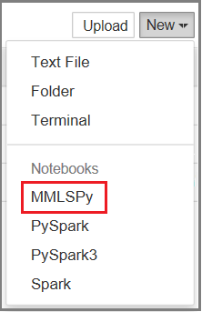

---

# required metadata
title: "Configure Jupyter Notebooks for revoscalepy in Machine Learning Server | Microsoft Docs "
description: "How to configure a Jupyter notebook to call Python functions from revoscalepay and microsofml modules in Machine learning Server."
keywords: ""
author: "HeidiSteen"
ms.author: "heidist"
manager: "jhubbard"
ms.date: "09/22/2017"
ms.topic: "article"
ms.prod: "microsoft-r"

# optional metadata
#ROBOTS: ""
#audience: ""
#ms.devlang: ""
#ms.reviewer: ""
#ms.suite: ""
#ms.tgt_pltfrm: ""
ms.technology: ""
#ms.custom: ""

---

# How to configure a Jupyter notebook for revoscalepy

This article explains how to access a local Jupyter Notebook App and load our samples from Github. It also explains how to add our libraries to a remote Jupyter server acting as central hub for multi-user notebooks on your network.

Jupyter Notebooks is distributed with Anaconda, which is the Python distribution used by Machine Learning Server. If you installed Machine Learning Server, you have the components necessary for running notebooks as a single user on localhost.

Both Machine Learning Server and Jupyter Notebooks must be on the same computer.

> [!Note]
> Jupyter Notebooks are presentation concept, integrating script and text on the same page. Script is interactive on the page, often Python or R, but could be any one of the 40 languages supported by Jupyter. The text is user-provided content that describes the script. Notebooks are executed on a server, accessed over http, and rendered as HTML in a browser to the person requesting the notebook. For more information, see [Jupyter documentation](https://jupyter.readthedocs.io/atest/content-quickstart.html).

## On Windows

1. Download our Python samples, which include two notebooks, from Github: [https://github.com/Microsoft/ML-Server-Python-Samples](https://github.com/Microsoft/ML-Server-Python-Samples)

2. In Downloads, right-click **Extract all** to unzip the samples.

3. At an elevated command prompt, navigate to the Jupyter-notebook executable: `C:\Program Files\Microsoft\ML Server\PYTHON_SERVER\Scripts`

3. Start the Jupyter Notebook App by typing this at the command line: `jupyter-notebook`

4. The Notebook Dashboard opens in your default browser at http://localhost:8888/tree. 

5. Click **Upload**.

6. There are several .ipnyb files. As an example, navigate to and then open `\Downloads\ML-Server-Python-Samples-master\microsoftml\quickstarts\binary-classification\Binary+Classification+Quickstart.ipynb`

7. Click the upload file action to add the notebook to your server.

8. After the notebook loads, click **Run** to step through the content. For this particular notebook, no additional configuration is required. For the azureml notebooks, read the readme for configuration requirements.

## On Linux or a Spark cluster edge node

For a local single user experience, we recommend that you run Jupyter Notebook on the edge node of the cluster. 

1. Download our Python samples, which include two notebooks, from Github: [https://github.com/Microsoft/ML-Server-Python-Samples](https://github.com/Microsoft/ML-Server-Python-Samples)

3. Start the Jupyter Notebook App by typing this at the command line: `jupyter notebook`


## Configure for multi-user access

This procedure applies to Linux or Spark edge node upon which you are hosting a JupyterHub or multi-user server. It does not apply to single-user localhost servers. 

For a multi-user server, add our custom kernel **MMLSPy** to the data directory of your server. Machine Learning Server provides this kernel for notebooks and scripts that make calls to [revoscalepy](../python-reference/revoscalepy/revoscalepy-package.md), [microsoftml](../python-reference/microsoftml/microsoftml-package.md), and [azureml](../python-reference/microsoftml/azureml-model-management-sdk.md).

Run the following command to install the kernel:

```
sudo /usr/bin/anaconda/bin/jupyter kernelspec install /opt/microsoft/mlserver/9.2.1/libraries/jupyter/kernels/MMLSPy
```

Or, do the following steps (it should produce the same results):

1. Run `jupyter –data-dir` from the node on which Jupyter Notebook Server is installed.
2. Note the path returned by `-data-dir`. This is where Jupyter stores its data directories, including kernels.
3. Copy the **MMLSPy** directory from `/opt/microsoft/mlserver/9.2.1/libraries/kernels/` to the kernels subdirectory under the data directory.

You might need to restart your server in order for the server to pick up the kernel.

## Test the configuration

In Jupyter dashboard, click **New** to create a new notebook. You should see the new kernel (MMLSPy) in the drop down.




## See Also

+ [microsoftml function reference](../python-reference/microsoftml/microsoftml-package.md)
+ [revoscalepy function reference](../python-reference/revoscalepy/revoscalepy-package.md)
+ [Jupyter/IPython Notebook Quick Start Guide](https://jupyter-notebook-beginner-guide.readthedocs.io)
