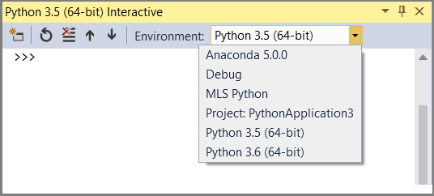
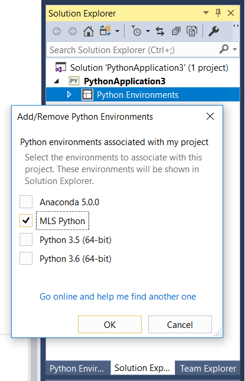

---

# required metadata
title: "Quickstart: Link to Machine Learning Server from Python tools"
description: "Link Python tools like PyCharm, Jupyter notebooks, and Visual Studio to Machine Learning Server Python libraries"
keywords: "quickstart, Machine Learning Server, python tools"
author: "HeidiSteen"
ms.author: "heidist"
manager: "cgronlun"
ms.date: "02/16/2018"
ms.topic: "get-started-article"
ms.prod: "mlserver"

# optional metadata
#ROBOTS: ""
#audience: ""
#ms.devlang: "r"
#ms.reviewer: ""
#ms.suite: ""
#ms.tgt_pltfrm: ""
#ms.custom: ""

---
# Link Python tools to Machine Learning Server Python modules

**Applies to: Microsoft Learning Server 9.x**

## Objective

Learn how to link to the Python modules in Machine Learning Server from common tools and Python IDEs.

## Time estimate

After you have completed the prerequisites, this task takes approximately *5* minutes to complete.

## Prerequisites

Before you begin this QuickStart, have an the following ready:

> [!div class="checklist"]
> * An instance of [Machine Learning Server ](../what-is-machine-learning-server.md) installed with the Python option. &nbsp;
> * A Python IDE, such as Visual Studio 2017 Community Edition with Python.
> * Familiarity with Python. [Here's a video tutorial](https://mva.microsoft.com/en-us/training-courses/introduction-to-programming-with-python-8360?l=lqhuMxFz_8904984382). &nbsp;

## Python.exe (built-in MLServer)

Machine Learning Server installs a local, folder-only install of Anaconda to avoid interfering with other Python distributions on your system. As such, packages providing the Python modules (revoscalepy, microsoftml, azureml-model-management-sdk) are not available system-wide.

To use the Python modules interactively, start the Python executable from the installation path.

On Windows, go to \Program Files\Microsoft\ML Server\PYTHON_SERVER and run Python.exe to open an interactive command-line window.

## Visual Studio 2017 with Python

The setup program for Machine Learning Server 9.3 adds Python distribution information to the registry, which makes loading Python modules more straightfoward than in previous releases. 

However, when using an earlier release or to confirm settings, follow these steps to add Machine Learning Server's Python distribution information to your environment.

1. In **Tools** > **Python** > **Python environments**, click **+ Custom** to create a new environment.
2. Give the environment name, and then fill in the following fields.
3. In **Prefix path**, enter `C:\Program Files\Microsoft\ML Server\PYTHON_SERVER`. 
4. Click **Auto Detect** in the top right to auto-fill the remaining fields:
    a. **Interpreter path** should be `C:\Program Files\Microsoft\ML Server\PYTHON_SERVER\python.exe`.
    b. **Windowed interpreter** should be `C:\Program Files\Microsoft\ML Server\PYTHON_SERVER\pythonw.exe`.
    c. **Language version** should be `3.5` for Python 3.5.
    d. **Architeccture** should be `64-bit`.
    e. **Path** should be read-only. 
5. Click **Apply** in the top right to save the environment.

You can use this environment by selecting it in an interactive window. As a verification step, run the example from the [rx_summary function](../python-reference/revoscalepy/rx-summary.md#example) in revoscalepy.

For new projects, you can also add an environment to your project in **Solution Explorer** > **Python Environments** > **Add/Remove Environments**. 

For more information, see [Python environments (Visual Studio docs)](https://docs.microsoft.com/visualstudio/python/managing-python-environments-in-visual-studio).

## Jupyter Notebooks (local)

A local Jupyter Notebook executable is installed with Machine Learning Server. 

+ Go to \Program Files\Microsoft\ML Server\PYTHON_SERVER\Scripts\ and double-click **jupyter-notebook.exe** to start a Jupyter Notebook session in the default browser window.

For additional instructions on configuring a multi-user server, see [How to add Machine Learning Server modules to single and multi-user Jupyter Notebook instances](how-to-revoscalepy-jupyter-nb-config.md).

## PyCharm

In PyChart, set the interpreter to the Python executable installed by Machine Learning Server.

1. In a new project, in Settings, click **Add Local**.
2. Enter `C:\Program Files\Microsoft\ML Server\PYTHON_SERVER`.

You can now import revoscalepy, microsoftml, or azureml-model-management-sdk modules.

You can also choose **Tools** > **Python Console** to open an interactive window.

## Next steps

Now that you know how to load the Python libraries, you might want to explore them in-depth:

- [revoscalepy Python package functions](../python-reference/revoscalepy/revoscalepy-package.md)
- [microsoftml Python package functions](../python-reference/microsoftml/microsoftml-package.md)
- [azureml-model-management-sdk](../python-reference/azureml-model-management-sdk/azureml-model-management-sdk.md)

## See also

For more about Machine Learning Sever in general, see [Overview of Machine Learning Server](../what-is-machine-learning-server.md) 
