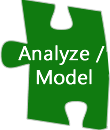

---

# required metadata
title: "RevoScaleR package for R (Microsoft Machine Learning Server) | Microsoft Docs"
description: "Function help reference for the RevoScaleR R package of Microsoft Machine Learning Server"
keywords: "RevoScaleR, ScaleR"
author: "HeidiSteen"
ms.author: "heidist"
manager: "jhubbard"
ms.date: "06/22/2016"
ms.topic: "reference"
ms.prod: "microsoft-r"

# optional metadata
#ROBOTS: ""
#audience: ""
#ms.devlang: ""
#ms.reviewer: ""
#ms.suite: ""
#ms.tgt_pltfrm: ""
ms.technology: "r-server"
#ms.custom: ""

---

# RevoScaleR package for R

Applies to: [**Microsoft Machine Learning Server**](../what-is-microsoft-r-server.md) version 9.2, [**SQL Server 2017 Machine Learning Services**](https://docs.microsoft.com/sql/advanced-analytics/python/sql-server-python-services), [**SQL Server 2017 Machine Learning Server (Standalone)**](https://docs.microsoft.com/sql/advanced-analytics/r/r-server-standalone#whats-new-in-microsoft-machine-learning-server)

The **RevoScaleR** library provides a set of over one hundred portable, scalable, and distributable data analysis functions.

## How to use RevoScaleR

This package is included in installations of...   It is often preloaded into tools that integrate with R Server, which means you can call functions without having to load the library. Run the following commands in the order shown below to load the library, get the version, and run one of its signature commands.

$ install.library(RevoScaleR)
$ print.version(Revo)
$ rxSummary****

> [!Note]
> Some function names begin with `rx` and others with `Rx`. The `Rx` function name prefix is used to distinguish the class constructors such as data sources and compute contexts.

### Scope

While most of these functions are of general application, some are specific to particular compute contexts and some may not be fully supported in all compute contexts. If you are looking for the functions optimized for Hadoop, Teradata, or SQL Server compute contexts, see the relevant function list for that context:
+ [Computing on a Hadoop Cluster](revoscaler-hadoop-functions.md)
+ [Computing on a Teradata Datawarehouse](revoscaler-teradata-functions.md)
+ [Computing on SQL Server](https://msdn.microsoft.com/en-us/library/mt652103.aspx)

## Data Analysis Functions
<!--<br />
&nbsp;&nbsp;&nbsp;&nbsp;&nbsp;&nbsp;&nbsp;&nbsp;&nbsp;&nbsp;&nbsp;&nbsp;&nbsp;&nbsp;&nbsp;&nbsp;


&nbsp;

<br />&nbsp;&nbsp;&nbsp;&nbsp;&nbsp;&nbsp;&nbsp;&nbsp;&nbsp;&nbsp;&nbsp;&nbsp;&nbsp;&nbsp;&nbsp;&nbsp;


<br />
&nbsp;&nbsp;&nbsp;&nbsp;&nbsp;&nbsp;&nbsp;&nbsp;&nbsp;&nbsp;&nbsp;&nbsp;&nbsp;&nbsp;&nbsp;&nbsp;


&nbsp;

-->

<br />&nbsp;&nbsp;&nbsp;&nbsp;&nbsp;&nbsp;&nbsp;&nbsp;&nbsp;&nbsp;&nbsp;&nbsp;&nbsp;&nbsp;&nbsp;&nbsp;


Whenever you want to perform an analysis using `RevoScaleR` functions, you should specify three distinct pieces of information:
 + The [**analytic function**](#analytics), which specifies the analysis to be performed
 + The [**compute context**](#compute), which specifies where the computations should take place
 + The [**data source**](#data), which is the data to be used

<br />
####Import and Export Functions

<table>
    <tr>
        <th>Function Name</th>
        <th></th>
        <th>Description</th>
        <th>
            <center>Help</center>
        </th>
    </tr>
    <tr>
        <td width="160px">`rxImport`</td>
        <td width="25px">
            <center></center>
        </td>
        <td>Creates an .xdf file or data frame from a data source (e.g. text, SAS, SPSS data files, ODBC or Teradata connection, or data frame).</td>
        <td>
            <center><small>[**View**](rximport.md)<center></small></td>
    </tr>
    <tr>
        <td>`rxDataStep`</td>
        <td>
            <center></center>
        </td>
        <td>Transform and subset data. Creates an .xdf file, a comma-delimited text file, or data frame in memory (assuming you have sufficient memory to hold the output data) from an .xdf file or a data frame.</td>
        <td>
            <center><small>[**View**](rxdatastep.md)<center></small></td>
    </tr>
    <tr>
        <td>`rxGetInfo`</td>
        <td>
            <center></center>
        </td>
        <td>Retrieves summary information from a data source or data frame.</td>
        <td>
            <center><small>[**View**](rxgetinfoxdf.md)<center></small></td>
    </tr>
    <tr>
        <td>`rxSetInfo`</td>
        <td>
            <center></center>
        </td>
        <td>Sets a file description in an .xdf file or a description attribute in a data frame.</td>
        <td>
            <center><small>[**View**](rxsetinfo.md)<center></small></td>
    </tr>
    <tr>
        <td>`rxGetVarInfo`</td>
        <td> </td>
        <td>Retrieves variable information from a data source or data frame.</td>
        <td>
            <center><small>[**View**](rxgetvarinfoxdf.md)<center></small></td>
    </tr>
    <tr>
        <td>`rxSetVarInfo`</td>
        <td> </td>
        <td>Modifies variable information in an .xdf file or data frame.</td>
        <td>
            <center><small>[**View**](rxsetvarinfoxdf.md)<center></small></td>
    </tr>
    <tr>
        <td>`rxGetVarNames`</td>
        <td> </td>
        <td>Retrieves variable names from a data source or data frame.</td>
        <td>
            <center><small>[**View**](rxgetvarnames.md)<center></small></td>
    </tr>
    <tr>
        <td>`rxCreateColInfo`</td>
        <td> </td>
        <td>Generates a 'colInfo' list from a data source.</td>
        <td>
            <center><small>[**View**](rxcreatecolinfo.md)<center></small></td>
    </tr>
    <tr>
        <td>`rxCompressXdf`</td>
        <td> </td>
        <td>Compresses an existing .xdf file, or a directory of .xdf files.</td>
        <td>
            <center><small>[**View**](rxcompressxdf.md)<center></small></td>
    </tr>
    <tr>
        <td>`RxXdfData`</td>
        <td> </td>
        <td>Creates an efficient XDF data source object.</td>
        <td>
            <center><small>[**View**](rxxdfdata.md)<center></small></td>
    </tr>
    <tr>
        <td>`RxTextData`</td>
        <td> </td>
        <td>Creates a comma delimited text data source object.</td>
        <td>
            <center><small>[**View**](rxtextdata.md)<center></small></td>
    </tr>
    <tr>
        <td>`RxSasData`</td>
        <td> </td>
        <td>Creates a SAS data source object.</td>
        <td>
            <center><small>[**View**](rxsasdata.md)<center></small></td>
    </tr>
    <tr>
        <td>`RxSpssData`</td>
        <td> </td>
        <td>Creates a SPSS data source object.</td>
        <td>
            <center><small>[**View**](rxspssdata.md)<center></small></td>
    </tr>
    <tr>
        <td>`RxOdbcData`</td>
        <td> </td>
        <td>Creates a ODBC data source object.</td>
        <td>
            <center><small>[**View**](rxodbcdata.md)<center></small></td>
    </tr>
    <tr>
        <td>`RxTeradata`</td>
        <td> </td>
        <td>Creates a Teradata data source object.</td>
        <td>
            <center><small>[**View**](rxteradata.md)<center></small></td>
    </tr>
    <tr>
        <td>`RxSqlServerData`</td>
        <td> </td>
        <td>Creates a SQL Server data source object.</td>
        <td>
            <center><small>[**View**](rxsqlserverdata.md)<center></small></td>
    </tr>
    <tr>
        <td>`rxOpen`</td>
        <td> </td>
        <td>Opens a data source for reading.</td>
        <td>
            <center><small>[**View**](rxopen-methods.md)<center></small></td>
    </tr>
    <tr>
        <td>`rxClose`</td>
        <td> </td>
        <td>Closes a data source.</td>
        <td>
            <center><small>[**View**](rxopen-methods.md)<center></small></td>
    </tr>
    <tr>
        <td>`rxReadNext`</td>
        <td> </td>
        <td>Read data from a source</td>
        <td>
            <center><small>[**View**](rxopen-methods.md)<center></small></td>
    </tr>
    <tr>
        <td>`rxSetFileSystem`</td>
        <td> </td>
        <td>Specify a file system type for data for import.</td>
        <td>
            <center><small>[**View**](rxsetfilesystem.md)<center></small></td>
    </tr>
    <tr>
        <td>`rxGetFileSystem`</td>
        <td> </td>
        <td>Retrieve the current file system type.</td>
        <td>
            <center><small>[**View**](rxsetfilesystem.md)<center></small></td>
    </tr>
    <tr>
        <td>`rxHdfsFileSystem`</td>
        <td> </td>
        <td>Creates an HDFS file system object.</td>
        <td>
            <center><small>[**View**](rxhdfsfilesystem.md)<center></small></td>
    </tr>
    <tr>
        <td>`rxNativeFileSystem`</td>
        <td> </td>
        <td>Creates a native file system object.</td>
        <td>
            <center><small>[**View**](rxnativefilesystem.md)<center></small></td>
    </tr>
</table>

<small> signifies the most popular functions</small>
<br />

<br />
####Manipulation, Cleansing, and Transformation Functions


<table>
    <tr>
        <th>Function Name</th>
        <th></th>
        <th>Description</th>
        <th>
            <center>Help</center>
        </th>
    </tr>
    <tr>
        <td width="160px">`rxDataStep`</td>
        <td>
            <center></center>
        </td>
        <td>Transform and subset data. Creates an .xdf file, a comma-delimited text file, or data frame in memory (assuming you have sufficient memory to hold the output) from an .xdf file or a data frame.</td>
        <td>
            <center><small>[**View**](rxdatastep.md)</small></center>
        </td>
    </tr>
    <tr>
        <td>`rxFactors`</td>
        <td>
            <center></center>
        </td>
        <td>Recode a factor variable or convert non-factor variable into a factor in an .xdf file or data frame.</td>
        <td>
            <center><small>[**View**](rxfactors.md)</small></center>
        </td>
    </tr>
    <tr>
        <td>`rxGetFuzzyDist`</td>
        <td> </td>
        <td>Get fuzzy distances for a character vector.</td>
        <td>
            <center><small>[**View**](rxgetfuzzydist.md)</small></center>
        </td>
    </tr>
    <tr>
        <td>`rxGetFuzzyKeys`</td>
        <td> </td>
        <td>Get fuzzy keys for a character vector.</td>
        <td>
            <center><small>[**View**](rxgetfuzzykeys.md)</small></center>
        </td>
    </tr>
    <tr>
        <td>`rxSplit`</td>
        <td> </td>
        <td>Splits an .xdf file or data frame into multiple .xdf files or data frames.</td>
        <td>
            <center><small>[**View**](rxsplitxdf.md)</small></center>
        </td>
    </tr>
    <tr>
        <td>`rxSort`</td>
        <td> </td>
        <td>Multi-key sorting of the variables an .xdf file or data frame.</td>
        <td>
            <center><small>[**View**](rxsortxdf.md)</small></center>
        </td>
    </tr>
    <tr>
        <td>`rxMerge`</td>
        <td> </td>
        <td>Merges two .xdf files or data frames using a variety of merge types.</td>
        <td>
            <center><small>[**View**](rxmergexdf.md)</small></center>
        </td>
    </tr>
    <tr>
        <td>`rxExecuteSQLDDL`</td>
        <td> </td>
        <td>SQL Server R Services only. Runs an arbitrary SQL DDL command.</td>
        <td>
            <center><small>[**View**](rxexecutesqlddl.md)</small></center>
        </td>
    </tr>
</table>

<small> signifies the most popular functions</small>


<br/>


<br />
####Visualization Functions

|Function Name          | |Description|Help|
|-----------------------|:-:|-----------------------|:--------------:|
|`rxHistogram`       ||Creates a histogram from data.|<small>[**View**](rxhistogram.md)</small>|
|`rxLinePlot`  ||Creates a line plot from data.|<small>[**View**](rxlineplot.md)</small>|
| `rxLorenz`      | |Computes a Lorenz curve which can be plotted.|<small>[**View**](rxlorenz.md)</small>|
|`rxRocCurve`  | |Computes and plots ROC curves from actual and predicted data.|<small>[**View**](rxroc.md)</small>|

<small> signifies the most popular functions</small>

<br />

<br />
####Analysis Functions for Descriptive Statistics and Cross-Tabulations


<table>
    <tr>
        <th>Function Name</th>
        <th></th>
        <th>Description</th>
        <th>
            <center>Help</center>
        </th>
    </tr>
    <tr>
        <td width="150px">`rxQuantile`</td>
        <td>
            <center></center>
        </td>
        <td>Computes approximate quantiles for .xdf files and data frames without sorting.</td>
        <td>
            <center><small>[**View**](rxquantile.md)</small></center>
        </td>
    </tr>
    <tr>
        <td>`rxSummary`</td>
        <td>
            <center></center>
        </td>
        <td>Basic summary statistics of data, including computations by group. Writing by group computations to .xdf file not supported.</td>
        <td>
            <center><small>[**View**](rxsummary.md)</small></center>
        </td>
    </tr>
    <tr>
        <td>`rxCrossTabs`</td>
        <td>
            <center></center>
        </td>
        <td>Formula-based cross-tabulation of data.</td>
        <td>
            <center><small>[**View**](rxcrosstabs.md)</small></center>
        </td>
    </tr>
    <tr>
        <td>`rxCube`</td>
        <td>
            <center></center>
        </td>
        <td>Alternative formula-based cross-tabulation designed for efficient representation returning ‘cube’ results. Writing output to .xdf file not supported.</td>
        <td>
            <center><small>[**View**](rxcube.md)</small></center>
        </td>
    </tr>
    <tr>
        <td>`rxMarginals`</td>
        <td> </td>
        <td>Marginal summaries of cross-tabulations.</td>
        <td>
            <center><small>[**View**](rxmarginals.md)</small></center>
        </td>
    </tr>
    <tr>
        <td>`as.xtabs`</td>
        <td> </td>
        <td>Converts cross tabulation results to an `xtabs` object.</td>
        <td>
            <center><small>[**View**](as-xtabs.md)</small></center>
        </td>
    </tr>
    <tr>
        <td>`rxChiSquaredTest`</td>
        <td> </td>
        <td>Performs Chi-squared Test on `xtabs` object. Used with small data sets and does not chunk data.</td>
        <td>
            <center><small>[**View**](rxchisquaredtest.md)</small></center>
        </td>
    </tr>
    <tr>
        <td>`rxFisherTest`</td>
        <td> </td>
        <td>Performs Fisher's Exact Test on `xtabs` object. Used with small data sets and does not chunk data.</td>
        <td>
            <center><small>[**View**](rxchisquaredtest.md)</small></center>
        </td>
    </tr>
    <tr>
        <td>`rxKendallCor`</td>
        <td> </td>
        <td>Computes Kendall's Tau Rank Correlation Coefficient using `xtabs` object.</td>
        <td>
            <center><small>[**View**](rxchisquaredtest.md)</small></center>
        </td>
    </tr>
    <tr>
        <td>`rxPairwiseCrossTab`</td>
        <td> </td>
        <td>Apply a function to pairwise combinations of rows and columns of an `xtabs` object.</td>
        <td>
            <center><small>[**View**](rxpairwisecrosstab.md)</small></center>
        </td>
    </tr>
    <tr>
        <td>`rxRiskRatio`</td>
        <td> </td>
        <td>Calculate the relative risk on a two-by-two `xtabs` object.</td>
        <td>
            <center><small>[**View**](rxriskratio.md)</small></center>
        </td>
    </tr>
    <tr>
        <td>`rxOddsRatio`</td>
        <td> </td>
        <td>Calculate the odds ratio on a two-by-two `xtabs` object.</td>
        <td>
            <center><small>[**View**](rxriskratio.md)</small></center>
        </td>
    </tr>
</table>

<small> signifies the most popular functions</small>

<br />

####Analysis, Learning, and Prediction Functions for Statistical Modeling


<table>
    <tr>
        <th>Function Name</th>
        <th></th>
        <th>Description</th>
        <th>
            <center>Help</center>
        </th>
    </tr>
    <tr>
        <td width="150px">`rxLinMod`</td>
        <td>
            <center></center>
        </td>
        <td>Fits a linear model to data.</td>
        <td>
            <center><small>[**View**](rxlinmod.md)</small></center>
        </td>
    </tr>
    <tr>
        <td>`rxLogit`</td>
        <td>
            <center></center>
        </td>
        <td>Fits a logistic regression model to data.</td>
        <td>
            <center><small>[**View**](rxlogit.md)</small></center>
        </td>
    </tr>
    <tr>
        <td>`rxGlm`</td>
        <td>
            <center></center>
        </td>
        <td>Fits a generalized linear model to data.</td>
        <td>
            <center><small>[**View**](rxglm.md)</small></center>
        </td>
    </tr>
    <tr>
        <td>`rxCovCor`</td>
        <td>
            <center></center>
        </td>
        <td>Calculate the covariance, correlation, or sum of squares / cross-product matrix for a set of variables.</td>
        <td>
            <center><small>[**View**](rxcovcor.md)</small></center>
        </td>
    </tr>
    <tr>
        <td>`rxDTree`</td>
        <td>
            <center></center>
        </td>
        <td>Fits a classification or regression tree to data.</td>
        <td>
            <center><small>[**View**](rxdtree.md)</small></center>
        </td>
    </tr>
    <tr>
        <td>`rxBTrees`</td>
        <td>
            <center></center>
        </td>
        <td>Fits a classification or regression decision forest to data using a stochastic gradient boosting algorithm.</td>
        <td>
            <center><small>[**View**](rxbtrees.md)</small></center>
        </td>
    </tr>
    <tr>
        <td>`rxDForest`</td>
        <td>
            <center></center>
        </td>
        <td>Fits a classification or regression decision forest to data.</td>
        <td>
            <center><small>[**View**](rxdforest.md)</small></center>
        </td>
    </tr>
    <tr>
        <td>`rxPredict`</td>
        <td>
            <center></center>
        </td>
        <td>Calculates predictions for fitted models. Output must be an XDF data source.</td>
        <td>
            <center><small>[**View**](../microsoftml/rxpredict.md)</small></center>
        </td>
    </tr>
    <tr>
        <td>`rxKmeans`</td>
        <td>
            <center></center>
        </td>
        <td>Performs k-means clustering.</td>
        <td>
            <center><small>[**View**](rxkmeans.md)</small></center>
        </td>
    </tr>
    <tr>
        <td>`rxNaiveBayes`</td>
        <td>
            <center></center>
        </td>
        <td>Performs Naive Bayes classification.</td>
        <td>
            <center><small>[**View**](rxnaivebayes.md)</small></center>
        </td>
    </tr>
    <tr>
        <td>`rxCov`</td>
        <td> </td>
        <td>Calculate the covariance matrix for a set of variables.</td>
        <td>
            <center><small>[**View**](rxcovcor.md)</small></center>
        </td>
    </tr>
    <tr>
        <td>`rxCor`</td>
        <td> </td>
        <td>Calculate the correlation matrix for a set of variables.</td>
        <td>
            <center><small>[**View**](rxcovcor.md)</small></center>
        </td>
    </tr>
    <tr>
        <td>`rxSSCP`</td>
        <td> </td>
        <td>Calculate the sum of squares / cross-product matrix for a set of variables.</td>
        <td>
            <center><small>[**View**](rxcovcor.md)</small></center>
        </td>
    </tr>
    <tr>
        <td>`rxRoc`</td>
        <td> </td>
        <td>Receiver Operating Characteristic (ROC) computations using actual and predicted values from binary classifier system.</td>
        <td>
            <center><small>[**View**](rxroc.md)</small></center>
        </td>
    </tr>
</table>

<small> signifies the most popular functions</small>

<br />
<a name="compute"></a>
##Compute Context Functions


<table>
    <tr>
        <th>Function Name</th>
        <th></th>
        <th>Description</th>
        <th>
            <center>Help</center>
        </th>
    </tr>
    <tr>
        <td width="180px">`rxSetComputeContext`</td>
        <td>
            <center></center>
        </td>
        <td>Sets a compute context.</td>
        <td>
            <center><small>[**View**](rxsetcomputecontext.md)</small></center>
        </td>
    </tr>
    <tr>
        <td>`rxGetComputeContext`</td>
        <td>
            <center></center>
        </td>
        <td>Gets the current compute context.</td>
        <td>
            <center><small>[**View**](rxsetcomputecontext.md)</small></center>
        </td>
    </tr>
    <tr>
        <td>`RxHadoopMR`</td>
        <td>
            <center></center>
        </td>
        <td>Creates an in-data, file-based Hadoop compute context.</td>
        <td>
            <center><small>[**View**](rxhadoopmr.md)</small></center>
        </td>
    </tr>
    <tr>
        <td>`RxSpark`</td>
        <td>
            <center></center>
        </td>
        <td>Creates an in-data, file-based Spark compute context. Computations are parallelized and distributed across the nodes of a Hadoop cluster via Apache Spark.</td>
        <td>
            <center><small>[**View**](rxspark.md)</small></center>
        </td>
    </tr>
    <tr>
        <td>`RxInTeradata`</td>
        <td>
            <center></center>
        </td>
        <td>Creates an in-database compute context for Teradata.</td>
        <td>
            <center><small>[**View**](rxinteradata.md)</small></center>
        </td>
    </tr>
    <tr>
        <td>`RxInSqlServer`
            <td> </td>
            <td>Creates an in-database compute context for SQL Server.</td>
            <td>
                <center><small>[**View**](rxinsqlserver.md)</small></center>
            </td>
    </tr>
    <tr>
        <td>`RxComputeContext`</td>
        <td> </td>
        <td>Creates a compute context.</td>
        <td>
            <center><small>[**View**](rxcomputecontext.md)</small></center>
        </td>
    </tr>
    <tr>
        <td>`RxLocalSeq`</td>
        <td> </td>
        <td>Creates a local compute context for `rxExec` using sequential computations.</td>
        <td>
            <center><small>[**View**](rxlocalseq.md)</small></center>
        </td>
    </tr>
    <tr>
        <td>`RxLocalParallel`</td>
        <td> </td>
        <td>Creates a local compute context for `rxExec` using the `parallel` package as backend.</td>
        <td>
            <center><small>[**View**](rxlocalparallel.md)</small></center>
        </td>
    </tr>
    <tr>
        <td>`RxForeachDoPar`</td>
        <td> </td>
        <td>Creates a compute context for `rxExec`using the current `foreach` parallel backend.</td>
        <td>
            <center><small>[**View**](rxforeachdopar.md)</small></center>
        </td>
    </tr>
    <tr>
        <td>`rxInstalledPackages`</td>
        <td> </td>
        <td>Returns the list of installed packages for a compute context.</td>
        <td><center><small>[**View**](rxinstalledpackages.md)</small></center>
        </td>
    </tr>
    <tr>
        <td>`rxFindPackage`</td>
        <td> </td>
        <td>Returns the path to one or more packages for a compute context.</td>
        <td><center><small>[**View**](rxfindpackage.md)</small></center>
        </td>
    </tr>
</table>

<small> signifies the most popular functions</small>

<br/>
<a name="data"></a>
##Data Source Functions

<table>
    <tr>
        <th>Function Name</th>
        <th></th>
        <th>Description</th>
        <th>
            <center>Help</center>
        </th>
    </tr>
    <tr>
        <td width="150px">`RxXdfData`</td>
        <td> </td>
        <td>Creates an efficient XDF data source object.</td>
        <td>
            <center><small>[**View**](rxxdfdata.md)</small></center>
        </td>
    </tr>
    <tr>
        <td>`RxTextData`</td>
        <td> </td>
        <td>Creates a comma delimited text data source object.</td>
        <td>
            <center><small>[**View**](rxtextdata.md)</small></center>
        </td>
    </tr>
    <tr>
        <td>`RxSasData`</td>
        <td> </td>
        <td>Creates a SAS data source object.</td>
        <td>
            <center><small>[**View**](rxsasdata.md)</small></center>
        </td>
    </tr>
    <tr>
        <td>`RxSpssData`</td>
        <td> </td>
        <td>Creates a SPSS data source object.</td>
        <td>
            <center><small>[**View**](rxspssdata.md)</small></center>
        </td>
    </tr>
    <tr>
        <td>`RxOdbcData`</td>
        <td> </td>
        <td>Creates a ODBC data source object.</td>
        <td>
            <center><small>[**View**](rxodbcdata.md)</small></center>
        </td>
    </tr>
    <tr>
        <td>`RxTeradata`</td>
        <td> </td>
        <td>Creates a Teradata data source object.</td>
        <td>
            <center><small>[**View**](rxteradata.md)</small></center>
        </td>
    </tr>
    <tr>
        <td>`RxSqlServerData`</td>
        <td> </td>
        <td>Creates a SQL Server data source object.</td>
        <td><center><small>[**View**](rxsqlserverdata.md)</small></center>
        </td>
    </tr>
</table>

<small> signifies the most popular functions</small>

<br />

##HPC and Distributed Computing Functions

These functions and many more can be used for high performance computing and distributed computing. Learn more about the entire set of functions in the [Distributed Computing guide](../../r/how-to-revoscaler-distributed-computing.md).

<table>
    <tr>
        <th>Function Name</th>
        <th></th>
        <th>Description</th>
        <th>
            <center>Help</center>
        </th>
    </tr>
    <tr>
        <td width="180px">`rxExec`</td>
        <td> </td>
        <td>Run an arbitrary R function on nodes or cores of a cluster.</td>
        <td>
            <center><small>[**View**](rxexec.md)</small></center>
        </td>
    </tr>
    <tr>
        <td>`rxRngNewStream`</td>
        <td> </td>
        <td>Support for Parallel Random Number Generation.</td>
        <td>
            <center><small>[**View**](rxrng.md)</small></center>
        </td>
    </tr>
    <tr>
        <td>`rxRngDelStream`</td>
        <td> </td>
        <td>Support for Parallel Random Number Generation.</td>
        <td>
            <center><small>[**View**](rxrng.md)</small></center>
        </td>
    </tr>
    <tr>
        <td>`rxRngGetStream`</td>
        <td> </td>
        <td>Support for Parallel Random Number Generation.</td>
        <td>
            <center><small>[**View**](rxrng.md)</small></center>
        </td>
    </tr>
    <tr>
        <td>`rxRngSetStream`</td>
        <td> </td>
        <td>Support for Parallel Random Number Generation.</td>
        <td>
            <center><small>[**View**](rxrng.md)</small></center>
        </td>
    </tr>
    <tr>
        <td>`rxGetAvailableNodes`</td>
        <td> </td>
        <td>Get all the available nodes on a distributed compute context.</td>
        <td>
            <center><small>[**View**](rxgetavailablenodes.md)</small></center>
        </td>
    </tr>
    <tr>
        <td>`rxGetNodeInfo`</td>
        <td> </td>
        <td>Get information on nodes specified for a distributed compute context.</td>
        <td>
            <center><small>[**View**](rxgetnodeinfo.md)</small></center>
        </td>
    </tr>
    <tr>
        <td>`rxPingNodes`</td>
        <td> </td>
        <td>Test round trip from user through computation node(s) in a cluster or cloud.</td>
        <td>
            <center><small>[**View**](rxpingnodes.md)</small></center>
        </td>
    </tr>
    <tr>
        <td>`rxGetJobStatus`</td>
        <td> </td>
        <td>Get the status of a non-waiting distributed computing job.</td>
        <td>
            <center><small>[**View**](rxgetjobresults.md)</small></center>
        </td>
    </tr>
    <tr>
        <td>`rxGetJobResults`</td>
        <td> </td>
        <td>Get the return object(s) of a non-waiting distributed computing job.</td>
        <td>
            <center><small>[**View**](rxgetjobresults.md)</small></center>
        </td>
    </tr>
    <tr>
        <td>`rxGetJobOutput`</td>
        <td> </td>
        <td>Get the console output from a non-waiting distributed computing job.</td>
        <td>
            <center><small>[**View**](rxgetjoboutput.md)</small></center>
        </td>
    </tr>
    <tr>
        <td>`rxGetJobs`</td>
            <td> </td>
            <td>Get the available distributed computing job information objects.</td>
            <td>
                <center><small>[**View**](rxgetjobs.md)</small></center>
            </td>
    </tr>
    <tr>
        <td>`rxLocateFile`</td>
            <td> </td>
            <td>Get the first occurrence of a specified input file in a set of specified paths.</td>
            <td>
                <center><small>[**View**](rxlocatefile.md)</small></center>
            </td>
    </tr>
</table>

<small> signifies the most popular functions</small>

<br />
##Utility Functions

>Not all of these functions will work if you switch your compute context to Hadoop, Teradata, or SQL Server.

<table>
    <tr>
        <th>Function Name</th>
        <th></th>
        <th>Description</th>
        <th>
            <center>Help</center>
        </th>
    </tr>
    <tr>
        <td width="200px">`rxOptions`</td>
        <td>
            <center></center>
        </td>
        <td>Gets or sets `RevoScaleR`-specific options.</td>
        <td>
            <center><small>[**View**](rxoptions.md)</small></center>
        </td>
    </tr>
    <tr>
        <td>`rxGetOption`</td>
                <td>
            <center></center>
        </td>
        <td>Retrieves a specific `RevoScaleR`-option.</td>
        <td>
            <center><small>[**View**](rxoptions.md)</small></center>
        </td>
    </tr>
    <tr>
        <td>`rxGetEnableThreadPool`</td>
        <td> </td>
        <td>Gets the current state of the thread pool, which on Linux can be either persistent or on-demand.</td>
        <td>
            <center><small>[**View**](rxgetenablethreadpool.md)</small></center>
        </td>
    </tr>
    <tr>
        <td>`rxSetEnableThreadPool`</td>
        <td> </td>
        <td>Sets the thread pool state.</td>
        <td>
            <center><small>[**View**](rxgetenablethreadpool.md)</small></center>
        </td>
    </tr>
    <tr>
        <td>`rxStepControl`</td>
        <td> </td>
        <td>Construct `variable.selection` argument for `rxLinMod`.</td>
        <td>
            <center><small>[**View**](rxstepcontrol.md)</small></center>
        </td>
    </tr>
    <tr>
        <td>`rxIsOpen`</td>
        <td> </td>
        <td>Indicates whether a data source can be accessed.</td>
        <td><center><small>[**View**](rxopen-methods.md)</small></center>
        </td>
    </tr>
    <tr>
        <td>`rxSqlServerDropTable`</td>
        <td> </td>
        <td>Execute an SQL statement that drops a table.</td>
        <td><center><small>[**View**](rxsqlserverdroptable.md)</small></center>
        </td>
    </tr>
    <tr>
        <td>`rxSqlServerTableExists`</td>
        <td> </td>
        <td>Execute an SQL statement that checks for a table's existance.</td>
        <td><center><small>[**View**](rxsqlserverdroptable.md)</small></center>
        </td>
    </tr>
    <tr>
        <td>`rxWriteNext`</td>
        <td> </td>
        <td>Writes the next chunk when moving data between ScaleR data sources.</td>
        <td><center><small>[**View**](rxopen-methods.md)</small></center>
        </td>
    </tr>
</table>

<small> signifies the most popular functions</small>

<br />
<br />

<a name="findmore"></a>
## Get help on RevoScaleR functions from the R console

To see the **RevoScaleR** functions that can be called from the R console:

1. With Microsoft R Server or R Client installed, launch an R console with `Rgui.exe` or another preferred R IDE such as R Tools for Visual Studio.
2. Load `RevoScaleR` from the command line by typing `library(RevoScaleR)`.
1. In the console, open the package help by typing the following at the R prompt: `help(package="RevoScaleR")`.
1. In the help tab, review the list of functions for this package. Click a link to get the specific help page for that function.
 
> [!NOTE]
> To list all public functions, type library(help="RevoScaleR") at the R prompt.
>

**Search for an object**

1. In an R console, return a numbered list of objects by typing the following at the R prompt `>`:
   ```
   > search()
   ```

2. Identify the position of the object you are interested in. You should see RevoScaleR in the list.

   

3. At the R prompt, type `objects(<position>)` to reveal the set of functions such as:
   ```
   > objects(5)
   ```
4. Use `?<function_name>` to open the help page for that function.

## Next steps

For more information on using this library, see our articles in [Quickstarts]() and [How-to guidance]().

## See also

 [Python function library help (Machine Learning Server)](../introducing-python-package-reference.md)  
