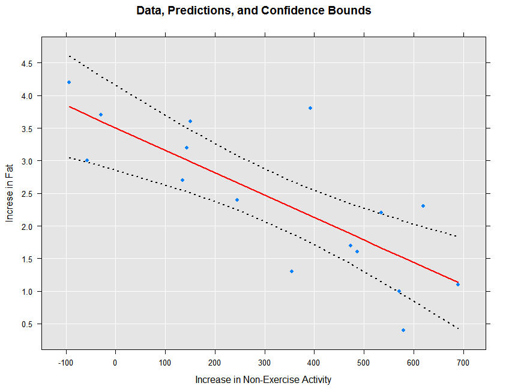
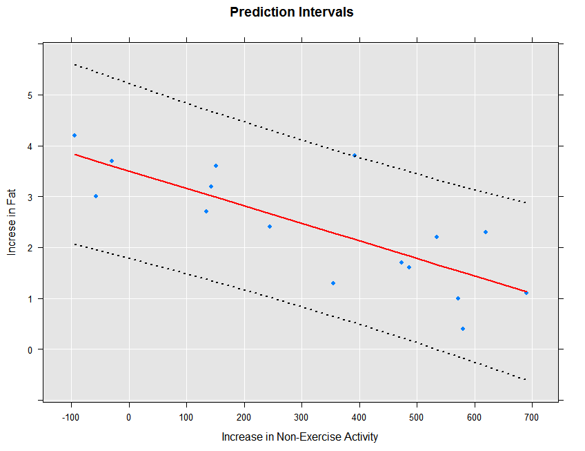
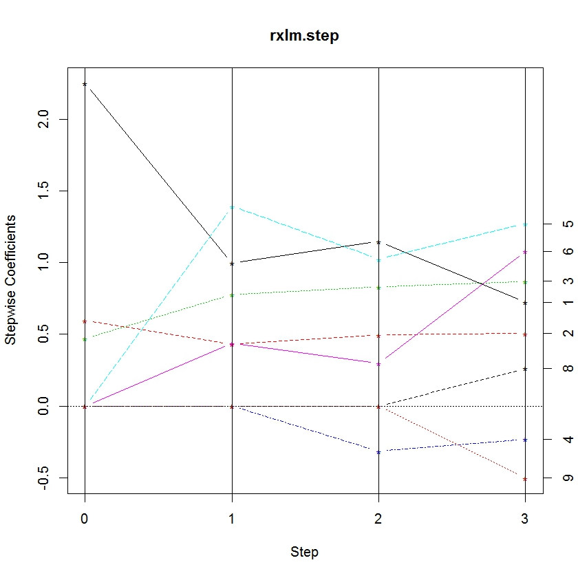
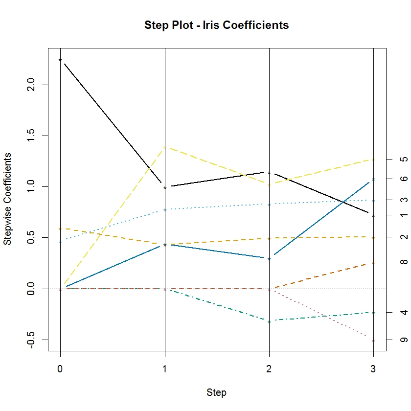
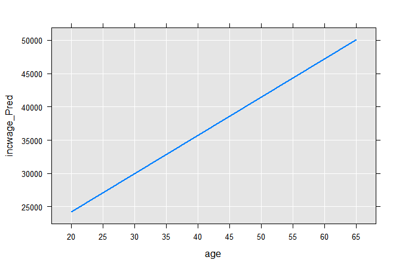
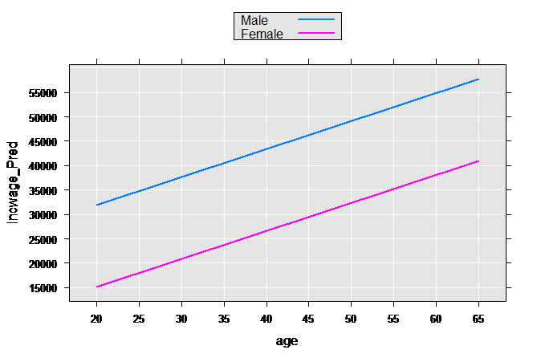
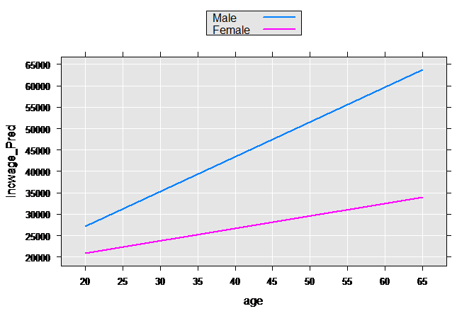
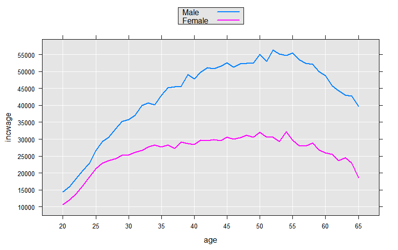

---

# required metadata
title: "Fitting Linear Models (RevoScaleR) in Machine Learning Server "
description: "Linear Models with RevoScaleR."
keywords: ""
author: "HeidiSteen"
ms.author: "heidist"
manager: "jhubbard"
ms.date: "03/17/2016"
ms.topic: "get-started-article"
ms.prod: "microsoft-r"

# optional metadata
#ROBOTS: ""
#audience: ""
#ms.devlang: ""
#ms.reviewer: ""
#ms.suite: ""
#ms.tgt_pltfrm: ""
ms.technology: "r-server"
#ms.custom: ""

---
# Fitting Linear Models using RevoScaleR

Linear regression models are fitted in RevoScaleR using the *rxLinMod* function. Like other RevoScaleR functions, *rxLinMod* uses an updating algorithm to compute the regression model. The R object returned by *rxLinMod* includes the estimated model coefficients and the call used to generate the model, together with other information that allows RevoScaleR to recompute the model—because *rxLinMod* is designed to work with arbitrarily large data sets, quantities such as residuals, and fitted values are not included in the return object, although these can be obtained easily once the model has been fitted.

As a simple example, let’s use the sample data set AirlineDemoSmall.xdf and fit the arrival delay by day of week:

	# Fitting Linear Models

	readPath <- rxGetOption("sampleDataDir")
	airlineDemoSmall <- file.path(readPath, "AirlineDemoSmall.xdf")
	rxLinMod(ArrDelay ~ DayOfWeek, data = airlineDemoSmall)

	  Call:
	  rxLinMod(formula = ArrDelay ~ DayOfWeek, data = airlineDemoSmall)

	  Linear Regression Results for: ArrDelay ~ DayOfWeek
	  File name:
	      C:\Program Files\Microsoft\MRO-for-RRE\8.0\R-3.2.2\library\ RevoScaleR\SampleData\AirlineDemoSmall.xdf
	  Dependent variable(s): ArrDelay
	  Total independent variables: 8 (Including number dropped: 1)
	  Number of valid observations: 582628
	  Number of missing observations: 17372

	  Coefficients:
	                        ArrDelay
	  (Intercept)         10.3318058
	  DayOfWeek=Monday     1.6937981
	  DayOfWeek=Tuesday    0.9620019
	  DayOfWeek=Wednesday -0.1752668
	  DayOfWeek=Thursday  -1.6737983
	  DayOfWeek=Friday     4.4725290
	  DayOfWeek=Saturday   1.5435207
	  DayOfWeek=Sunday       Dropped

Because our predictor is categorical, we can use the *cube* argument to *rxLinMod* to perform the regression using a partitioned inverse, which may be faster and may use less memory than the standard algorithm. The output object also includes a data frame with the averages or counts for each category:

	arrDelayLm1 <- rxLinMod(ArrDelay ~ DayOfWeek, cube = TRUE,
	    data = airlineDemoSmall)

Typing the name of the object arrDelayLm1 yields the following output:

	Call:
	rxLinMod(formula = ArrDelay ~ DayOfWeek, data = airlineDemoSmall,
	    cube = TRUE)

	Cube Linear Regression Results for: ArrDelay ~ DayOfWeek
	File name:
	    C:\Program Files\Microsoft\MRO-for-RRE\8.0\R-3.2.2\library\ RevoScaleR\SampleData\AirlineDemoSmall.xdf
	Dependent variable(s): ArrDelay
	Total independent variables: 7
	Number of valid observations: 582628
	Number of missing observations: 17372

	Coefficients:
	                     ArrDelay
	DayOfWeek=Monday    12.025604
	DayOfWeek=Tuesday   11.293808
	DayOfWeek=Wednesday 10.156539
	DayOfWeek=Thursday   8.658007
	DayOfWeek=Friday    14.804335
	DayOfWeek=Saturday  11.875326
	DayOfWeek=Sunday    10.331806

## Obtaining a Summary of the Model

The print method for the rxLinMod model object shows only the call and the coefficients. You can obtain more information about the model by calling the summary method:

	# Obtaining a Summary of a Model

	summary(arrDelayLm1)

This produces the following output, which includes substantially more information about the model coefficients, together with the residual standard error, multiple R-squared, and adjusted R-squared:

	Call:
	rxLinMod(formula = ArrDelay ~ DayOfWeek, data = airlineDemoSmall,
	    cube = TRUE)

	Cube Linear Regression Results for: ArrDelay ~ DayOfWeek
	File name:
	    C:\Program Files\Microsoft\MRO-for-RRE\8.0\R-3.2.2\library\ RevoScaleR\SampleData\AirlineDemoSmall.xdf
	Dependent variable(s): ArrDelay
	Total independent variables: 7
	Number of valid observations: 582628
	Number of missing observations: 17372

	Coefficients:
	                    Estimate Std. Error t value Pr(>|t|)     | Counts
	DayOfWeek=Monday     12.0256     0.1317   91.32 2.22e-16 *** |  95298
	DayOfWeek=Tuesday    11.2938     0.1494   75.58 2.22e-16 *** |  74011
	DayOfWeek=Wednesday  10.1565     0.1467   69.23 2.22e-16 *** |  76786
	DayOfWeek=Thursday    8.6580     0.1445   59.92 2.22e-16 *** |  79145
	DayOfWeek=Friday     14.8043     0.1436  103.10 2.22e-16 *** |  80142
	DayOfWeek=Saturday   11.8753     0.1404   84.59 2.22e-16 *** |  83851
	DayOfWeek=Sunday     10.3318     0.1330   77.67 2.22e-16 *** |  93395
	---
	Signif. codes:  0 '***' 0.001 '**' 0.01 '*' 0.05 '.' 0.1 ' ' 1

	Residual standard error: 40.65 on 582621 degrees of freedom
	Multiple R-squared: 0.001869 (as if intercept included)
	Adjusted R-squared: 0.001858
	F-statistic: 181.8 on 6 and 582621 DF,  p-value: < 2.2e-16
	Condition number: 1

## Using Probability Weights

Probability weights are common in survey data; they represent the probability that a case was selected into the sample from the population, and are calculated as the inverse of the sampling fraction. The variable *perwt* in the census data represents a probability weight. You pass probability weights to the RevoScaleR analysis functions using the *pweights* argument, as in the following example:

	#  Using Probability Weights

	rxLinMod(incwage ~ F(age), pweights = "perwt", data = censusWorkers)

Yields the following output:

	Call:
	rxLinMod(formula = incwage ~ F(age), data = censusWorkers, pweights = "perwt")

	Linear Regression Results for: incwage ~ F(age)
	File name:
	    C:\Program Files\Microsoft\MRO-for-RRE\8.0\R-3.2.2\library\RevoScaleR\SampleData\CensusWorkers.xdf
	Probability weights: perwt
	Dependent variable(s): incwage
	Total independent variables: 47 (Including number dropped: 1)
	Number of valid observations: 351121
	Number of missing observations: 0

	Coefficients:
	                incwage
	(Intercept)  32111.3012
	F_age=20    -19488.0874
	F_age=21    -18043.7738
	F_age=22    -15928.5538
	F_age=23    -13498.2138
	F_age=24    -11248.8583
	F_age=25     -7948.6603
	F_age=26     -5667.3599
	F_age=27     -4682.8375
	F_age=28     -3024.1648
	F_age=29     -1480.8682
	F_age=30      -971.4461
	F_age=31       143.5648
	F_age=32      2009.0019
	F_age=33      2861.3031
	F_age=34      2797.9986
	F_age=35      4038.2131
	F_age=36      5511.8633
	F_age=37      5148.1841
	F_age=38      5957.2190
	F_age=39      7652.9870
	F_age=40      6969.9630
	F_age=41      8387.6821
	F_age=42      9150.0006
	F_age=43      8936.7590
	F_age=44      9267.0820
	F_age=45     10148.1702
	F_age=46      9099.0659
	F_age=47      9996.0450
	F_age=48     10408.1712
	F_age=49     10281.1324
	F_age=50     12029.6751
	F_age=51     10247.2529
	F_age=52     12105.0654
	F_age=53     10957.8211
	F_age=54     11881.4307
	F_age=55     11490.8457
	F_age=56      9442.3856
	F_age=57      9331.2347
	F_age=58      9353.1980
	F_age=59      7526.4912
	F_age=60      6078.4463
	F_age=61      4636.6756
	F_age=62      3129.5531
	F_age=63      2535.4858
	F_age=64      1520.3707
	F_age=65        Dropped

## Using Frequency Weights

Frequency weights are useful when your data has a particular form: a set of data in which one or more cases is exactly replicated. If you then compact the data to remove duplicated observations and create a variable to store the number of replications of each observation, you can use that new variable as a frequency weights variable in the RevoScaleR analysis functions.

For example, the sample data set fourthgraders.xdf contains the following 44 rows:

	   height eyecolor   male reps
	14     44     Blue   Male    1
	23     44    Brown   Male    3
	9      44    Brown Female    1
	38     44    Green Female    1
	8      45     Blue   Male    1
	31     45     Blue Female    5
	2      45    Brown   Male    2
	51     45    Brown Female    1
	6      45    Green   Male    1
	47     45    Hazel Female    1
	37     46     Blue   Male    1
	21     46     Blue Female    3
	12     46    Brown   Male    2
	5      46    Brown Female    4
	19     46    Green   Male    1
	80     46    Green Female    3
	64     47     Blue   Male    1
	69     47     Blue Female    3
	39     47    Brown   Male    4
	18     47    Brown Female    3
	41     47    Green   Male    2
	7      47    Green Female    4
	26     47    Hazel   Male    3
	17     48     Blue   Male    4
	36     48     Blue Female    3
	13     48    Brown   Male    6
	62     48    Brown Female    4
	61     48    Green Female    2
	56     48    Hazel   Male    1
	10     49     Blue   Male    1
	15     49     Blue Female    5
	22     49    Brown   Male    2
	4      49    Brown Female    5
	3      49    Green   Male    3
	91     49    Green Female    1
	94     50     Blue   Male    1
	96     50     Blue Female    1
	97     50    Brown   Male    1
	1      50    Brown Female    1
	28     50    Green   Male    4
	52     50    Hazel   Male    1
	98     51     Blue   Male    1
	57     51    Brown Female    1
	90     51    Green Female    1

The *reps* column shows the number of replications for each observation; the sum of the reps column indicates the total number of observations, in this case 100. We can fit a model (admittedly not very useful) of height on eye color with *rxLinMod* as follows:

	#  Using Frequency Weights

	fourthgraders <- file.path(rxGetOption("sampleDataDir"),
	    "fourthgraders.xdf")
	fourthgradersLm <- rxLinMod(height ~ eyecolor, data = fourthgraders,
	    fweights="reps")

Typing the name of the object shows the following output:

	Call:
	rxLinMod(formula = height ~ eyecolor, data = fourthgraders, fweights = "reps")

	Linear Regression Results for: height ~ eyecolor
	File name:
	    C:\Program Files\Microsoft\MRO-for-RRE\8.0\R-3.2.2\library\RevoScaleR\SampleData\fourthgraders.xdf
	Linear Regression Results for: height ~ eyecolor
	Frequency weights: reps
	Dependent variable(s): height
	Total independent variables: 5 (Including number dropped: 1)
	Number of valid observations: 44
	Number of missing observations: 0

	Coefficients:
	                    height
	(Intercept)    47.33333333
	eyecolor=Blue  -0.01075269
	eyecolor=Brown -0.08333333
	eyecolor=Green  0.40579710
	eyecolor=Hazel     Dropped

## Using rxLinMod with R Data Frames

While RevoScaleR is primarily designed to work with data on disk, it can also be used with in-memory R data frames. As an example, consider the R sample data frame “cars”, which contains data recorded in the 1920s on the speed of cars and the distances taken to stop.

	#  Using rxLinMod with R Data Frames

	rxLinMod(dist ~ speed, data = cars)

We get the following output (which matches the output given by the R function lm):

	Call:
	rxLinMod(formula = dist ~ speed, data = cars)

	Linear Regression Results for: dist ~ speed
	Data: cars
	Dependent variable(s): dist
	Total independent variables: 2
	Number of valid observations: 50
	Number of missing observations: 0

	Coefficients:
	                  dist
	(Intercept) -17.579095
	speed         3.932409

## Using the Cube Option for Conditional Predictions

If the cube argument is set to TRUE and the first term of the independent variables is categorical, *rxLinMod* will compute and return a data frame with category counts. If there are no other independent variables, or if the *cubePredictions* argument is set to TRUE, the data frame will also contain predicted values. Let’s create a simple data frame to illustrate:

	#  Using the Cube Option for Conditional Predictions

	xfac1 <- factor(c(1,1,1,1,2,2,2,2,3,3,3,3), labels=c("One1", "Two1", "Three1"))
	xfac2 <- factor(c(1,1,1,1,1,1,2,2,2,3,3,3), labels=c("One2", "Two2", "Three2"))
	set.seed(100)
	y <- as.integer(xfac1) + as.integer(xfac2)* 2 + rnorm(12)
	myData <- data.frame(y, xfac1, xfac2)

If we estimate a simple linear regression of y on xfac1, the coefficients are equal to the within- group means:

	myLinMod <- rxLinMod(y ~ xfac1, data = myData, cube = TRUE)
	myLinMod

	  Call:
	  rxLinMod(formula = y ~ xfac1, data = myData, cube = TRUE)

	  Cube Linear Regression Results for: y ~ xfac1
	  Data: myData
	  Dependent variable(s): y
	  Total independent variables: 3
	  Number of valid observations: 12
	  Number of missing observations: 0

	  Coefficients:
	                      y
	  xfac1=One1   3.109302
	  xfac1=Two1   5.142086
	  xfac1=Three1 8.250260

In addition to the standard output, the returned object contains a *countDF* data frame with information on within-group means and counts in each category. In this simple case the within-group means are the same as the coefficients:

	myLinMod$countDF
	   xfac1        y Counts
	1   One1 3.109302      4
	2   Two1 5.142086      4
	3 Three1 8.250260      4

Using rxLinMod with the cube option also allows us to compute conditional within-group means.  For example:

	myLinMod1 <- rxLinMod(y~xfac1 + xfac2, data = myData,
	    cube = TRUE, cubePredictions = TRUE)
	myLinMod1

	  Call:
	  rxLinMod(formula = y ~ xfac1 + xfac2, data = myData, cube = TRUE,
	  cubePredictions=TRUE)

	  Cube Linear Regression Results for: y ~ xfac1 + xfac2
	  Data: myData
	  Dependent variable(s): y
	  Total independent variables: 6 (Including number dropped: 1)
	  Number of valid observations: 12
	  Number of missing observations: 0

	  Coefficients:
	                       y
	  xfac1=One1    7.725231
	  xfac1=Two1    8.833730
	  xfac1=Three1  8.942099
	  xfac2=One2   -4.615929
	  xfac2=Two2   -2.767359
	  xfac2=Three2   Dropped

If we look at the countDF, we see the within-group means, conditional on the average value of the conditioning variable, xfac2:

	myLinMod1$countDF
	     xfac1        y Counts
	  1   One1 4.725427      4
	  2   Two1 5.833926      4
	  3 Three1 5.942295      4

For the variable xfac2, 50% of the observations have the value “One2”, 25% of the observations have the value “Two2”, and 25% have the value “Three2”.  We can compute the weighted average of the coefficients for xfac2 as:

	myCoef <- coef(myLinMod1)
	avexfac2c <- .5*myCoef[4] + .25*myCoef[5]

To compute the conditional within-group mean shown in the countDF for xfac1 equal to “One1”, we add this to the coefficient computed for “One1”:

	condMean1 <- myCoef[1] + avexfac2c
	condMean1

	  xfac1=One1
	    4.725427

Conditional within-group means can also be computed using additional continuous independent variables.

## Fitted Values, Residuals, and Prediction

When you fit a model with lm or any of the other core R model-fitting functions, you get back an object that includes as components both the fitted values for the response variable and the model residuals. For models fit with rxLinMod or other RevoScaleR functions, it is usually impractical to include these components, as they can be many megabytes in size. Instead, they are computed on demand using the rxPredict function. This function takes an rxLinMod object as its first argument, an input data set as its second argument, and an output data set as its third argument. If the input data set is the same as the data set used to fit the rxLinMod object, the resulting predictions are the fitted values for the model. If the input data set is a different data set (but one containing the same variable names used in fitting the rxLinMod object), the resulting predictions are true predictions of the response for the new data from the original model. In either case, residuals for the predicted values can be obtained by setting the flag computeResiduals to TRUE.

For example, we can draw from the 7% sample of the large airline data set (available [online](http://go.microsoft.com/fwlink/?LinkID=698896&clcid=0x409)) training and prediction data sets as follows (remember to customize the first line below for your own system):

	bigDataDir <- "C:/MRS/Data"
	sampleAirData <- file.path(bigDataDir, "AirOnTime7Pct.xdf")
	trainingDataFile <- "AirlineData06to07.xdf"
	targetInfile <- "AirlineData08.xdf"

	rxDataStep(sampleAirData, trainingDataFile, rowSelection = Year == 1999 |
		Year == 2000 | Year == 2001 | Year == 2002 | Year == 2003 |
		Year == 2004 | Year == 2005 | Year == 2006 | Year == 2007)
	rxDataStep(sampleAirData, targetInfile, rowSelection = Year == 2008)

We can then fit a linear model with the training data and compute predicted values on the prediction data set as follows:

	arrDelayLm2 <- rxLinMod(ArrDelay ~ DayOfWeek + UniqueCarrier + Dest,
	    data = trainingDataFile)
	rxPredict(arrDelayLm2, data = targetInfile, outData = targetInfile)

To see the first few rows of the result, use rxGetInfo as follows:

	rxGetInfo(targetInfile,  numRows = 5)

	  File name: C:\MRS\Data\OutData\AirlineData08.xdf
	  Number of observations: 489792
	  Number of variables: 14
	  Number of blocks: 2
	  Compression type: zlib
	  Data (5 rows starting with row 1):
	    Year DayOfWeek UniqueCarrier Origin Dest CRSDepTime DepDelay TaxiOut TaxiIn
	  1 2008       Mon            9E    ATL  HOU   7.250000       -2      14      5
	  2 2008       Mon            9E    ATL  HOU   7.250000       -2      16      2
	  3 2008       Sat            9E    ATL  HOU   7.250000        0      18      5
	  4 2008       Wed            9E    ATL  SRQ  12.666667        6      20      4
	  5 2008       Sat            9E    HOU  ATL   9.083333       -9      15      9
	    ArrDelay ArrDel15 CRSElapsedTime Distance ArrDelay_Pred
	  1      -15    FALSE            140      696      8.981548
	  2        0    FALSE            140      696      8.981548
	  3        0    FALSE            140      696      5.377572
	  4        6    FALSE             86      445      7.377952
	  5      -23    FALSE            120      696      6.552242

## Prediction Standard Errors, Confidence Intervals, and Prediction Intervals

You can also use rxPredict to obtain prediction standard errors, provided you have included the variance-covariance matrix in the original rxLinMod fit. If you choose to compute the prediction standard errors, you can also obtain either of two kinds of intervals: *confidence intervals* that for a given confidence level tells us how confident we are that the expected value is within the given interval, and *prediction intervals* that specify, for a given confidence level, how likely future observations are to fall within the interval given what has already been observed. Standard error computations are computationally intensive, and they may become prohibitive on large data sets with a large number of predictors. To illustrate the computation, we start with a small data set, using the example on page 132 of *Introduction to the Practice of Statistics,* (5th Edition). The predictor, neaInc, is the increase in “non-exercise activity” in response to an increase in caloric intake. The response, fatGain, is the associated increase in fat. We first read in the data and create a data frame to use in our analysis:

	# Standard Errors, Confidence Intervals, and Prediction Intervals

	neaInc <- c(-94, -57, -29, 135, 143, 151, 245, 355, 392, 473, 486, 535, 571,
	    580, 620, 690)
	fatGain <- c( 4.2, 3.0, 3.7, 2.7, 3.2, 3.6, 2.4, 1.3, 3.8, 1.7, 1.6, 2.2, 1.0,
	    0.4, 2.3, 1.1)
	ips132df <- data.frame(neaInc = neaInc, fatGain=fatGain)

Next we fit the linear model with rxLinMod, setting covCoef=TRUE to ensure we have the variance-covariance matrix in our model object:

	ips132lm <- rxLinMod(fatGain ~ neaInc, data=ips132df, covCoef=TRUE)

Now we use rxPredict to obtain the fitted values, prediction standard errors, and confidence intervals. By setting writeModelVars to TRUE, the variables used in the model will also be included in the output data set.  In this first example, we obtain confidence intervals:

	ips132lmPred <- rxPredict(ips132lm, data=ips132df, computeStdErrors=TRUE,
	    interval="confidence", writeModelVars = TRUE)

The standard errors are by default put into a variable named by concatenating the name of the response variable with an underscore and the string “StdErr”:

	ips132lmPred$fatGain_StdErr

	 [1] 0.3613863 0.3381111 0.3209344 0.2323853 0.2288433 0.2254018 0.1941840
	 [8] 0.1863180 0.1915656 0.2151569 0.2202366 0.2418892 0.2598922 0.2646223
	[15] 0.2865818 0.3279390

We can view the original data, the fitted prediction line, and the confidence intervals as follows:

	rxLinePlot(fatGain + fatGain_Pred + fatGain_Upper + fatGain_Lower ~ neaInc,
		data = ips132lmPred, type = "b",
		lineStyle = c("blank", "solid", "dotted", "dotted"),
		lineColor = c(NA, "red", "black", "black"),
		symbolStyle = c("solid circle", "blank", "blank", "blank"),
		title = "Data, Predictions, and Confidence Bounds",
		xTitle = "Increase in Non-Exercise Activity",
		yTitle = "Increse in Fat", legend = FALSE)

The resulting plot is shown below:

The prediction intervals can be obtained and plotted as follows:

	ips132lmPred2 <- rxPredict(ips132lm, data=ips132df, computeStdErrors=TRUE,
	    interval="prediction", writeModelVars = TRUE)
	rxLinePlot(fatGain + fatGain_Pred + fatGain_Upper + fatGain_Lower ~ neaInc,
		data = ips132lmPred2, type = "b",
		lineStyle = c("blank", "solid", "dotted", "dotted"),
		lineColor = c(NA, "red", "black", "black"),
		symbolStyle = c("solid circle", "blank", "blank", "blank"),
		title = "Prediction Intervals",
		xTitle = "Increase in Non-Exercise Activity",
		yTitle = "Increse in Fat", legend = FALSE)

The resulting plot is shown below:

We can fit the prediction standard errors on our large airline regression model if we first refit it with covCoef=TRUE:

	arrDelayLmVC <- rxLinMod(ArrDelay ~ DayOfWeek + UniqueCarrier + Dest,
		data = trainingDataFile, covCoef=TRUE)

We can then obtain the prediction standard errors and a confidence interval as before:

	rxPredict(arrDelayLmVC, data = targetInfile, outData = targetInfile,
		computeStdErrors=TRUE, interval = "confidence", overwrite=TRUE)

We can then look at the first few lines of targetInfile to see the first few predictions and standard errors:

	rxGetInfo(targetInfile, numRows=10)

	  File name: C:\YourOutputPath\AirlineData08.xdf
	  Number of observations: 489792
	  Number of variables: 17
	  Number of blocks: 2
	  Compression type: zlib
	  Data (10 rows starting with row 1):
		 Year DayOfWeek UniqueCarrier Origin Dest CRSDepTime DepDelay TaxiOut TaxiIn
	  1  2008       Mon            9E    ATL  HOU   7.250000       -2      14      5
	  2  2008       Mon            9E    ATL  HOU   7.250000       -2      16      2
	  3  2008       Sat            9E    ATL  HOU   7.250000        0      18      5
	  4  2008       Wed            9E    ATL  SRQ  12.666667        6      20      4
	  5  2008       Sat            9E    HOU  ATL   9.083333       -9      15      9
	  6  2008       Mon            9E    ATL  IAH  16.416666       -3      25      4
	  7  2008      Thur            9E    IAH  ATL  18.500000        9      12      7
	  8  2008       Sat            9E    IAH  ATL  18.500000       -3      19      8
	  9  2008       Mon            9E    IAH  ATL  18.500000       -5      16      6
	  10 2008      Thur            9E    ATL  IAH  13.250000       -2      15      7
		 ArrDelay ArrDel15 CRSElapsedTime Distance ArrDelay_Pred ArrDelay_StdErr
	  1       -15    FALSE            140      696      8.981548       0.3287748
	  2         0    FALSE            140      696      8.981548       0.3287748
	  3         0    FALSE            140      696      5.377572       0.3293198
	  4         6    FALSE             86      445      7.377952       0.6380760
	  5       -23    FALSE            120      696      6.552242       0.2838803
	  6       -11    FALSE            145      689      7.530244       0.2952031
	  7        -8    FALSE            125      689     12.168922       0.2833356
	  8       -16    FALSE            125      689      6.552242       0.2838803
	  9       -24    FALSE            125      689     10.156218       0.2833283
	  10       21     TRUE            130      689      9.542948       0.2952058
		 ArrDelay_Lower ArrDelay_Upper
	  1        8.337161       9.625935
	  2        8.337161       9.625935
	  3        4.732117       6.023028
	  4        6.127346       8.628559
	  5        5.995847       7.108638
	  6        6.951657       8.108832
	  7       11.613594      12.724249
	  8        5.995847       7.108638
	  9        9.600905      10.711532
	  10       8.964355      10.121540

## Stepwise Variable Selection

Stepwise linear regression is an algorithm that helps you determine which variables are most important to a regression model. You provide a minimal, or lower, model formula and a maximal, or upper, model formula, and using forward selection, backward elimination, or bidirectional search, the algorithm determines the model formula that provides the best fit based on an AIC selection criterion.

In SAS, stepwise linear regression is implemented through PROC REG. In open source R, it is implemented through the function *step*. The problem with using the function *step* in R is that the size of the data set that can be analyzed is severely limited by the requirement that all computations must be done in memory.

RevoScaleR provides an implementation of stepwise linear regression that is not constrained by the use of "in-memory" algorithms. Stepwise linear regression in RevoScaleR is implemented by the functions *rxLinMod* and *rxStepControl*.

Stepwise linear regression begins with an initial model of some sort. Consider, for example,  the airline training data set AirlineData06to07.xdf we created in section 8.6:

	#  Stepwise Linear Regression

	rxGetVarInfo(trainingDataFile)
	  Var 1: Year, Type: integer, Low/High: (1999, 2007)
	  Var 2: DayOfWeek
			 7 factor levels: Mon Tues Wed Thur Fri Sat Sun
	  Var 3: UniqueCarrier
			 30 factor levels: AA US AS CO DL ... OH F9 YV 9E VX
	  Var 4: Origin
			 373 factor levels: JFK LAX HNL OGG DFW ... IMT ISN AZA SHD LAR
	  Var 5: Dest
			 377 factor levels: LAX HNL JFK OGG DFW ... ESC IMT ISN AZA SHD
	  Var 6: CRSDepTime, Type: numeric, Storage: float32, Low/High: (0.0000, 23.9833)
	  Var 7: DepDelay, Type: integer, Low/High: (-1199, 1930)
	  Var 8: TaxiOut, Type: integer, Low/High: (0, 1439)
	  Var 9: TaxiIn, Type: integer, Low/High: (0, 1439)
	  Var 10: ArrDelay, Type: integer, Low/High: (-926, 1925)
	  Var 11: ArrDel15, Type: logical, Low/High: (0, 1)
	  Var 12: CRSElapsedTime, Type: integer, Low/High: (-34, 1295)
	  Var 13: Distance, Type: integer, Low/High: (11, 4962)

We are interested in fitting a model that will predict arrival delay (*ArrDelay*) as a function of some of the other variables. To keep things simple, we’ll start with our by now familiar model of arrival delay as a function of *DayOfWeek* and *CRSDepTime*:

	initialModel <- rxLinMod(ArrDelay ~ DayOfWeek + CRSDepTime,
		data = trainingDataFile)
	initialModel

	  Call:
	  rxLinMod(formula = ArrDelay ~ DayOfWeek + CRSDepTime, data = trainingDataFile)

	  Linear Regression Results for: ArrDelay ~ DayOfWeek + CRSDepTime
	  File name:
		  C:\MyWorkingDir\Documents\MRS\LMPrediction\AirlineData06to07.xdf
	  Dependent variable(s): ArrDelay
	  Total independent variables: 9 (Including number dropped: 1)
	  Number of valid observations: 3945964
	  Number of missing observations: 98378

	  Coefficients:
						ArrDelay
	  (Intercept)    -4.91416806
	  DayOfWeek=Mon   0.49172258
	  DayOfWeek=Tues -1.41878850
	  DayOfWeek=Wed   0.09677481
	  DayOfWeek=Thur  2.52841304
	  DayOfWeek=Fri   3.29474667
	  DayOfWeek=Sat  -2.86217838
	  DayOfWeek=Sun      Dropped
	  CRSDepTime      0.86703378

The question is, can we improve this model by adding more predictors? If so, which ones? To use stepwise selection in RevoScaleR, you add the *variableSelection* argument to your call to *rxLinMod*. The *variableSelection* argument is a list, most conveniently created by using the *rxStepControl* function. Using *rxStepControl*, you specify the method (the default, "stepwise", specifies a bidirectional search), the scope (lower and upper formulas for the search), and various control parameters. With our model, we first want to try some more numeric predictors, so we specify our model as follows:

	airlineStepModel <- rxLinMod(ArrDelay ~ DayOfWeek + CRSDepTime,
		data = trainingDataFile,
		variableSelection = rxStepControl(method="stepwise",
			scope = ~ DayOfWeek + CRSDepTime + CRSElapsedTime +
				Distance + TaxiIn + TaxiOut ))
	  Call:
	  rxLinMod(formula = ArrDelay ~ DayOfWeek + CRSDepTime, data = trainingDataFile,
		  variableSelection = rxStepControl(method = "stepwise", scope = ~DayOfWeek +
			  CRSDepTime + CRSElapsedTime + Distance + TaxiIn + TaxiOut))

	  Linear Regression Results for: ArrDelay ~ DayOfWeek + CRSDepTime +
		  CRSElapsedTime + Distance + TaxiIn + TaxiOut
	  File name:
		  C:\MyWorkingDir\Documents\MRS\LMPrediction\AirlineData06to07.xdf
	  Dependent variable(s): ArrDelay
	  Total independent variables: 13 (Including number dropped: 1)
	  Number of valid observations: 3945964
	  Number of missing observations: 98378

	  Coefficients:
						ArrDelay
	  (Intercept)    -9.87474950
	  DayOfWeek=Mon   0.09830827
	  DayOfWeek=Tues -1.81998781
	  DayOfWeek=Wed  -0.62761606
	  DayOfWeek=Thur  1.53941124
	  DayOfWeek=Fri   2.45565510
	  DayOfWeek=Sat  -2.20111789
	  DayOfWeek=Sun      Dropped
	  CRSDepTime      0.75995355
	  CRSElapsedTime -0.20256102
	  Distance        0.02135381
	  TaxiIn          0.16194266
	  TaxiOut         0.99814931

### Methods of Variable Selection

Three methods of variable selection are supported by rxLinMod:

-   *"forward"*: starting from the minimal model, variables are added one at a time until no additional variable satisfies the selection criterion, or until the maximal model is reached.

-   *"backward"*: starting from the maximal model, variables are removed one at a time until the removal of another variable won’t satisfy the selection criterion, or until the minimal model is reached.

-   *"stepwise"* (the default): a combination of forward and backward selection, in which variables are added to the minimal model, but at each step, the model is reanalyzed to see if any variables that have been added are candidates for deletion from the current model.

You specify the desired method by supplying a named component *"method"* in the list supplied for the *variableSelection* argument, or by specifying the *method* argument in a call to *rxStepControl* that is then passed as the *variableSelection* argument.

### Variable Selection with Wide Data

We’ve found that generalized linear models do not converge if the number of predictors is greater than the number of observations. If your data has more variables, it won’t be possible to include all of them in the maximal model for stepwise selection. We recommend you use domain experience and insights from initial data explorations to choose a subset of the variables to serve as the maximal model before performing stepwise selection.

There are a few things you can do to reduce the number of predictors. If there are many variables that measure the same quantitative or qualitative entity, try to select one variable that represents the entity best. For example, include a variable that identifies a person’s political party affiliation instead of including many variables representing how the person feels about individual issues. If your goal with linear modeling is the interpretation of individual predictors, you want to ensure that correlation between variables in the model is minimal to avoid multicollinearity. This means checking for these correlations before modeling. Sometimes it is useful to combine correlated variables into a composite variable. Height and weight are often correlated, but can be transformed into BMI. Combining variables allows you to reduce the number of variables without losing any information. Ultimately, the variables you select will depend on how you plan to use the results of your linear model.

### Specifying Model Scope

You use the *scope* argument in *rxStepControl* (or a named component *"scope"* in the list supplied for the *variableSelection* argument) to specify which variables should be considered for inclusion in the final model selection and which should be ignored. Whether you specify a separate value for scope also determines which models the algorithm tries next.

You can specify the scope as a simple formula (which will be treated as the upper bound, or maximal model), or as a named list with components *"lower"* and *"upper"* (either of which may be missing). For example, to analyze the iris data with a minimal model involving the single predictor *Sepal.Width* and a maximal model involving *Sepal.Width*, *Petal.Length*, and the interaction between *Petal.Width* and *Species*, we can specify our variable selection model as follows:

	#	Specifying Model Scope

	form <- Sepal.Length ~ Sepal.Width + Petal.Length
	scope <- list(
	    lower = ~ Sepal.Width,
	    upper = ~ Sepal.Width + Petal.Length + Petal.Width * Species)

	varsel <- rxStepControl(method = "stepwise", scope = scope)
	rxlm.step <- rxLinMod(form, data = iris, variableSelection = varsel,
	    verbose = 1, dropMain = FALSE, coefLabelStyle = "R")

In general, the models considered are determined from the *scope* argument as follows:

-   *"lower"* scope only: All models considered will include this lower model up to the base model specified in the *formula* argument to *rxLinMod*.

-   *"upper"* scope only: All models considered will include the terms in the base model (specified by the *formula* argument to *rxLinMod*), plus additional terms as specified in the upper scope.

-   Both *"lower"* and *"upper"* scope supplied: All models considered will include at least the terms in the lower scope and additional terms are added using terms from the upper scope until the stopping criterion is reached or the full upper scope model is selected.

-   No scope supplied: The minimal model includes just the intercept term and the maximal model include at most the terms specified in the base model.

(This convention is identical to that used by R’s *step* function.)

### Specifying the Selection Criterion

By default, variable selection is determined using the Akaike Information Criterion, or AIC; this is the R standard. If you want a stepwise selection that is more SAS-like, you can specify *stepCriterion="SigLevel".* If this is set, rxLinMod uses either an F-test (default) or Chi-square test to determine whether to add or drop terms from the model. You can specify which test to perform using the *test* argument. For example, we can refit our airline model using the SigLevel step criterion with an F-test as follows:

	#  
	# Specifying selection criterion
	#  
	airlineStepModelSigLevel <- rxLinMod(ArrDelay ~ DayOfWeek + CRSDepTime,
		data = trainingDataFile, variableSelection =
			rxStepControl( method = "stepwise", scope = ~ DayOfWeek +
				CRSDepTime + CRSElapsedTime + Distance + TaxiIn + TaxiOut,
				stepCriterion = "SigLevel" ))

In this case (and with many other well-behaved models), the results of using the SigLevel step criterion are identical to those using AIC.

You can control the significance levels for adding and dropping models using the *maxSigLevelToAdd* and *minSigLevelToDrop*. The *maxSigLevelToAdd* specifies a significance level below which a variable can be considered for inclusion in the model; the *minSigLevelToDrop* specifies a significance level above which a variable currently included can be considered for dropping. By default, for *method="stepwise",* both the levels are set to 0.15. We can tighten the selection criterion to the 0.10 level as follows:

	airlineStepModelSigLevel.10 <- rxLinMod(ArrDelay ~ DayOfWeek + CRSDepTime,
		data = trainingDataFile, variableSelection =
			rxStepControl( method = "stepwise", scope = ~ DayOfWeek +
				CRSDepTime + CRSElapsedTime +Distance + TaxiIn + TaxiOut,
				stepCriterion = "SigLevel",
				maxSigLevelToAdd=.10, minSigLevelToDrop=.10))

### Plotting Model Coefficients

By default, the values of the parameters at each step of the stepwise selection are not preserved. Using an additional argument, *keepStepCoefs*, in your *rxStepControl* statement saves the values of the coefficients from each step of the regression. This coefficient data can then be plotted using another function, *rxStepPlot.*

Consider the stepwise linear regression on the iris data from section 8.8.3:

	#  
	# Plottings Model Coefficients at Each Step
	#  
	form <- Sepal.Length ~ Sepal.Width + Petal.Length
	scope <- list(
	    lower = ~ Sepal.Width,
	    upper = ~ Sepal.Width + Petal.Length + Petal.Width * Species)

	varsel <- rxStepControl(method = "stepwise", scope = scope, keepStepCoefs=TRUE)
	rxlm.step <- rxLinMod(form, data = iris, variableSelection = varsel,
	    verbose = 1, dropMain = FALSE, coefLabelStyle = "R")

Notice the addition of the argument *keepStepCoefs = TRUE* to the *rxStepContol* call. This produces an extra piece of output in the *rxLinMod* object, a dataframe containing the values of the coefficients at each step of the regression. This dataframe, *stepCoefs*, can be accessed as follows:

	rxlm.step$stepCoefs
	                               0         1          2          3
	  (Intercept)          2.2491402 0.9962913  1.1477685  0.7228228
	  Sepal.Width          0.5955247 0.4322172  0.4958889  0.5050955
	  Petal.Length         0.4719200 0.7756295  0.8292439  0.8702840
	  Petal.Width          0.0000000 0.0000000 -0.3151552 -0.2313888
	  Species1             0.0000000 1.3940979  1.0234978  1.2715542
	  Species2             0.0000000 0.4382856  0.2999359  1.0781752
	  Species3             0.0000000        NA         NA         NA
	  Petal.Width:Species1 0.0000000 0.0000000  0.0000000  0.2630978
	  Petal.Width:Species2 0.0000000 0.0000000  0.0000000 -0.5012827
	  Petal.Width:Species3 0.0000000 0.0000000  0.0000000         NA

Trying to glean patterns and information from a table can be difficult. So we’ve added another function, *rxStepPlot*, which allows the user to plot the parameter values at each step. Using the iris model object, we plot the coefficients:

rxStepPlot(rxlm.step)

From this plot, we can tell when a variable enters the model by noting the step when it becomes non-zero. Lines are labeled with the numbers on the right axis to indicate the parameter. The numbers correspond to the order they appear in the data frame *stepCoef*. You’ll notice that the 7th and 10th parameters don’t show up in this plot because the *species3* parameter is the reference category for species.

The function *rxStepPlot* is easily customized by using additional graphical parameters from the *matplot* function from base R. In the following example, we update our original call to *rxStepPlot* to demonstrate how to specify the colors used for each line, adjust the line width, and add a proper title to the plot:

	colorSelection <- c("#000000", "#E69F00", "#56B4E9", "#009E73", "#F0E442",
	    "#0072B2", "#D55E00", "#CC79A7")
	rxStepPlot(rxlm.step, col = colorSelection, lwd = 2,
	    main = "Step Plot – Iris Coefficients")

By default, the *rxStepPlot* function uses seven line colors. If the number of parameters exceeds the number of colors, they are reused in the same order. However, the line types are set to vary from 1 to 5, so lines that have the same color may differ in line type. The line types can also be specified using the *lty* argument in the *rxStepPlot* call.

## Fixed-Effects Models

Fixed-effects models are commonly associated with studies in which multiple observations are recorded for each test subject, for example, yearly observations of median housing price by city, or measurements of tensile strength from samples of steel rods by batch. To fit such a model with rxLinMod, include a factor variable specifying the subject (the cities, or the batch identifier) as the first predictor, and specify *cube=TRUE* to use a partitioned inverse and omit the intercept term.

For example, the MASS library contains the data set *petrol*, which consists of measurements of the yield of a certain refining process with possible predictors including specific gravity, vapor pressure, ASTM 10% point, and volatility measured as the ASTM endpoint for 10 samples of crude oil. Following Venables and Ripley , we first scale the numeric predictors, then fit the fixed-effects model:

	#  Fixed-Effects Models

	library(MASS)
	Petrol <- petrol
	Petrol[,2:5] <- scale(Petrol[,2:5], scale=F)
	rxLinMod(Y ~ No + EP, data=Petrol,cube=TRUE)

	  Call:
	  rxLinMod(formula = Y ~ No + EP, data = Petrol, cube = TRUE)

	  Cube Linear Regression Results for: Y ~ No + EP
	  Data: Petrol
	  Dependent variable(s): Y
	  Total independent variables: 11
	  Number of valid observations: 32
	  Number of missing observations: 0

	  Coefficients:
					Y
	  No=A 32.5493917
	  No=B 24.2746407
	  No=C 27.7820456
	  No=D 21.1541642
	  No=E 21.5191269
	  No=F 20.4355218
	  No=G 15.0359067
	  No=H 13.0630467
	  No=I  9.8053871
	  No=J  4.4360767
	  EP    0.1587296

## Least Squares Dummy Variable (LSDV) Models

RevoScaleR is capable of estimating huge models where fixed effects are estimated by dummy variables, that is, binary variables set to 1 or TRUE if the observation is in a particular category. Creation of these dummy variables is often accomplished by interacting two or more factor variables using “:” in the formula. If the first term in an rxLinMod (or rxLogit) model is purely categorical and the “cube” argument is set to TRUE, the estimation uses a partitioned inverse to save on computation time and memory.

### A Quick Review of Interacting Factors#

First, let’s do a quick, cautionary review of interacting factor variables by experimenting with a small made-up data set.

	#  Least Squares Dummy Variable (LSDV) Models
	#   A Quick Review of Interacting Factors

	set.seed(50)
	income <- rep(c(1000,1500,2500,4000), each=5) + 100*rnorm(20)
	region <- rep(c("Rural","Urban"), each=10)
	sex <- rep(c("Female", "Male"), each=5)
	sex <- c(sex,sex)
	myData <- data.frame(income, region, sex)

The data set has 20 observations with three variables: a numeric variable income and two factor variables representing region and sex. There are three easy ways to compute the within group means of every combination of age and region using RevoScaleR. First, we can use *rxSummary*:

	rxSummary(income~region:sex, data=myData)

which includes in its output:

	 Category                            region sex    Means     StdDev   Min      
	 income for region=Rural, sex=Female Rural  Female  970.7522 98.01983  827.2396
	 income for region=Urban, sex=Female Urban  Female 2501.8303 47.10861 2450.1364
	 income for region=Rural, sex=Male   Rural  Male   1480.4378 92.29320 1355.4250
	 income for region=Urban, sex=Male   Urban  Male   3944.5127 40.82421 3883.3983

Second, we could use rxCube:

	rxCube(income~region:sex, data=myData)

which includes in its output:

	 region    sex    income Counts
	1 Rural Female  970.7522      5
	2 Urban Female 2501.8303      5
	3 Rural   Male 1480.4378      5
	4 Urban   Male 3944.5127      5

Or, we can use *rxLinMod* with *cube=TRUE*. The intercept is automatically omitted, and four dummy variables are created from the two factors: one for each combination of region and sex. The coefficients are simply the within group means:

	summary(rxLinMod(income~region:sex, cube=TRUE, data=myData))

which includes in its output:

	Coefficients:
	                         Estimate Std. Error t value Pr(>|t|)     | Counts
	region=Rural, sex=Female   970.75      33.18   29.26 2.66e-15 *** |      5
	region=Urban, sex=Female  2501.83      33.18   75.41 2.22e-16 *** |      5
	region=Rural, sex=Male    1480.44      33.18   44.62 2.22e-16 *** |      5
	region=Urban, sex=Male    3944.51      33.18  118.90 2.22e-16 *** |      5

The same model could be estimated using: *lm(income~region:sex + 0, data=myData*). Below we refer to these within group means as *MeanIncRuralFemale, MeanIncUrbanFemale, MeanIncRuralMale,* and *MeanIncUrbanMale.*

If we add an intercept, we encounter perfect multicollinearity and one of the coefficients will be dropped. The intercept is then the mean of a reference group and the other coefficients represent the differences or contrasts between the within group means and the reference group. For example,

	lm(income~region:sex, data=myData)

produces:

	Coefficients:
	        (Intercept)  region:Rural:sexFemale  regionUrban:sexFemale  
	               3945                -2974                -1443  
	  regionRural:sexMale    regionUrban:sexMale  
	              -2464                   NA  

We can see that the dummy variable for urban males was dropped; urban males are the reference group and the Intercept is equal to *MeanIncUrbanMale.* The other coefficients represent contrasts from the reference group, so for example, *regionRural:sexFemale* is equal to *MeanIncRuralFemale – MeanIncUrbanMale.*

Another variation is to use “\*”in the formula for factor crossing. Using *a\*b* is equivalent to using *a + b + a:b*. For example:

	lm(income~region*sex, data = myData)

which results in:

	Coefficients:
	      (Intercept)          regionUrban            sexMale  regionUrban:sexMale  
	            970.8             1531.1              509.7              933.0

The dropping of coefficients in rxLinMod can be controlled to obtain the same results:

	rxLinMod(income~region*sex, data = myData, dropFirst = TRUE, dropMain = FALSE)

Coefficients using this model can be more difficult to interpret, and in fact are highly dependent on the order of the factor levels. In this case, we see the following relationship between the estimated coefficients and the within group means

| *(Intercept)*         | *MeanIncRuralFemale*                                                            |
|-----------------------|---------------------------------------------------------------------------------|
| *regionUrban*         | *MeanIncUrbanFemale – MeanIncRuralFemale*                                       |
| *sexMale*             | *MeanIncRuralMale – MeanIncRuralFemale*                                         |
| *regionUrban:sexMale* | *MeanIncUrbanMale – MeanIncUrbanFemale - MeanIncRuralMale + MeanIncRuralFemale* |

If we set up our data slightly differently, we get different results. Let’s use the same income data but a different naming convention for the factors:

	region <- rep(c("Rural","Urban"), each=10)
	sex <- rep(c("Woman", "Man"), each=5)
	sex <- c(sex,sex)
	myData1 <- data.frame(income, region, sex)

Using the same model, *lm(income~region\*sex, data=myData1)*, results in:

	Coefficients:
	           (Intercept)           regionUrban                sexWoman  
	                1480.4                  2464.1                  -509.7  
	regionUrban:sexWoman  
	                -933.0  

With this superficial modification to the data, the coefficient for the dummy variable for regionUrban has jumped from $1531 to $2464. This is due to the change in reference group; in this model the Urban coefficient represents the difference between mean urban and rural male income, while in the previous model it was the difference between mean urban and rural female income. That is, the relationship between the within group means and the new coefficients are:

| *(Intercept)*         | *MeanIncRuralMale*                                                              |
|-----------------------|---------------------------------------------------------------------------------|
| *regionUrban*         | *MeanIncUrbanMale – MeanIncRuralMale*                                           |
| *sexWoman*            | *MeanIncRuralFemale – MeanIncRuralMale*                                         |
| *regionUrban:sexMale* | *MeanIncUrbanFemale – MeanIncUrbanMale - MeanIncRuralFemale + MeanIncRuralMale* |

Omitting the intercept provides yet another combination of results. For example, using rxLinMod with the original factor labeling:

	rxLinMod(income~region*sex, data=myData, cube=TRUE)

results in:

	Call:
	rxLinMod(formula = income ~ region * sex, data = myData, cube = TRUE)

	Cube Linear Regression Results for: income ~ region * sex
	Data: myData
	Dependent variable(s): income
	Total independent variables: 8 (Including number dropped: 4)
	Number of valid observations: 20
	Number of missing observations: 0

	Coefficients:
	                           income
	region=Rural            1480.4378
	region=Urban            3944.5127
	sex=Female             -1442.6824
	sex=Male                  Dropped
	region=Rural, sex=Female 932.9968
	region=Urban, sex=Female  Dropped
	region=Rural, sex=Male    Dropped
	region=Urban, sex=Male    Dropped

| *region=Rural*             | *MeanIncRuralMale*                                                                  |
|----------------------------|-------------------------------------------------------------------------------------|
| *region=Urban*             | *MeanIncUrbanMale*                                                                  |
| *Sex=Female*               | *MeanIncUrbanFemale – MeanIncUrbanMale*                                             |
| *region=Rural, sex=Female* | *(MeanIncRuralFemale – MeanIncRuralMale) - (MeanIncUrbanFemale – MeanIncUrbanMale)* |

With large data sets it is common to estimate many interaction terms, and if some categories have zero counts, it may not even be obvious what the reference group is. Also note that setting *cube=TRUE* in the preceding model is of limited use: only the first term from the expanded expression (in this case *region*) is estimated using a partitioned inverse.

### Using Dummy Variables in rxLinMod: Letting the Data Speak Example 2

In previous articles, we looked at the CensusWorkers.xdf data set and examined the relationship between wage income and age. Now let’s add another variable, and examine the relationship between wage income and sex and age.

We can start with a simple dummy variable model, computing the mean wage income by sex:

	#   Using Dummy Variables in rxLinMod

	censusWorkers <- file.path(rxGetOption("sampleDataDir"), "CensusWorkers.xdf")
	rxLinMod(incwage~sex, data=censusWorkers, pweights="perwt", cube=TRUE)

which computes:

	Call:
	rxLinMod(formula = incwage ~ sex, data = censusWorkers, pweights = "perwt",
		cube = TRUE)

	Cube Linear Regression Results for: incwage ~ sex
	File name:
		C:\Program Files\Microsoft\MRO-for-RRE\8.0\R-3.2.2\library\RevoScaleR\SampleData\CensusWorkers.xdf
	Probability weights: perwt
	Dependent variable(s): incwage
	Total independent variables: 2
	Number of valid observations: 351121
	Number of missing observations: 0

	Coefficients:
				incwage
	sex=Male   43472.71
	sex=Female 26721.09

Similarly, we could look at a simple linear relationship between wage income and age:

	linMod1 <- rxLinMod(incwage~age, data=censusWorkers, pweights="perwt")
	summary(linMod1)

resulting in:

	Call:
	rxLinMod(formula = incwage ~ age, data = censusWorkers, pweights = "perwt")

	Linear Regression Results for: incwage ~ age
	File name:
		C:\Program Files\Microsoft\MRO-for-RRE\8.0\R-3.2.2\library\RevoScaleR\SampleData\CensusWorkers.xdf
	Probability weights: perwt
	Dependent variable(s): incwage
	Total independent variables: 2
	Number of valid observations: 351121
	Number of missing observations: 0

	Coefficients:
				 Estimate Std. Error t value Pr(>|t|)    
	(Intercept) 12802.980    247.963   51.63 2.22e-16 ***
	age           572.980      5.947   96.35 2.22e-16 ***
	---
	Signif. codes:  0 '***' 0.001 '**' 0.01 '*' 0.05 '.' 0.1 ' ' 1

	Residual standard error: 180800 on 351119 degrees of freedom
	Multiple R-squared: 0.02576
	Adjusted R-squared: 0.02576
	F-statistic:  9284 on 1 and 351119 DF,  p-value: < 2.2e-16
	Condition number: 1

Computing the two end points on the regression line, we can plot it:

	age <- c(20,65)
	coefLinMod1 <- coef(linMod1)
	incwage_Pred <- coefLinMod1[1] + age*coefLinMod1[2]
	plotData1 <- data.frame(age, incwage_Pred)
	rxLinePlot(incwage_Pred~age, data=plotData1)

The next typical step is to combine the two approaches by estimating separate intercepts for males and females:

	linMod2 <- rxLinMod(incwage~sex+age, data = censusWorkers, pweights = "perwt",
	cube=TRUE)
	summary(linMod2)

which results in:

	Call:
	rxLinMod(formula = incwage ~ sex + age, data = censusWorkers,
		pweights = "perwt", cube = TRUE)

	Cube Linear Regression Results for: incwage ~ sex + age
	File name:
	C:\Program Files\Microsoft\MRO-for-RRE\8.0\R-3.2.2\library\RevoScaleR\SampleData\CensusWorkers.xdf
	Probability weights: perwt
	Dependent variable(s): incwage
	Total independent variables: 3
	Number of valid observations: 351121
	Number of missing observations: 0

	Coefficients:
				Estimate Std. Error t value Pr(>|t|)     |  Counts
	sex=Male   20479.178    250.033   81.91 2.22e-16 *** | 3866542
	sex=Female  3723.067    252.968   14.72 2.22e-16 *** | 3276744
	age          573.232      5.816   98.56 2.22e-16 *** |        
	---
	Signif. codes:  0 '***' 0.001 '**' 0.01 '*' 0.05 '.' 0.1 ' ' 1

	Residual standard error: 176800 on 351118 degrees of freedom
	Multiple R-squared: 0.06804 (as if intercept included)
	Adjusted R-squared: 0.06804
	F-statistic: 1.282e+04 on 2 and 351118 DF,  p-value: < 2.2e-16
	Condition number: 1

We create a small sample data set with the same variables we use in censusWorkers, but with only four observations representing the high and low value of age for both sexes.  Using the `rxPredict` function, the predicted values for each one of these sample observations is computed, which we then plot:

	age <- c(20,65,20,65)
	sex <- factor(rep(c(1, 2), each=2), labels=c("Male", "Female"))
	perwt <- rep(1, times=4)
	incwage <- rep(0, times=4)
	plotData2 <- data.frame(age, sex, perwt, incwage)
	plotData2p <- rxPredict(linMod2, data=plotData2, outData=plotData2)
	rxLinePlot(incwage_Pred~age, groups=sex, data=plotData2p)

These types of models are often relaxed further by allowing both the slope and intercept to vary by group:

	linMod3 <- rxLinMod(incwage~sex+sex:age, data = censusWorkers,
		pweights = "perwt", cube=TRUE)
	summary(linMod3)
	Call:
	rxLinMod(formula = incwage ~ sex + sex:age, data = censusWorkers,
		pweights = "perwt", cube = TRUE)

	Cube Linear Regression Results for: incwage ~ sex + sex:age
	File name:
		C:\Program Files\Microsoft\MRO-for-RRE\8.0\R-3.2.2\library\RevoScaleR\SampleData\CensusWorkers.xdf
	Probability weights: perwt
	Dependent variable(s): incwage
	Total independent variables: 4
	Number of valid observations: 351121
	Number of missing observations: 0

	Coefficients:
						Estimate Std. Error t value Pr(>|t|)     |  Counts
	sex=Male           10783.449    328.871   32.79 2.22e-16 *** | 3866542
	sex=Female         15131.422    356.806   42.41 2.22e-16 *** | 3276744
	age for sex=Male     814.948      7.888  103.31 2.22e-16 *** |        
	age for sex=Female   288.876      8.556   33.76 2.22e-16 *** |        
	---
	Signif. codes:  0 '***' 0.001 '**' 0.01 '*' 0.05 '.' 0.1 ' ' 1

	Residual standard error: 176300 on 351117 degrees of freedom
	Multiple R-squared: 0.07343 (as if intercept included)
	Adjusted R-squared: 0.07343
	F-statistic:  9276 on 3 and 351117 DF,  p-value: < 2.2e-16
	Condition number: 1.1764

Again getting predictions and plotting:

	plotData3p <- rxPredict(linMod3, data=plotData2, outData=plotData2)
	rxLinePlot(incwage_Pred~age, groups=sex, data=plotData3p)

We could continue the process, experimenting with functional forms for age. But, since we have many observations (and therefore many degrees of freedom), we can take advantage of the F() function available in revoScaleR to let the data speak for itself. The F() function creates a factor variable from a numeric variable “on-the-fly”, creating a level for every integer value. This allows us to compute and observe the shape of the functional form using a purely dummy variable model:

	linMod4 <- rxLinMod(incwage~sex:F(age), data=censusWorkers, pweights="perwt",
	cube=TRUE)

This model estimated a total of 92 coefficients, all for dummy variables representing every age in the range of 20 to 65 for each sex. To visually examine the coefficients we could add observations to our plotData data frame and use rxPredict to compute predicted values for each of the 92 groups represented, but since the model contains only dummy variables in an initial cube term, we can instead use the “counts” data frame returned with the rxLinMod object:

	plotData4 <- linMod4$countDF
	# Convert the age factor variable back to an integer
	plotData4$age <- as.integer(levels(plotData4$F.age.))[plotData4$F.age.]
	rxLinePlot(incwage~age, groups=sex, data=plotData4)

## Intercept-Only Models

You may have seen intercept-only models fitted with R’s *lm* function, where the model formula is of the form response ~ 1. In RevoScaleR these models should be fitted using *rxSummary*, because the intercept-only model simply returns the mean of the response. For example:

	airlineDF <- rxDataStep(inData =
		file.path(rxGetOption("sampleDataDir"), "AirlineDemoSmall.xdf"))
	lm(ArrDelay ~ 1, data = airlineDF)
	  Call:
	  lm(formula = ArrDelay ~ 1, data = airlineDF)

	  Coefficients:
	  (Intercept)  
	        11.32  

	rxSummary(~ ArrDelay, data = airlineDF)
	  Call:
	  rxSummary(formula = ~ArrDelay, data = airlineDF)

	  Summary Statistics Results for: ~ArrDelay
	  Data: airlineDF
	  Number of valid observations: 6e+05
	  Number of missing observations: 0

	     Name     Mean     StdDev   Min Max  ValidObs MissingObs
	     ArrDelay 11.31794 40.68854 -86 1490 582628   17372
