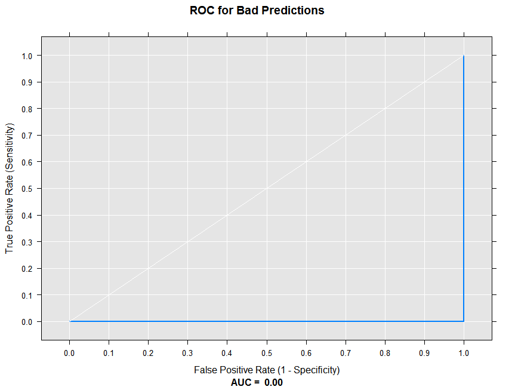
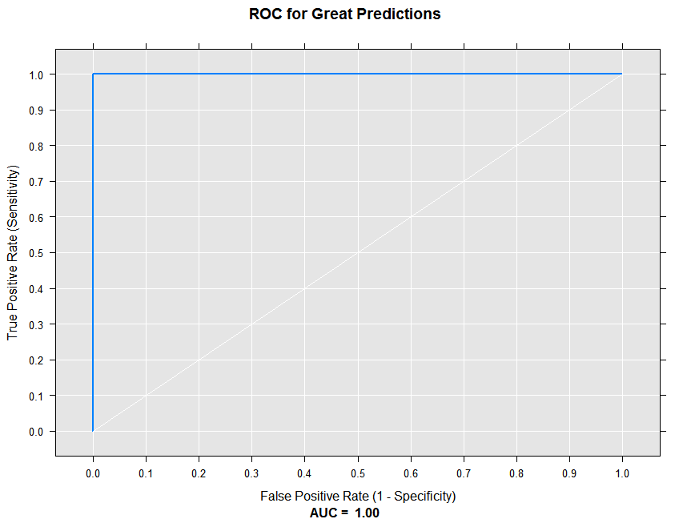
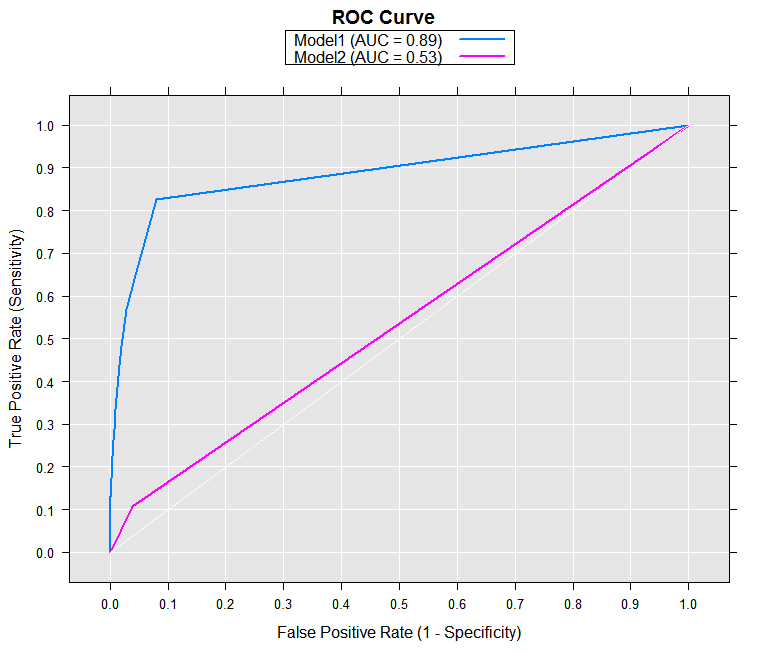

---

# required metadata
title: "Fitting Logistic Regression Models (RevoScaleR) in Machine Learning Server | Microsoft Docs"
description: "Logistic regression with RevoScaleR."
keywords: ""
author: "HeidiSteen"
ms.author: "heidist"
manager: "jhubbard"
ms.date: "03/17/2016"
ms.topic: "get-started-article"
ms.prod: "microsoft-r"

# optional metadata
#ROBOTS: ""
#audience: ""
#ms.devlang: ""
#ms.reviewer: ""
#ms.suite: ""
#ms.tgt_pltfrm: ""
ms.technology: "r-server"
#ms.custom: ""

---

# Fitting Logistic Regression Models using Machine Learning Server

Logistic regression is a standard tool for modeling data with a binary response variable. In R, you fit a logistic regression using the *glm* function, specifying a binomial family and the logit link function. In RevoScaleR, you can use *rxGlm* in the same way (see [Fitting Generalized Linear Models](how-to-revoscaler-generalized-linear-model.md)) or you can fit a logistic regression using the optimized *rxLogit* function; because this function is specific to logistic regression, you need not specify a family or link function.

### A Simple Logistic Regression Example

As an example, consider the *kyphosis* data set in the *rpart* package. This data set consists of 81 observations of four variables (Age, Number, Kyphosis, Start) in children following corrective spinal surgery; it is used as the initial example of *glm* in the White Book. The variable Kyphosis reports the absence or presence of this deformity.

We can use *rxLogit* to model the probability that kyphosis is present as follows:

	library(rpart)
	rxLogit(Kyphosis ~ Age + Start + Number, data = kyphosis)

The following output is returned:

	Logistic Regression Results for: Kyphosis ~ Age + Start + Number
	Data: kyphosis
	Dependent variable(s): Kyphosis
	Total independent variables: 4
	Number of valid observations: 81
	Number of missing observations: 0

	Coefficients:
				   Kyphosis
	(Intercept) -2.03693354
	Age          0.01093048
	Start       -0.20651005
	Number       0.41060119

The same model can be fit with `glm` (or `rxGlm`) as follows:

	glm(Kyphosis ~ Age + Start + Number, family = binomial, data = kyphosis)

	 Call:  glm(formula = Kyphosis ~ Age + Start + Number, family = binomial,      data = kyphosis)

	 Coefficients:
	 (Intercept)          Age        Start       Number  
	    -2.03693      0.01093     -0.20651      0.41060  

	 Degrees of Freedom: 80 Total (i.e. Null);  77 Residual
	 Null Deviance:	    83.23
	 Residual Deviance: 61.38 	AIC: 69.38

### Stepwise Logistic Regression

Stepwise logistic regression is an algorithm that helps you determine which variables are most important to a logistic model. You provide a minimal, or lower, model formula and a maximal, or upper, model formula, and using forward selection, backward elimination, or bidirectional search, the algorithm determines the model formula that provides the best fit based on an AIC or significance level selection criterion.

RevoScaleR provides an implementation of stepwise logistic regression that is not constrained by the use of "in-memory" algorithms. Stepwise linear regression in RevoScaleR is implemented by the functions *rxLogit* and *rxStepControl*.

Stepwise logistic regression begins with an initial model of some sort. We can look at the kyphosis data again and start with a simpler model: Kyphosis ~ Age:

	initModel <- rxLogit(Kyphosis ~ Age, data=kyphosis)
	initModel

	  Logistic Regression Results for: Kyphosis ~ Age
	  Data: kyphosis
	  Dependent variable(s): Kyphosis
	  Total independent variables: 2
	  Number of valid observations: 81
	  Number of missing observations: 0

	  Coefficients:
	  				Kyphosis
	  (Intercept) -1.809351230
	  Age          0.005441758

We can specify a stepwise model using rxLogit and rxStepControl as follows:

	KyphStepModel <-  rxLogit(Kyphosis ~ Age,
		data = kyphosis,
		variableSelection = rxStepControl(method="stepwise",
			scope = ~ Age + Start + Number ))
	KyphStepModel
	  Logistic Regression Results for: Kyphosis ~ Age + Start + Number
	  Data: kyphosis
	  Dependent variable(s): Kyphosis
	  Total independent variables: 4
	  Number of valid observations: 81
	  Number of missing observations: 0

	  Coefficients:
	  			   Kyphosis
	  (Intercept) -2.03693354
	  Age          0.01093048
	  Start       -0.20651005
	  Number       0.41060119

The methods for variable selection (forward, backward, and stepwise), the definition of model scope, and the available selection criteria are all the same as for stepwise linear regression; see ["Stepwise Variable Selection"](how-to-revoscaler-linear-model.md#stepwise-variable-selection) and the rxStepControl help file for more details.

#### Plotting Model Coefficients

The ability to save model coefficients using the argument *keepStepCoefs = TRUE* within the *rxStepControl* call and to plot them with the function *rxStepPlot* was described in great detail for stepwise *rxLinMod* in section 8.8.5. This functionality is also available for stepwise *rxLogit* objects.

### Prediction

As described above for linear models, the objects returned by the RevoScaleR model-fitting functions do not include fitted values or residuals. We can obtain them, however, by calling *rxPredict* on our fitted model object, supplying the original data used to fit the model as the data to be used for prediction.

For example, consider the mortgage default example in Section 6 of the manual *RevoScaleR: Getting Started Guide.* For that example, we used ten input data files to create the data set used to fit the model. But suppose instead we use nine input data files to create the training data set and use the remaining data set for prediction. We can do that as follows (again, remember to modify the first line for your own system):

	#  Logistic Regression Prediction

	bigDataDir <- "C:/MRS/Data"
	mortCsvDataName <- file.path(bigDataDir, "mortDefault", "mortDefault")
	trainingDataFileName <- "mortDefaultTraining"
	mortCsv2009 <- paste(mortCsvDataName, "2009.csv", sep = "")
	targetDataFileName <- "mortDefault2009.xdf"
	ageLevels <- as.character(c(0:40))		
	yearLevels <- as.character(c(2000:2009))
	colInfo <- list(list(name = "houseAge", type = "factor",
		levels = ageLevels), list(name = "year", type = "factor",
		levels = yearLevels))
	append= FALSE
	for (i in 2000:2008)
	{
		importFile <- paste(mortCsvDataName, i, ".csv", sep = "")
		rxImport(inData = importFile, outFile = trainingDataFileName,
		colInfo = colInfo, append = append)
		append = TRUE								
	}

	rxImport(inData = mortCsv2009, outFile = targetDataFileName,
	   colInfo = colInfo)

We can then fit a logistic regression model to the training data and predict with the prediction data set as follows:

	logitObj <- rxLogit(default ~ year + creditScore + yearsEmploy + ccDebt,
		data = trainingDataFileName, blocksPerRead = 2, verbose = 1,
		reportProgress=2)
	rxPredict(logitObj, data = targetDataFileName,
		outData = targetDataFileName, computeResiduals = TRUE)

>The `blocksPerRead` argument is ignored if run locally using R Client. [Learn more...](tutorial-revoscaler-data-import-transform.md#chunking)

To view the first 30 rows of the output data file, use rxGetInfo as follows:

	rxGetInfo(targetDataFileName, numRows = 30)

### Prediction Standard Errors and Confidence Intervals

You can use rxPredict to obtain prediction standard errors and confidence intervals for models fit with rxLogit in the same way as for those fit with rxLinMod. The original model must be fit with covCoef=TRUE:

	#  Prediction Standard Errors and Confidence Intervals

	logitObj2 <- rxLogit(default ~ year + creditScore + yearsEmploy + ccDebt,
		data = trainingDataFileName, blocksPerRead = 2, verbose = 1,
		reportProgress=2, covCoef=TRUE)

>The `blocksPerRead` argument is ignored if run locally using R Client. [Learn more...](tutorial-revoscaler-data-import-transform.md#chunking)

You then specify `computeStdErr=TRUE` to obtain prediction standard errors; if this is TRUE, you can also specify `interval="confidence"` to obtain a confidence interval:

	rxPredict(logitObj2, data = targetDataFileName,
		outData = targetDataFileName, computeStdErr = TRUE,
		interval = "confidence", overwrite=TRUE)

The first ten lines of the file with predictions can be viewed as follows:

	rxGetInfo(targetDataFileName, numRows=10)

	  File name: C:\Users\yourname\Documents\MRS\mortDefault2009.xdf
	  Number of observations: 1e+06
	  Number of variables: 10
	  Number of blocks: 2
	  Compression type: zlib
	  Data (10 rows starting with row 1):
	     creditScore houseAge yearsEmploy ccDebt year default default_Pred
	  1          617       20           8   4410 2009       0 6.620773e-06
	  2          623       11           7   5609 2009       0 4.610861e-05
	  3          758       17           4   7250 2009       0 4.259884e-04
	  4          687       22           5   3761 2009       0 3.770789e-06
	  5          663       15           6   6746 2009       0 2.312827e-04
	  6          676       10           2   7106 2009       0 1.092593e-03
	  7          721       23           2   2280 2009       0 8.515912e-07
	  8          680       18           7   2831 2009       0 6.011109e-07
	  9          734        9           5   3867 2009       0 3.144299e-06
	  10         688       16           8   6238 2009       0 5.350031e-05
	     default_StdErr default_Lower default_Upper
	  1    3.143695e-07  6.032422e-06  7.266507e-06
	  2    1.953612e-06  4.243427e-05  5.010109e-05
	  3    1.594783e-05  3.958500e-04  4.584203e-04
	  4    1.739047e-07  3.444893e-06  4.127516e-06
	  5    8.733193e-06  2.147838e-04  2.490486e-04
	  6    3.952975e-05  1.017797e-03  1.172880e-03
	  7    4.396314e-08  7.696409e-07  9.422675e-07
	  8    3.091885e-08  5.434655e-07  6.648706e-07
	  9    1.469334e-07  2.869109e-06  3.445883e-06
	  10   2.224102e-06  4.931401e-05  5.804197e-05

Using ROC Curves to Evaluate Estimated Binary Response Models
-------------------------------------------------------------

A *receiver operating characteristic* (ROC) curve can be used to visually assess binary response models. It plots the *True Positive Rate* (the number of correctly predicted TRUE responses divided by the actual number of TRUE responses) against the *False Positive Rate* (the number of incorrectly predicted TRUE responses divided by the actual number of FALSE responses), calculated at various thresholds. The *True Positive Rate* is the same as the *sensitivity*, and the *False Positive Rate* is equal to one minus the *specificity*.

Let’s start with a simple example. Suppose we have a data set with 10 observations. The variable *actual* contains the actual responses, or the ‘truth’. The variable *badPred* are the predicted responses from a very poor model. The variable *goodPred* contains the predicted responses from a great model.

	# Using ROC Curves for Binary Response Models

	sampleDF <- data.frame(
	    actual = c(0, 0, 0, 0, 0, 1, 1, 1, 1, 1),
	    badPred = c(.99, .99, .99, .99, .99, .01, .01, .01, .01, .01),
	    goodPred = c( .01, .01, .01, .01, .01,.99, .99, .99, .99, .99))

We can now call the *rxRocCurve* function to compute the sensitivity and specificty for the ‘bad’ predictions, and draw the ROC curve. The numBreaks argument indicates the number of breaks to use in determining the thresholds for computing the true and false positive rates.

rxRocCurve(actualVarName = "actual", predVarNames = "badPred",
	data = sampleDF, numBreaks = 10, title = "ROC for Bad Predictions")

Since all of our predictions are wrong at every threshold, the ROC curve is a flat line at 0. The *Area Under the Curve* (AUC) summary statistic is 0.

At the other extreme, let’s draw an ROC curve for our great model:

	rxRocCurve(actualVarName = "actual", predVarNames = "goodPred",
		data = sampleDF, numBreaks = 10, title = "ROC for Great Predictions")

With perfect predictions, we see the the True Positive Rate is 1 for all thresholds, and the AUC is 1. We’d expect a random guess ROC curve to lie along with white diagonal line.

Now let’s use actual model predictions in an ROC curve. We’ll use the small mortgage default sample data to estimate a logistic model and them compute predicted values:

>The `blocksPerRead` argument is ignored if run locally using R Client. [Learn more...](tutorial-revoscaler-data-import-transform.md#chunking)

	# Using mortDefaultSmall for predictions and an ROC curve

	mortXdf <- file.path(rxGetOption("sampleDataDir"), "mortDefaultSmall")
	logitOut1 <- rxLogit(default ~ creditScore + yearsEmploy + ccDebt,
		data = mortXdf,	blocksPerRead = 5)

	predFile <- "mortPred.xdf"

	predOutXdf <- rxPredict(modelObject = logitOut1, data = mortXdf,
		writeModelVars = TRUE, predVarNames = "Model1", outData = predFile)

Now, let’s estimate a different model (with 1 less independent variable), and add the predictions from that model to our output data set:

	# Estimate a second model without ccDebt
	logitOut2 <- rxLogit(default ~ creditScore + yearsEmploy,
		data = predOutXdf, blocksPerRead = 5)

	# Add preditions to prediction data file
	predOutXdf <- rxPredict(modelObject = logitOut2, data = predOutXdf,

	predVarNames = "Model2")

Now we can compute the sensitivity and specificity for both models, using rxRoc:

	rocOut <- rxRoc(actualVarName = "default",
		predVarNames = c("Model1", "Model2"),
		data = predOutXdf)
	rocOut

		 threshold predVarName sensitivity specificity
	  1       0.00      Model1 1.000000000   0.0000000
	  2       0.01      Model1 0.825902335   0.9197118
	  3       0.02      Model1 0.647558386   0.9567965
	  4       0.03      Model1 0.569002123   0.9721488
	  5       0.04      Model1 0.481953291   0.9797647
	  6       0.05      Model1 0.437367304   0.9845472
	  7       0.06      Model1 0.386411890   0.9877825
	  8       0.07      Model1 0.335456476   0.9900130
	  9       0.08      Model1 0.305732484   0.9916406
	  10      0.09      Model1 0.288747346   0.9930272
	  11      0.10      Model1 0.261146497   0.9940520
	  12      0.11      Model1 0.237791932   0.9947252
	  13      0.12      Model1 0.225053079   0.9953682
	  14      0.13      Model1 0.208067941   0.9959107
	  15      0.14      Model1 0.197452229   0.9963528
	  16      0.15      Model1 0.182590234   0.9967648
	  17      0.16      Model1 0.171974522   0.9971064
	  18      0.17      Model1 0.161358811   0.9973877
	  19      0.18      Model1 0.152866242   0.9975886
	  20      0.19      Model1 0.150743100   0.9978298
	  21      0.20      Model1 0.144373673   0.9980307
	  22      0.21      Model1 0.138004246   0.9982518
	  23      0.22      Model1 0.131634820   0.9984527
	  24      0.23      Model1 0.131634820   0.9986034
	  25      0.24      Model1 0.129511677   0.9987340
	  26      0.25      Model1 0.123142251   0.9987843
	  27      0.26      Model1 0.116772824   0.9988546
	  28      0.27      Model1 0.116772824   0.9989149
	  29      0.28      Model1 0.114649682   0.9989752
	  30      0.29      Model1 0.108280255   0.9990355
	  31      0.30      Model1 0.101910828   0.9991158
	  32      0.31      Model1 0.099787686   0.9991661
	  33      0.32      Model1 0.091295117   0.9992264
	  34      0.33      Model1 0.087048832   0.9992866
	  35      0.34      Model1 0.082802548   0.9993469
	  36      0.35      Model1 0.080679406   0.9994072
	  37      0.36      Model1 0.074309979   0.9994474
	  38      0.37      Model1 0.072186837   0.9994675
	  39      0.38      Model1 0.070063694   0.9995077
	  40      0.39      Model1 0.067940552   0.9995780
	  41      0.40      Model1 0.063694268   0.9995881
	  42      0.41      Model1 0.063694268   0.9996182
	  43      0.42      Model1 0.063694268   0.9996684
	  44      0.43      Model1 0.055201699   0.9996986
	  45      0.44      Model1 0.050955414   0.9997287
	  46      0.45      Model1 0.048832272   0.9997790
	  47      0.46      Model1 0.046709130   0.9997790
	  48      0.47      Model1 0.042462845   0.9997991
	  49      0.48      Model1 0.040339703   0.9998091
	  50      0.49      Model1 0.040339703   0.9998292
	  51      0.50      Model1 0.040339703   0.9998493
	  52      0.51      Model1 0.040339703   0.9998794
	  53      0.52      Model1 0.033970276   0.9998895
	  54      0.53      Model1 0.031847134   0.9999096
	  55      0.54      Model1 0.031847134   0.9999196
	  56      0.55      Model1 0.031847134   0.9999297
	  57      0.58      Model1 0.029723992   0.9999397
	  58      0.59      Model1 0.027600849   0.9999498
	  59      0.60      Model1 0.023354565   0.9999598
	  60      0.61      Model1 0.016985138   0.9999598
	  61      0.63      Model1 0.014861996   0.9999598
	  62      0.65      Model1 0.014861996   0.9999799
	  63      0.70      Model1 0.014861996   0.9999900
	  64      0.72      Model1 0.012738854   0.9999900
	  65      0.74      Model1 0.010615711   0.9999900
	  66      0.78      Model1 0.010615711   1.0000000
	  67      0.80      Model1 0.008492569   1.0000000
	  68      0.83      Model1 0.006369427   1.0000000
	  69      0.89      Model1 0.004246285   1.0000000
	  70      0.91      Model1 0.000000000   1.0000000
	  71      0.00      Model2 1.000000000   0.0000000
	  72      0.01      Model2 0.108280255   0.9612776
	  73      0.02      Model2 0.000000000   0.9994474
	  74      0.03      Model2 0.000000000   1.0000000

With the *removeDups* argument set to its default of *TRUE*, rows containing duplicate entries for sensitivity and specificity were removed from the returned data frame. In this case, it results in many fewer rows for Model2 than Model1. We can use the *rxRoc* *plot* method to render our ROC curve using the computed results.

	plot(rocOut)

The resulting plot shows that the second model is much closer to the “random” diagonal line than the first model.

