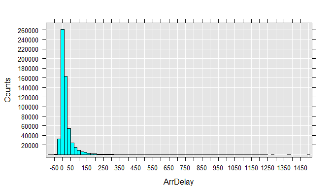
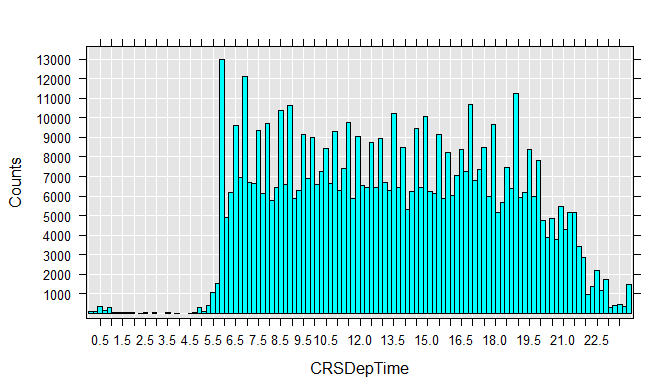
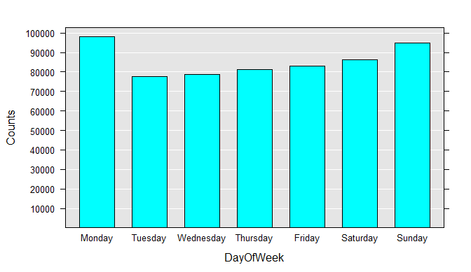
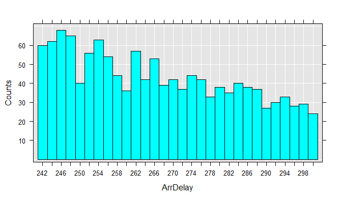

---

# required metadata
title: "Tutorial: Data import and exploration (Machine Learning Server) "
description: "Learn how to import and explore data using the RevoScaleR functions in Machine Learning Server."
keywords: ""
author: "HeidiSteen"
ms.author: "heidist"
manager: "jhubbard"
ms.date: "07/17/2017"
ms.topic: "get-started-article"
ms.prod: "mlserver"

# optional metadata
#ROBOTS: ""
#audience: ""
#ms.devlang: ""
#ms.reviewer: ""
#ms.suite: ""
#ms.tgt_pltfrm: ""
#ms.technology: ""
#ms.custom: ""

---

# Tutorial: Data import and exploration using RevoScaleR

**Applies to: Microsoft R Client, Machine Learning Server**

In data-driven projects, one action item guaranteed to be on the list is data acquisition and exploration. In this tutorial, you will learn how to import a text-delimited .csv file into an R session and use functions from [RevoScaleR](../r-reference/revoscaler/revoscaler.md) to ascertain the shape of the data. 

To load data, use **rxImport** from the RevoScaleR function library. The **rxImport** function converts source data into a columnar format for consumption in R and returns a data source object that wraps a dataset with useful metadata. Optionally, by specifying an *outFile* parameter, you can create an XDF file if you want to persist the data for future calculations.

> [!Note]
> R Client and Machine Learning Server are interchangeable in terms of RevoScaleR as long as [data fits into memory and processing is single-threaded](#chunking). If datasets exceed memory, we recommend pushing the [compute context](concept-what-is-compute-context.md) to Machine Learning Server.

## What you will learn

1. How to load CSV data using **rxImport** and optionally save it as an XDF
2. How to obtain information about the data structure
3. Use parameters for selective import and conversion
4. Summarize data
4. Subset and transform data

## Prerequisites

To complete this tutorial as written, use an R console application and built-in data. 

+ On Windows, go to \Program Files\Microsoft\R Client\R_SERVER\bin\x64 and double-click **Rgui.exe**.	
+ On Linux, at the command prompt, type **Revo64**.

The command prompt for R is `>`. You can hand-type case-sensitive R commands, or copy-paste multi-line commands at the console command prompt. The R interpreter can queue up multiple commands and run them sequentially.

### How to locate built-in data

[RevoScaleR](../r-reference/revoscaler/revoscaler.md) provides both functions and built-in datasets, including the *AirlineDemoSmall.csv* file used in this tutorial. The sample data directory is registered with RevoScaleR. Its location can be returned through a "sampleDataDir" parameter on the **rxGetOption** function.

1. Open the R console or start a Revo64 session. The RevoScaleR library is loaded automatically.

2. Retrieve the list of [sample data files](sample-built-in-data.md) provided in RevoScaleR by entering the following command at the `>` command prompt:

        list.files(rxGetOption("sampleDataDir"))

The open source R `list.files` command returns a file list provided by the RevoScaleR **rxGetOption** function and the *sampleDataDir* argument. 

> [!NOTE]
> If you are a Windows user and new to R, be aware that R script is case-sensitive. If you mistype rxGetOption or sampleDataDir, you will get an error instead of the file list.

### How to locate the working directory

Both R and RevoScaleR use the *working directory* to store any files that you create. The following open source R command provides the working directory location: `getwd()`.

Depending on your environment, you might not have permission to save files to this directory. On Windows, if the output is something like `C:/Program Files/Microsoft/ML Server/R_SERVER/bin/x64`, you won't have write permissions on that older. To change the working directory, run `setwd("C:/Users/TEMP")`. 

Alternatively, specify a fully-qualified path to a writable directory whenever a file name is required (for example, `outFile="C:/users/temp/airExample.xdf"` on an **rxImport** call).  

Windows users, please note the direction of the path delimiter. By default, R script uses forward slashes as path delimiters.

### About the airline dataset

The *AirlineDemoSmall.csv* dataset is used in this tutorial. It's a subset of a larger dataset containing information on flight arrival and departure details for all commercial flights within the USA, from October 1987 to April 2008. The file contains three columns of data: *ArrDelay*, *CRSDepTime*, and *DayOfWeek*, with a total of 600,000 rows.

## Load data

As a first step, perform a preliminary import using the airline data. Initially, the data is loaded as a data frame that exists only in memory.

~~~~
	mysource <- file.path(rxGetOption("sampleDataDir"), "AirlineDemoSmall.csv")
	airXdfData <- rxImport(inData=mysource)
~~~~

On the first line,`mysource` is an object specifying source data created using R's `file.path` command. The folder path is provided through RevoScaleR's rxGetOption("sampleDataDir"), with "AirlineDemoSmall.csv" for the file. 

On line two, `airXdfData` is a data source object returned by **rxImport**, which we can query to learn about data characteristics.

## Save as XDF

Although we could work with the data frame for the duration of the session, it often helps to save the data as an .xdf file for reuse at a later date. To create an .xdf file, run **rxImport** with an *outFile* parameter specifying the name and a folder for which you have write permissions:

~~~~
	airXdfData <- rxImport(inData=mysource, outFile="c:/Users/Temp/airExample.xdf")
~~~~

Common errors occurring on your first file save exercise might include:

+ "Error: '\u' used without hex digits in character string..." indicates an invalid path delimiter. R uses forward slash delimiters (/), even if the path is on the Windows file system.	
+ "Error in file <<file-name>>; Permission denied" is obviously a permission error. Choosing a different folder or granting write-access to the current folder will resolve the error.	

### About data storage in Machine Learning Server

In Machine Learning Server, you can work with in-memory data as a *data frame*, or save it to disk as an *XDF file*. As noted, **rxImport** can create a data source object with or without the .xdf file. If you omit the *outFile* argument or set it NULL, the return object is a data frame containing the data.

A data frame is the fundamental data structure in R and is fully supported in Machine Learning Server. It is tabular, composed of rows and columns, where columns contain variables and the first row, called the *header*, stores column names. Subsequent rows provide data values for each variable associated with a single observation. A data frame is a temporary data structure, created when you load some data. It exists only for the duration of the session.

An .xdf file is a binary file format native to Machine Learning Server, used for persisting data on disk. The organization of an .xdf file is column-based, one column per variable, which is optimum for the variable orientation of data used in statistics and predictive analytics. With .xdf, you can load subsets of the data for targeted analysis. Also, .xdf files include precomputed metadata that is immediately available with no additional processing.

Creating an .xdf is not required, but when datasets are large or complex, .xdf files can help by compressing data and by allocating data into chunks that can be read and refreshed independently. Additionally, on distributed file systems like Hadoop's HDFS, XDF files can store data in multiple physical files to accommodate very large datasets. 

> [!Tip]
> You can use **rxImport** to load all or part of an .xdf into a data frame by specifying an .xdf file as the input. Doing so instantiates a data source object for the .xdf file, but without loading its data. Having an object represent the data source can come in handy. It doesn’t take up much memory, and it can be used in many other RevoScaleR objects interchangeably with a data frame.

## Examine object metadata

You should now have a `mysource` object and an `airXdfData` object representing the data source. Once a data source object exists, you can use the **rxGetInfo** function to return metadata and learn more about the structure. Adding the *getVarInfo* argument returns metadata about variables:

~~~~
    rxGetInfo(airXdfData, getVarInfo = TRUE)
~~~~

Notice how the output includes the precomputed metadata for each variable, plus a summary of observations, variables, blocks, and compression information. Variables are based on fields in the CSV file. In this case, there are 3 variables. 

    File name: C:\Users\TEMP\airExample.xdf 
    Number of observations: 6e+05 
    Number of variables: 3 
    Number of blocks: 2 
    Compression type: zlib 
    Variable information: 
    Var 1: ArrDelay, Type: character
    Var 2: CRSDepTime, Type: numeric, Storage: float32, Low/High: (0.0167, 23.9833)
    Var 3: DayOfWeek, Type: character

From the output, we can determine whether the number of observations is large enough to warrant subdivision into smaller blocks. Additionally, we can see which variables exist, the data type, and for numeric data, the range of values. The presence of string variables is a consideration. To use this data in subsequent analysis, we might need to convert strings to numeric data for ArrDelay. Likewise, we might want to convert DayOfWeek to a factor variable so that we can group observations by day. We can do all of these things in a subsequent import.

> [!Tip]
> To get just the variable information, use the standalone **rxGetVarInfo()** function to return precomputed metadata about variables in the .xdf file (for example, `rxGetVarInfo(airXdfData)`).

## Convert on re-import

The **rxImport** function takes multiple parameters that can be used to modify data during import. In this exercise, repeat the import and change the dataset at the same time. By adding parameters to **rxImport**, you can:

+ Convert the string column, *DayOfWeek*, to a factor variable using the *stringsAsFactors* argument.
+ Convert missing values to a specific value, such as the letter M rather than the default NA.
+ Allocate rows into blocks that you can subsequently read and write in *chunks*. By specifying the argument *rowsPerRead*, you can read and write the data in 3 blocks of 200,000 rows each.

~~~~
	airXdfData <- rxImport(inData=mysource, outFile="c:/Users/Temp/airExample.xdf",
	stringsAsFactors=TRUE, missingValueString="M", rowsPerRead=200000,
    overwrite=TRUE)
~~~~

Running this command refreshes the airXdfData data source object. Metadata for the new object reflects the allocation of rows among 3 blocks and conversion of string-to-numeric data for both ArrDelay and DayOfWeek. 

    > rxGetInfo(airXdfData)
    Variable information: 
    Var 1: ArrDelay
	       702 factor levels: 6 -8 -2 1 -14 ... 451 430 597 513 432
    Var 2: CRSDepTime, Type: numeric, Storage: float32, Low/High: (0.0167, 23.9833)
    Var 3: DayOfWeek
           7 factor levels: Monday Tuesday Wednesday Thursday Friday Saturday Sunday

### Control string conversion and factor level ordering

Setting *stringsAsFactors* to TRUE has built-in behaviors that can have unintended consequences. For example, we might not want every character variable to become a factor. In the case of ArrDelay, the data is actually numeric. You can use the *colClasses* argument to explicitly set the data type of a particular variable.

Additionally, factor levels are listed arbitrarily in the order in which they are encountered during import, which might not make sense. To override the default, you can explicitly specify the levels in a predefined order using the *colInfo* argument.

Rerun the import operation to use a fixed data type for ArrDelay and a fixed order for days of the week:

    ~~~~
	colInfo <- list(DayOfWeek = list(type = "factor",
	    levels = c("Monday", "Tuesday", "Wednesday", "Thursday", "Friday", "Saturday", "Sunday")))

	airXdfData <- rxImport(inData=mysource, outFile="c:/Users/Temp/airExample.xdf", missingValueString="M", 
	rowsPerRead=200000, colInfo  = colInfo, colClasses=c(ArrDelay="integer"),
    overwrite=TRUE)
    ~~~~

Notice that once you supply the *colInfo* argument, you no longer need to specify *stringsAsFactors* because *DayOfWeek* is the only factor variable.

## Visualize data

To get a sense of data shape, use the **rxHistogram** function to show the distribution in arrival delay by day of week. Internally, this function uses the **rxCube** function to calculate information for a histogram:

~~~~
	rxHistogram(~ArrDelay|DayOfWeek,  data = airXdfData)
~~~~

You can also compute descriptive statistics for the variable:
~~~~
	rxSummary(~ ArrDelay, data = airXdfData)

		Call:
		rxSummary(formula = ~ArrDelay, data = airXdfData)

		Summary Statistics Results for: ~ArrDelay
		Data: airXdfData (RxXdfData Data Source)
		File name: airExample.xdf
		Number of valid observations: 6e+05

		Name     Mean     StdDev   Min Max  ValidObs MissingObs
		ArrDelay 11.31794 40.68854 -86 1490 582628   17372
~~~~

## Create a new variable

This first look at the data tells us two important things: arrival delay has a long “tail” for every day of the week, with a few flights delayed for well over two hours, and there are quite a few missing values (17,372). Presumably the missing values for arrival delay represent flights that never arrived and thus canceled.

You can use RevoScaleR’s data step functionality to create a new variable, *VeryLate*, that represents flights that were either over two hours late or canceled. Because the original data is safely preserved in the original text file, we can simply add this variable to our existing XDF file using the *transforms* argument to **rxDataStep**. The *transforms* argument takes a list of one or more R expressions, typically in the form of assignment statements. In this case, we use the following expression: *list(VeryLate = (ArrDelay \> 120 | is.na(ArrDelay))*

The full RevoScaleR data step consists of the following steps:

1.  Read in the *data* a block (200,000 rows) at a time.
2.  For each block, pass the *ArrDelay* data to the R interpreter for processing the transformation to create *VeryLate*.
3.  Write the data out to the dataset a block at a time. The argument *overwrite=TRUE* allows us to overwrite the data file.

		airXdfData <- rxDataStep(inData = airXdfData, outFile = "c:/Users/Temp/airExample.xdf",
		    transforms=list(VeryLate = (ArrDelay > 120 | is.na(ArrDelay))),
		    overwrite = TRUE)
            
Output from this command reflects the creation of the new variable:

        > rxGetInfo(airXdfData, getVarInfo = TRUE)
        File name: C:\Users\TEMP\airExample.xdf 
        Number of observations: 6e+05 
        Number of variables: 4 
        Number of blocks: 3 
        Compression type: zlib 
        Variable information: 
        Var 1: ArrDelay, Type: integer, Low/High: (-86, 1490)
        Var 2: CRSDepTime, Type: numeric, Storage: float32, Low/High: (0.0167, 23.9833)
        Var 3: DayOfWeek
            7 factor levels: Monday Tuesday Wednesday Thursday Friday Saturday Sunday
        Var 4: VeryLate, Type: logical, Low/High: (0, 1)

## Summarize data

We already used **rxSummary** to get an initial impression of data shape, but let's take a closer look at its arguments. The **rxSummary** function takes a formula as its first argument, and the name of the dataset as the second. To get summary statistics for all of the data in your data file, you can alternatively use the R *summary* method for the *airXdfData* object.

	> rxSummary(~ArrDelay+CRSDepTime+DayOfWeek, data=airXdfData)

or

	> summary(airXdfData)

Summary statistics will be computed on the variables in the formula. By default, **rxSummary** computes data summaries term-by-term, and missing values are omitted on a term-by-term basis.

	Call:
	rxSummary(formula = ~ArrDelay + CRSDepTime + DayOfWeek, data = airDS)

	Summary Statistics Results for: ~ArrDelay + CRSDepTime + DayOfWeek
    Data: airXdfData (RxXdfData Data Source)
    File name: C:\Users\TEMP\airExample.xdf
	Number of valid observations: 6e+05

	 Name       Mean     StdDev    Min        Max        ValidObs MissingObs
	 ArrDelay   11.31794 40.688536 -86.000000 1490.00000 582628   17372     
	 CRSDepTime 13.48227  4.697566   0.016667   23.98333 600000       0     

	Category Counts for DayOfWeek
	Number of categories: 7
	Number of valid observations: 6e+05
	Number of missing observations: 0

	 DayOfWeek Counts
	 Monday    97975
	 Tuesday   77725
	 Wednesday 78875
	 Thursday  81304
	 Friday    82987
	 Saturday  86159
	 Sunday    94975

Notice that the summary information shows cell counts for categorical variables, and appropriately does not provide summary statistics such as *Mean* and *StdDev*. Also notice that the *Call:* line will show the actual call you entered or the call provided by *summary*, so will appear differently in different circumstances.

You can also compute summary information by one or more categories by using interactions of a numeric variable with a factor variable. For example, to compute summary statistics on Arrival Delay by Day of Week:

	> rxSummary(~ArrDelay:DayOfWeek, data=airXdfData)

The output shows the summary statistics for *ArrDelay* for each day of the week:

	Call:
	rxSummary(formula = ~ArrDelay:DayOfWeek, data=airXdfData)

	Summary Statistics Results for: ~ArrDelay:DayOfWeek
	File name: C:\Users\TEMP\airExample.xdf
	Number of valid observations: 6e+05

	 Name               Mean     StdDev   Min Max  ValidObs MissingObs
	 ArrDelay:DayOfWeek 11.31794 40.68854 -86 1490 582628   17372     

	Statistics by category (7 categories):

	 Category                         DayOfWeek Means    StdDev  Min Max ValidObs
	 ArrDelay for DayOfWeek=Monday    Monday    12.025604 40.02463 -76 1017 95298   
	 ArrDelay for DayOfWeek=Tuesday   Tuesday   11.293808 43.66269 -70 1143 74011   
	 ArrDelay for DayOfWeek=Wednesday Wednesday 10.156539 39.58803 -81 1166 76786   
	 ArrDelay for DayOfWeek=Thursday  Thursday   8.658007 36.74724 -58 1053 79145   
	 ArrDelay for DayOfWeek=Friday    Friday    14.804335 41.79260 -78 1490 80142   
	 ArrDelay for DayOfWeek=Saturday  Saturday  11.875326 45.24540 -73 1370 83851   
	 ArrDelay for DayOfWeek=Sunday    Sunday    10.331806 37.33348 -86 1202 93395

To get a better feel for the data, you can draw histograms for each variable. Run each **rxHistogram** function one at a time. The histogram is rendered in the R Plot pane.

	options("device.ask.default" = T)
	rxHistogram(~ArrDelay, data=airXdfData)
	rxHistogram(~CRSDepTime, data=airXdfData)
	rxHistogram(~DayOfWeek, data=airXdfData)

We can also easily extract a subsample of the data file into a data frame in memory. For example, we can look at just the flights that were between 4 and 5 hours late:

	myData <- rxDataStep(inData = airXdfData,
	rowSelection = ArrDelay > 240 & ArrDelay <= 300,
		varsToKeep = c("ArrDelay", "DayOfWeek"))
	rxHistogram(~ArrDelay, data = myData)

## Load a data subset

This exercise shows you how to use **rxDataStep** to read an arbitrary chunk of the dataset into a data frame for further examination. As a first step, lets get the number of rows, columns, and return the initial rows to better understand the available data. Standard R methods provide this information.

	nrow(airXdfData)
	ncol(airXdfData)
	head(airXdfData)

	> nrow(airXdfData)
	[1] 600000
	> ncol(airXdfData)
	[1] 3
	> head(airXdfData)
	  ArrDelay CRSDepTime DayOfWeek
	1        6   9.666666    Monday
	2       -8  19.916666    Monday
	3       -2  13.750000    Monday
	4        1  11.750000    Monday
	5       -2   6.416667    Monday
	6      -14  13.833333    Monday

From *nrow* we see that the number of rows is 600,000. To read 10 rows into a data frame starting with the 100,000th row:

	airXdfDataSmall <- rxDataStep(inData=airXdfData, numRows=10, startRow=100000)
	airXdfDataSmall

This code should generate the following output:

	   ArrDelay CRSDepTime DayOfWeek
	1        -2  11.416667  Saturday
	2        39   9.916667    Friday
	3        NA  10.033334    Monday
	4         1  17.000000    Friday
	5       -17   9.983334 Wednesday
	6         8  21.250000  Saturday
	7        -9   6.250000    Friday
	8       -11  15.000000    Friday
	9         4  20.916666    Sunday
	10       -8   6.500000  Thursday

You can now compute summary statistics on the reduced dataset

## Create a new dataset with variable transformations

In this task, use the **rxDataStep** function to create a new dataset containing the variables in airXdfData plus additional variables created through transformations. Typically additional variables are created using the *transforms* argument. You can refer to [Transform functions](concept-what-is-data-transformations.md) for information. Remember that all expressions used in *transforms* must be able to be processed on a chunk of data at a time.

In the example below, three new variables are created. 

+ *Late* is a logical variable set to *TRUE* (or *1*) if the flight was more than 15 minutes late in arriving. 
+ *DepHour* is an integer variable indicating the hour of the departure. 
+ *Night* is also a logical variable, set to *TRUE* (or *1*) if the flight departed between 10 P.M. and 5 A.M. 

The **rxDataStep** function will read the existing dataset and perform the transformations chunk by chunk, and create a new dataset.

~~~~
	airExtraDS <- rxDataStep(inData=airXdfData, outFile="c:/users/temp/ADS2.xdf",
		transforms=list(
			Late = ArrDelay > 15,
			DepHour = as.integer(CRSDepTime),
			Night = DepHour >= 20 | DepHour <= 5))

	rxGetInfo(airExtraDS, getVarInfo=TRUE, numRows=5)
~~~~

You should see the following information in your output:

~~~~
	C:\Users\TEMP\ADS2.xdf 
	Number of observations: 6e+05
	Number of variables: 6
	Number of blocks: 2
	Compression type: zlib
	Variable information:
	Var 1: ArrDelay, Type: integer, Low/High: (-86, 1490)
	Var 2: CRSDepTime, Type: numeric, Storage: float32, Low/High: (0.0167, 23.9833)
	Var 3: DayOfWeek
	       7 factor levels: Monday Tuesday Wednesday Thursday Friday Saturday Sunday
	Var 4: Late, Type: logical, Low/High: (0, 1)
	Var 5: DepHour, Type: integer, Low/High: (0, 23)
	Var 6: Night, Type: logical, Low/High: (0, 1)
	Data (5 rows starting with row 1):
	  ArrDelay CRSDepTime DayOfWeek  Late DepHour Night
	1        6   9.666666    Monday FALSE       9 FALSE
	2       -8  19.916666    Monday FALSE      19 FALSE
	3       -2  13.750000    Monday FALSE      13 FALSE
	4        1  11.750000    Monday FALSE      11 FALSE
	5       -2   6.416667    Monday FALSE       6 FALSE
~~~~

## Next steps

This tutorial demonstrated data import and exploration, but there are several more tutorials covering more scenarios, including instructions for working with bigger datasets.

  - [Tutorial: Visualize and analyze data](tutorial-revoscaler-data-model-analysis.md)
  - [Analyze large data with RevoScaleR and airline flight delay data](tutorial-revoscaler-large-data-airline.md)
  - [Example: Analyzing loan data with RevoScaleR](tutorial-revoscaler-large-data-loan.md)
  - [Example: Analyzing census data with RevoScaleR](tutorial-revoscaler-large-data-census.md)

### Try demo scripts

 Another way to learn about RevoScaleR is through demo scripts. Scripts provided in your Machine Learning Server installation contain code that's very similar to what you see in the tutorials. You can highlight portions of the script, right-click **Execute in Interactive** to run the script in [R Tools for Visual Studio](https://www.visualstudio.com/vs/rtvs/).

 Demo scripts are located in the *demoScripts* subdirectory of your Machine Learning Server installation. On Windows, this is typically:

 	`C:\Program Files\Microsoft\R Client\R_SERVER\library\RevoScaleR\demoScripts`

### Watch this video

This 30-minute video is the second in a 4-part video series. It demonstrates RevoScaleR functions for data ingestion.

> [!Tip]
> This video shows you how to create a source object for a list of files by using the R `list.files` function and patterns for selecting specific file names. It uses the multiple mortDefaultSmall*.csv files to show the approach. To create an XDF comprised of all the files, use the following syntax: `mySourceFiles <- list.files(rxGetOption("sampleDataDir"), pattern = "mortDefaultSmall\\d*.csv", full.names=TRUE)`.

 
<iframe src="https://channel9.msdn.com/Series/Microsoft-R-Server-Series/Introduction-to-Microsoft-R-Server-Session-2--Data-Ingestion/player" width="600" height="400" allowFullScreen frameBorder="0"></iframe>

 
### Overcome R Client data chunking limitations by pushing compute context or migrating to Machine Learning Server

*Data chunking* is a RevoScaleR capability that partitions data into multiple parts for processing in parallel, reassembling it later for analysis. It's one of the key mechanisms by which RevoScaleR processes and analyzes very large datasets.

In Machine Learning Server, chunking functionality is available only when RevoScaleR functions are executed on Machine Learning Server for Windows, Teradata, SQL Server, Linux, or Hadoop. You cannot use chunking on systems that have just Microsoft R Client. R Client requires that data fits into available memory. Moreover, it can only use a maximum of two threads for analysis. Internally, when RevoScaleR is running in R Client, the `blocksPerRead` argument is deliberately, which results in all data being read into memory. 

You can work around this limitation by writing script on R Client, but then [pushing the compute context](concept-what-is-compute-context.md) from R Client to a remote Machine Learning Server  instance. Optionally, you could use Machine Learning Server. Developers can install the developer edition of Machine Learning Server which is a full-featured Machine Learning Server, but licensed for development workstations instead of production servers. For more information, see [Machine Learning Server](../what-is-machine-learning-server.md).

## See Also

 [Machine Learning Server](../what-is-machine-learning-server.md)	
 [Getting Started with Hadoop and RevoScaleR](how-to-revoscaler-hadoop.md)    
 [Parallel and distributed computing in Machine Learning Server](how-to-revoscaler-distributed-computing.md)   
 [Importing data](how-to-revoscaler-data-import.md)     
 [ODBC data import](how-to-revoscaler-data-odbc.md)     
 [RevoScaleR Functions](../r-reference/revoscaler/revoscaler.md)     
