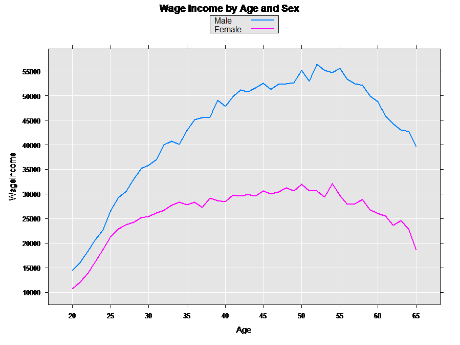
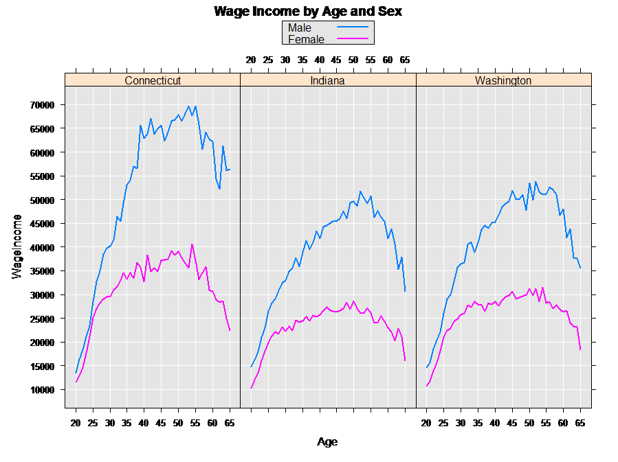

---

# required metadata
title: "Tutorial: Analyzing census data using RevoScaleR in Machine Learning Server "
description: "Learn how to work with big datasets using sample census data in this RevoScaleR tutorial walkthrough."
keywords: ""
author: "HeidiSteen"
ms.author: "heidist"
manager: "jhubbard"
ms.date: "05/12/2017"
ms.topic: "get-started-article"
ms.prod: "mlserver"

# optional metadata
#ROBOTS: ""
#audience: ""
#ms.devlang: ""
#ms.reviewer: ""
#ms.suite: ""
#ms.tgt_pltfrm: ""
#ms.technology: ""
#ms.custom: ""

---

# Tutorial: Analyzing US census data with RevoScaleR

This example builds on what you learned in an [earlier tutorial](tutorial-revoscaler-data-import-transform.md) by exploring the import and statistical RevoScaleR functions typically used with larger data sets. As before, you'll work with sample data to complete the steps.

## Download the census dataset

The data set used in this tutorial is *CensusUS5Pct2000.xdf*. You can download the .xdf file or zipped files [from this web site](https://go.microsoft.com/fwlink/?LinkID=698896&clcid=0x409).

When downloading these files, put them in a directory where you can easily access them. For example, create a directory "C:\MRS\BigData" and unpack the files there. When running examples using these files, you will want to specify this location as your *bigDataDir*. For example:

	bigDataDir <- "C:\MRS\BigData"

## Explore the data

The built-in data set *CensusWorkers.xdf* provides a subsample of the 2000 5% IPUMS U.S. Census data. It contains information on individuals from 20 to 65 years old in the states of Connecticut, Indiana, and Washington who worked during 2000.

First, let’s learn a little about the sample data set:

	sampleDataDir <- rxGetOption("sampleDataDir")
	dataFile <- file.path( sampleDataDir, "CensusWorkers")
	rxGetInfo(dataFile, getVarInfo=TRUE, numRows=3)

The results show that the data set has 6 variables and a little over 300,000 observations.

	File name: …SampleData\CensusWorkers.xdf
	Number of observations: 351121
	Number of variables: 6
	Number of blocks: 6
	Compression type: zlib
	Variable information:
	Var 1: age, Age
	       Type: integer, Low/High: (20, 65)
	Var 2: incwage, Wage and salary income
	       Type: integer, Low/High: (0, 354000)
	Var 3: perwt, Type: integer, Low/High: (2, 168)
	Var 4: sex, Sex
	       2 factor levels: Male Female
	Var 5: wkswork1, Weeks worked last year
	       Type: integer, Low/High: (21, 52)
	Var 6: state
	       3 factor levels: Connecticut Indiana Washington
	Data (3 rows starting with row 1):
	  age incwage perwt    sex wkswork1   state
	1  23   22000    39 Female       45 Indiana
	2  25   18000    27 Female       52 Indiana
	3  43   12000    24 Female       52 Indiana

## Plotting the Weighted Counts of Males and Females by Age

Use *rxCube* to compute and plot the Age/Sex distribution by year of age for the data set. This data set has probability weights associated with each observation in the variable *perwt*. We will use those weights in our calculations. As seen above, *age* is an integer variable.  We would like to have it treated as a categorical or factor variable in the calculation, so we will use the *F()* function when using *age* in the formula:

	ageSex <- rxCube(~F(age):sex, data=dataFile, pweights="perwt")

To extract a data frame containing the counts for every combination of age and sex, use *rxResultsDF*:

	ageSexDF <- rxResultsDF(ageSex)

Now plot the number of males and females by age.

	rxLinePlot(Counts~age, groups=sex, data=ageSexDF,
	 	title="2000 U.S. Workers by Age and Sex")

The resulting graph is shown below:

The graph shows us that for the population in the data set, there are more men than women at every age.

## Looking at Wage Income by Age and Sex

Next, run a regression looking at the relationship between age, sex, and wage income and plot the results:

	wageAgeSexLm  <- rxLinMod(incwage~F(age):sex, data=dataFile,
		pweights="perwt", cube=TRUE)
	wageAgeSex <- rxResultsDF(wageAgeSexLm)
	colnames(wageAgeSex) <- c("Age","Sex","WageIncome","Counts" )
	rxLinePlot(WageIncome~Age, data=wageAgeSex, groups=Sex,
		title="Wage Income by Age and Sex")

The resulting graph shows that, in this data set, wage income is higher for males than females at every age:

## Looking at Weeks Worked by Age and Sex

We can further explore the data by looking at the relationship between weeks worked and age and sex, following a similar process.

	workAgeSexLm <- rxLinMod(wkswork1 ~ F(age):sex, data=dataFile,
		pweights="perwt", cube=TRUE)
	workAgeSex <- rxResultsDF(workAgeSexLm)
	colnames(workAgeSex) <- c("Age","Sex","WeeksWorked","Counts" )
	rxLinePlot( WeeksWorked~Age, groups=Sex, data=workAgeSex,
		main="Weeks Worked by Age and Sex")

This resulting graph shows that it is also the case that on average females work fewer weeks per year at every age during the working years:

## Looking at Wage Income by Age, Sex, and State

Last, we can drill down by state.  For example, let’s look at the distribution of wage income by sex for each of the three states. First, do the computations as in the earlier examples:

	wageAgeSexStateLm  <- rxLinMod(incwage~F(age):sex:state, data=dataFile,
		pweights="perwt", cube=TRUE)
	wageAgeSexState <- rxResultsDF(wageAgeSexStateLm)
	colnames(wageAgeSexState) <-
		c("Age","Sex","State", "WageIncome","Counts" )

Now draw the plot:

	rxLinePlot(WageIncome~Age|State, groups=Sex, data=wageAgeSexState,
		layout=c(3,1), main="Wage Income by Age and Sex")

## Subsetting an .xdf File into a Data Frame

One advantage of storing data in .xdf file is that it is very fast to access a subsample of rows and columns.  If not too large, the subset of data can be easily read into a data frame and analyzed using any of the numerous functions available for data frames in R.  For example, suppose that we want to perform further analysis on workers in Connecticut who are 50 years old or under:

	ctDataFrame <- rxDataStep (inData=dataFile,
		rowSelection = (state == "Connecticut") & (age <= 50))
	nrow(ctDataFrame)
	head(ctDataFrame, 5)

The resulting data frame has only 60,755 observations, so can be used quite easily in R for analysis. For example, use the standard R summary function to compute descriptive statistics:

	summary(ctDataFrame)

This should give the result:

	      age           incwage           perwt            sex       
	 Min.   :20.00   Min.   :     0   Min.   :  2.00   Male  :31926  
	 1st Qu.:30.00   1st Qu.: 17500   1st Qu.: 16.00   Female:28829  
	 Median :37.00   Median : 32000   Median : 19.00                 
	 Mean   :36.57   Mean   : 42601   Mean   : 20.30                 
	 3rd Qu.:43.00   3rd Qu.: 50000   3rd Qu.: 25.00                 
	 Max.   :50.00   Max.   :354000   Max.   :152.00                 
	    wkswork1             state      
	 Min.   :21.00   Connecticut:60755  
	 1st Qu.:50.00   Indiana    :    0  
	 Median :52.00   Washington :    0  
	 Mean   :49.07                      
	 3rd Qu.:52.00

## Next steps

- If you missed the first tutorial, see [Practice data import and exploration](tutorial-revoscaler-data-import-transform.md) for an overview.
- For more advanced lessons, see [Write custom chunking algorithms](how-to-developer-write-chunking-algorithms.md).

## See Also

[Machine Learning Server](../what-is-machine-learning-server.md)	

[How-to guides in Machine Learning Server](how-to-introduction.md)

[RevoScaleR Functions](../r-reference/revoscaler/revoscaler.md)
