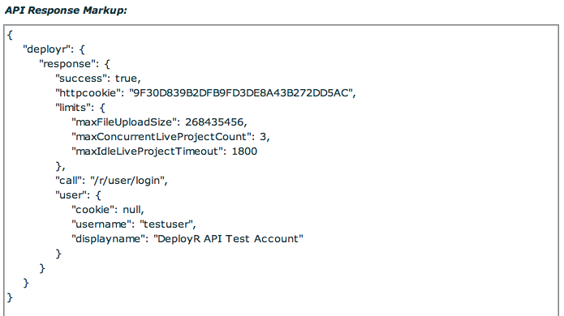

#  The API Explorer Tool

The DeployR API is extensive, providing a wide range of services related to [users](deployr-api-reference-guide.md#users-on-the-api), [projects](deployr-api-reference-guide.md#projects-on-the-api), [jobs](deployr-api-reference-guide.md#jobs-on-the-api) and the [repository](deployr-api-reference-guide.md#repository-on-the-api). To help developers familiarize themselves with the full set of APIs DeployR ships with a Web-based API Explorer tool. This tool allows developers to explore the DeployR API in an interactive manner.

>You cannot log into DeployR from two different accounts within the same brand of browser program. To use two or more different accounts, you'll need to log into each one in a separate brand of browser. For example, to log into the DeployR Administration Console with admin account and into the API Explorer tool with another user account, open one in Google Chrome™ and the other in Mozilla® Firefox®.

**Accessing the API Explorer**

The API Explorer is accessible after auto-installing DeployR. With a manual installation on Linux, make sure you install the API Explorer software. For more information, refer to the DeployR Installation Guide for your OS.

+ Visit the DeployR home page at `http://<DEPLOYR-SERVER-IP-ADDRESS-AND-PORT>/deployr/landing/`. From there, you can launch the API Explorer in your Web browser by clicking the API Explorer link near the top of the page.

+ Or, access the API Explorer directly here: `http://<DEPLOYR-SERVER-IP-ADDRESS-AND-PORT>/deployr/test/drive/deployr/api.html`.

>This tool requires that the Adobe Flash Player plug-in be installed and enabled in your Web browser.

## Overview of the API Explorer Interface 

The interface to the API Explorer consists of four main panels:

**The Preferences Panel**

At the top of the API Explorer window, you can find the Preferences Panel. Preference controls are on the right side of this panel. You can use these controls to set global preferences for all of the API calls you will make within this tool.

These global preferences are described as follows:

-  ***API*** : this preference specifies whether JSON or XML encodings should be used on API calls.
-  ***DEV*** : this preference specifies the default device for rendering plots in R: PNG or SVG
-  ***DLD*** : this preference specifies whether file downloads are saved as attachments or rendered directly in the Web browser.

** The API Tabs Panel**

The center section of the API Explorer window contains the API tabs panel:

Each tab contains functionality you can use to interact with and invoke a subset of the full API. To learn more about the functionality in each tab, refer to the section [Learning the API](#learning-the-api).

** The API Request Panel**

The lower left area of the API Explorer window contains the API Request Panel. Each time you make an API call, this panel automatically displays details of that call, including the following:

-  API call parameters

-  API call method

-  API call endpoint

**The API Response Markup Panel**

The lower right area of the API Explorer window contains the API Response Markup Panel. Each time an API call sees a response from the server, the complete response markup for the call is displayed in this panel.

## Learning the API

Use the functionality found under each tab in API Explorer to interact with and invoke a subset of the full API. Each of these tabs is described in the following sections.

**DeployR Tab**

The DeployR tab is the starting point in the API Explorer. This tab gives the user access to the full set of [User APIs](https://deployr.revolutionanalytics.com/documents/dev/api-doc/guide/single.html#workingusers).

When a user first launches the API Explorer the DeployR tab and the Repo Scripts tab are the only tabs enabled in the API Tabs Panel. In order to gain access to additional tabs you must first sign-in to DeployR.

Once you successfully authenticates with DeployR the following tabs are activated:

- DeployR
- Projects
- Repo Files
- Jobs

>When you sign out of DeployR, most tabs are automatically disabled except the default DeployR tab and the Repo Scripts tab, which are always enabled.

**Projects Tab**

The Projects tab provides access to the full set of [Project Management APIs](https://deployr.revolutionanalytics.com/documents/dev/api-doc/guide/single.html#workingprojects).

Once you select a specific project from the list of projects displayed under this tab, the following set of additional project-specific tabs are enabled in addition to those enabled earlier:

- Console
- Workspace
- Directory
- Packages
- About

The functionality found under these tabs allows you to interact with APIs on the selected project.

>Clearing the active selection in the list of projects displayed under the Projects tab will automatically disable the complete set of project-specific tabs.

**Console Tab**

The Console tab offers access to the full set of [Project Execution APIs](https://deployr.revolutionanalytics.com/documents/dev/api-doc/guide/single.html#projectexecution).

** Workspace Tab**

The Workspace tab offers access to the full set of [Project Workspace APIs](https://deployr.revolutionanalytics.com/documents/dev/api-doc/guide/single.html#projectworkspace).

**Directory Tab**

The Directory tab offers access to the full set of [Project Directory APIs](https://deployr.revolutionanalytics.com/documents/dev/api-doc/guide/single.html#projectdirectory).

**Packages Tab**

The Packages tab offers access to the full set of [Project Package APIs](https://deployr.revolutionanalytics.com/documents/dev/api-doc/guide/single.html#projectpackages).

**About Tab**

The About tab offers access to the [/r/project/about](https://deployr.revolutionanalytics.com/documents/dev/api-doc/guide/single.html#projectabout) and [/r/project/about/update](https://deployr.revolutionanalytics.com/documents/dev/api-doc/guide/single.html#projectaboutupdate) APIs. These APIs appear in their own tab simply due to space constraints in the UI.

**Repo Files Tab**

The Repo Files tab offers access to the full set of [Repository File APIs](https://deployr.revolutionanalytics.com/documents/dev/api-doc/guide/single.html#repositoryfiles).

**Jobs Tab**

The Jobs tab offers access to the full set of [Job APIs](https://deployr.revolutionanalytics.com/documents/dev/api-doc/guide/single.html#workingjobs).

**Repo Scripts Tab**

The Repo Scripts tab offers access to the full set of [Repository Script APIs](https://deployr.revolutionanalytics.com/documents/dev/api-doc/guide/single.html#repositoryscripts).

>Hovering your mouse over most UI elements in the API Explorer reveals helpful tooltips.
